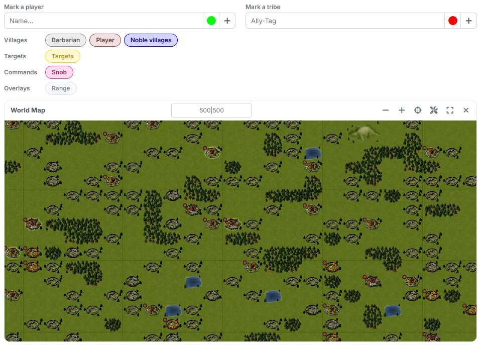
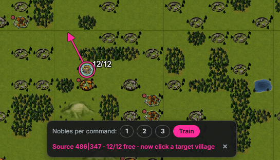
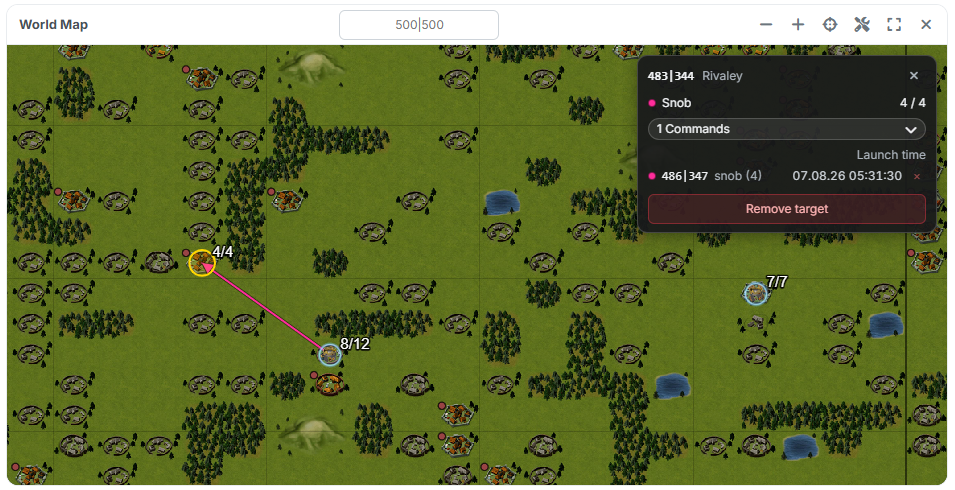

# The Overall Map

The map is reachable from **every** step: via the **"Map"** tab on the left edge
of the content area. It shows the world with your noble villages, the targets
and the planned commands — and in manual mode you plan directly on it.

{ .screenshot }

## 1. Control panel and layers

Above the map sits the control panel:

- **"Mark a player"** and **"Mark a tribe"** — enter a name or tribe tag, pick a
  colour, add it with the plus button. The marks collect below and can be
  removed individually.
- The **layer chips** switch what is visible:

| Row | Chips |
|---|---|
| **Villages** | `Barbarian`, `Player`, `Noble villages` |
| **Targets** | `Targets` |
| **Commands** | `Snob` — only appears once commands are planned |
| **Overlays** | `Range` — starts switched off |

In the map card itself you jump to a spot via the coordinate field (`500|500`)
and operate the zoom, **"Show all"**, the selection, the show/hide of the
control panel and the fullscreen mode.

## 2. What the map shows

Your **noble villages** carry a number stating how many noblemen are still free
there — for instance `4/4` for an untouched village, or `8/12` when four are
already planned. On top of that the map tints them in three shades: untouched,
partly planned and empty. That way exhausted villages stand out immediately.

Hovering over a village brings up the info box with coordinate, player, tribe
and points. For one of your own noble villages there is an additional line
**"Noble village: x / y free"**, for a target village the line **"Target"**.

## 3. Selecting targets

Via the button **"Select villages on the map"** — or directly via **"Open map"**
in [step 2](schritt2-zieldoerfer.md) — the map switches into selection mode. A
short click picks up a village, a second one drops it again; with the mouse
button held down you drag a lasso around a whole area. Panning works with the
**right** mouse button in this mode.

At the bottom the bar counts the selection. **"Apply selection"** enters the
villages as targets, **"Clear"** discards them.

## 4. Planning with two clicks

{ .screenshot }

This is the heart of manual mode — and it needs no mode of its own:

1. **Click the origin village.** It gets a ring, and the planner bar appears at
   the bottom: *"Source 486|347 · 12/12 free · now click a target village"*.
2. **Pick the step.** Under **"Nobles per command:"** you find `1`, `2`, `3` and
   **`Train`** (= 4). The step determines how many noblemen the next command
   carries.
3. **Click the target village.** The command is created and drawn as a line
   immediately.

You cancel with **Escape**, via the × in the bar, or with another click on the
same origin village.

!!! info "Unknown targets appear by themselves"
    If you click a village that is not in the target list yet, the tool creates
    it as a target automatically — you do not have to record it beforehand.

Not every click leads to a command. The tool declines when the target is out of
range, when no noblemen are free in the origin village, when the launch time
would fall into a [blocked period](schritt3-einstellungen.md), when no arrival
time has been set — or when you click a barbarian village or one of your own
noble villages as the target. It names the reason right in the info box.

## 5. Commands on the map

{ .screenshot }

Planned commands appear as lines from the origin to the target village; the chip
**"Snob"** hides and shows them again.

A click on a target village opens its info box. It shows how many noblemen the
target has already received (*"Snob 4 / 4"*) and lists under **"Commands"** every
single command with source, count and launch time. The × on a row removes a
single command, **"Remove target"** removes the whole target along with its
commands.

!!! info "Deleting the last command takes the target with it"
    If you remove the last command of a target on the map that only came into
    being while planning, the target disappears as well.

---

Back to the overview: [The Two Ways](die-zwei-wege.md).
