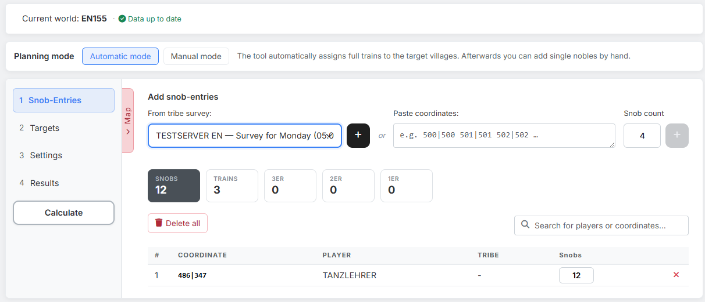
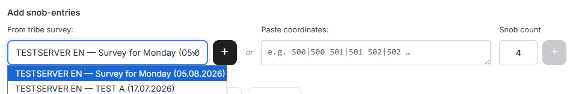
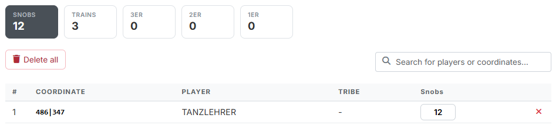

# Step 1: Snob-Entries

In step 1 you define **which noblemen are available** — that is, how many snobs
can start from which villages.

{ .screenshot }

On the left you find the **step bar**. You can jump between the steps at any
time. At the very bottom sits the **"Calculate"** button, which is reachable
from everywhere; step **4. Results** stays locked until a calculation has run.
On the left edge of the content area sits the **"Map"** tab — it opens the
[overall map](gesamtkarte.md), which is available in every step.

## 1. Adding snob-entries

Under **"Add snob-entries"** two equivalent ways sit next to each other.

### From tribe survey

{ .screenshot }

If your tribe leadership ran a
[tribe survey](../leader-view/stammes-umfragen.md) in which the members reported
their noblemen, you fetch the entries straight from it. The dropdown shows the
Discord server, the title of the survey and its date per entry; the most recent
one is at the top. The plus button takes the entries over.

!!! info "Without a survey this way is missing entirely"
    If none of your Discord servers has a survey for this world — or you lack
    the right to read it — the tool hides the column along with the "or". Then
    only the coordinate route remains.

### Paste coordinates

Into the field **"Paste coordinates:"** you can throw any text — the tool picks
out the coordinates itself. While typing it reports back below what it
recognised (*"12 coordinates successfully recognised."* or *"10 valid. 2 not
found: …"*). As long as it contains no valid coordinate, the plus button stays
disabled.

To the right, under **"Snob count"**, you enter how many noblemen are reported
**per village**. The default is `4`, that is one full train.

!!! info "Known coordinates are skipped"
    If you paste a coordinate that is already in the list, its snob count stays
    unchanged — the tool neither adds to it nor overwrites it. You change the
    number directly in the table.

## 2. Metrics and table

{ .screenshot }

Above the table there are five metrics:

- **Snobs** — the sum of all reported noblemen.
- **Trains** — how many **full** trains (4 snobs each) they contain.
- **3er / 2er / 1er** — the **remainder** left over per village after the full
  trains.

!!! info "Example"
    A village with 12 reported snobs counts as **3 trains** and leaves no
    remainder. A village with 6 snobs counts as **1 train** plus one **2er**.

The table below shows coordinate, player and tribe per row. The **Snobs** column
is an input field, so you can adjust the number afterwards. Set it to `0` and
the row disappears. The red × removes a row directly, **"Delete all"** empties
the whole list. The search field filters by player or coordinate.

!!! warning "Deleting takes commands with it"
    If you remove an origin village for which commands are already planned,
    those commands go with it. If you lower the snob count below what is already
    planned, the tool points that out.

!!! info "Recalculate after every change"
    If you change entries, targets or settings, the hint *"Changes only take
    effect after recalculating."* appears. The already calculated result stays
    as it is until then.

---

Next up: [Step 2: Targets](schritt2-zieldoerfer.md).
