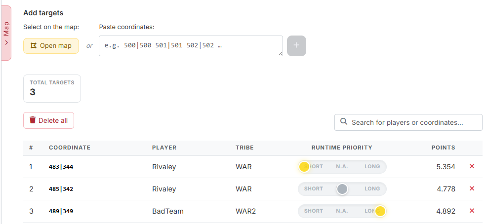
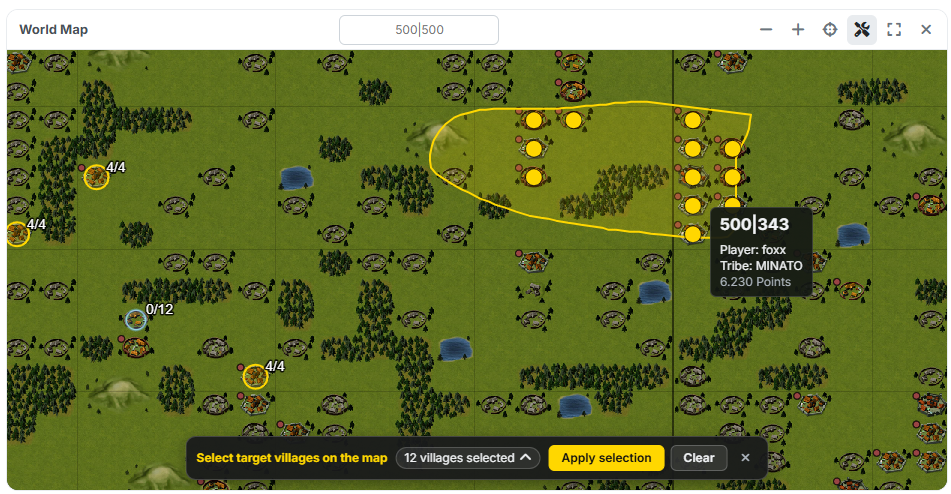

# Step 2: Targets

In step 2 you define **which villages are to be nobled**.

{ .screenshot }

!!! info "In manual mode this step is locked"
    If the [planning mode](die-zwei-wege.md) is set to **"Manual mode"**, you
    cannot open step 2 — there, targets are created automatically as soon as you
    plan a command on the map.

## 1. Adding targets

### Select on the map

{ .screenshot }

The button **"Open map"** unfolds the [overall map](gesamtkarte.md) and puts it
straight into selection mode. There you click individual villages or drag a
lasso around a whole area with the mouse button held down. At the bottom the bar
counts how many villages are selected; **"Apply selection"** enters them into
the list.

!!! info "What cannot be selected on the map"
    Barbarian villages and your own noble villages are blocked in the map
    selection. Via the coordinate field you can still enter them.

### Paste coordinates

As in step 1 the field accepts any text and picks out the coordinates itself;
below it reports back how many it recognised. The plus button puts them into the
list.

## 2. The target list

The metric **"Total targets"** shows how many targets are recorded. Below it
sits the table with coordinate, player, tribe and points. The red × removes a
row, **"Delete all"** empties the whole list; the search field filters by player
or coordinate.

## 3. Runtime priority

The column **"Runtime priority"** is a slider with three settings and controls
**from what distance** a target is served:

- **Short** — the target gets its train from the **nearest** origin village.
  Good for targets that should fall quickly.
- **Long** — the target gets its train from the **furthest** origin village.
  Good for putting far-flung noblemen to sensible use.
- **N.A.** — the default, no special treatment.

The order of assignment follows the same logic: the tool serves all **Short**
targets first, then the **Long** ones and finally **N.A.** So if you want to be
sure that a particular target gets a train, give it **Short**.

!!! warning "Deleting takes commands with it"
    If you remove a target for which commands are already planned, those
    commands go with it.

---

Next up: [Step 3: Settings](schritt3-einstellungen.md).
