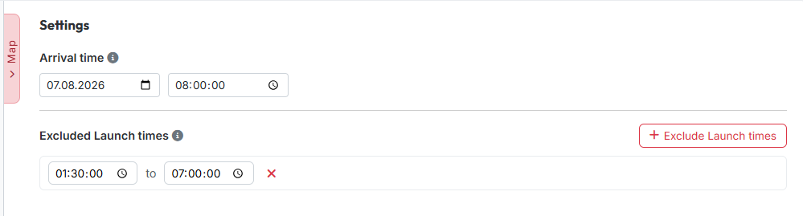

# Schritt 3: Einstellungen

Schritt 3 ist kurz: Hier legst du fest, **wann die Adelsgeschlechter eintreffen
sollen** — und welche Abschickzeiten dafür nicht in Frage kommen.

{ .screenshot }

## 1. Ankunftszeit

Unter **„Ankunftszeit"** trägst du Datum und Uhrzeit ein, zu der die AGs beim
Ziel ankommen sollen. Die Uhrzeit ist **sekundengenau**; die Vorgabe ist
`08:00:00`. Alle Abschickzeiten im Ergebnis rechnet das Tool von diesem
Zeitpunkt aus zurück.

Die Zeit gilt in der **Zeitzone der Welt**, nicht in deiner eigenen.

!!! info "Ohne Ankunftszeit geht nichts"
    Die Ankunftszeit ist Pflicht — auch im Handbetrieb. Solange sie fehlt, lehnt
    die Karte das Planen mit einem Hinweis ab.

## 2. Ausgeschlossene Abschickzeiten

Mit **„Ausschluss hinzufügen"** legst du Zeiträume an, in denen **nicht**
abgeschickt werden soll — typischerweise die Nacht. Je Zeile trägst du eine
Start- und eine Endzeit ein; über das rote × entfernst du sie wieder. Solange
nichts eingetragen ist, steht dort *„Keine ausgeschlossenen Zeiträume
definiert."*

Bei der Zuweisung überspringt das Tool dann alle Kombinationen, deren
Abschickzeit in einen dieser Zeiträume fiele.

!!! info "Gilt nur für die automatische Zuweisung"
    Die Ausschlüsse wirken auf die Trains, die **„Berechnen"** verteilt. Die
    Vorschläge unter **„Weitere AG-Optionen"** im Ergebnis sind davon nicht
    betroffen — dort entscheidest du selbst, was du nimmst.

!!! info "Im Handbetrieb ausgeblendet"
    Steht der [Planungsmodus](die-zwei-wege.md) auf **„Manuell planen"**, fehlt
    dieser Block ganz. Beim Planen auf der Karte weist das Tool aber trotzdem
    darauf hin, wenn eine Abschickzeit in einem gesperrten Zeitraum läge.

## 3. Rechnen

Den Knopf **„Berechnen"** findest du **nicht** auf dieser Seite, sondern unten
in der Schrittleiste — dort ist er aus jedem Schritt erreichbar. Er wird erst
scharf, wenn mindestens ein Herkunftsdorf **und** ein Zieldorf erfasst sind.

---

Weiter geht es mit [Schritt 4: Ergebnis](schritt4-ergebnis.md).
