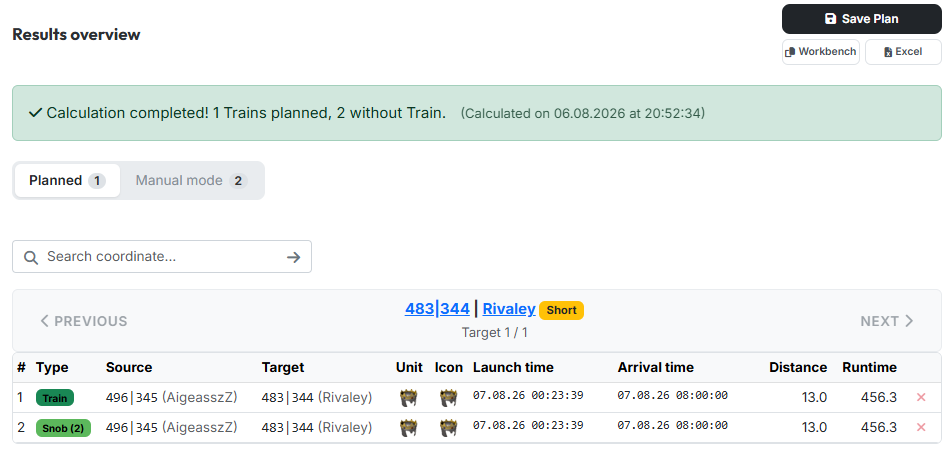
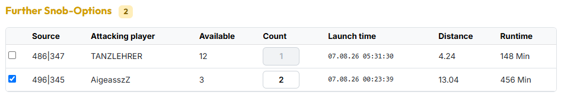

# Step 4: Results

Step 4 shows **what the tool has planned** — target by target. This is where you
top things up and save the plan.

{ .screenshot }

The step is locked at first. It opens as soon as a calculation has run or you
have loaded a saved plan — in manual mode already when snob-entries and an
arrival time exist.

## 1. Success banner and tabs

At the top a green banner sums up the result: how many trains could be planned,
how many targets were left **without** a train, and when the calculation ran.

Below it two tabs split up the targets:

- **"Planned"** — targets that received a complete train.
- **"Manual mode"** — targets for which it was not enough. Those you have to top
  up by hand (see section 3) or drop altogether.

The number in the tab says how many targets sit behind it. In manual mode the
tabs are gone; the pager then leads through **all** targets.

## 2. The commands of a target

Via the pager (**"Previous"** / **"Next"**) you walk through the targets; above
it stands the current target with coordinate, player and runtime priority, below
it the position (*"Target 1 / 12"*). The search field jumps straight to a
coordinate.

The table lists the commands of this target:

| Column | Meaning |
|---|---|
| **Type** | **Train** = full set of four, **Snob (n)** = single command carrying n noblemen |
| **Source** | origin village with player |
| **Target** | target village with player |
| **Unit** / **Icon** | slowest unit and workbench icon of the command |
| **Launch time** / **Arrival time** | in world time |
| **Distance** / **Runtime** | fields and minutes |

!!! info "The number in brackets is the count"
    **Snob (2)** means: this command carries two noblemen — it is not a
    sequential number. With exactly four it reads **Train** instead.

The red × at the end of a row removes a command. The noblemen go straight back
into the pool and are immediately available again under
**"Further Snob-Options"** — without recalculating.

## 3. Further Snob-Options

{ .screenshot }

Below the command table, **"Further Snob-Options"** lists every origin village
that could **additionally** still reach this target in time. Per row you see
source, attacking player, how many snobs are still **available** there, how many
of them you want to send (**Count**), plus launch time, distance and runtime.

Tick the box, enter the count — the command appears in the table above straight
away. This is how you top up targets for which the automatic assignment was not
enough.

If there are no options left, it reads *"No further snob-possibilities for this
target."*

## 4. Saving and exporting

At the top right there are three buttons:

- **"Save Plan"** — opens a small dialog with the field for the plan name. The
  checkbox **"Save as new Plan"** creates a copy instead of overwriting the
  loaded plan. You find saved plans again under
  [My Plans & Containers](../meine-plaene/gespeicherte-plaene.md) — that is also
  where they get published.
- **"Workbench"** — copies all commands as WB lines to the clipboard.
- **"Excel"** — downloads the plan as a spreadsheet.

---

Next up: [The Overall Map](gesamtkarte.md).
