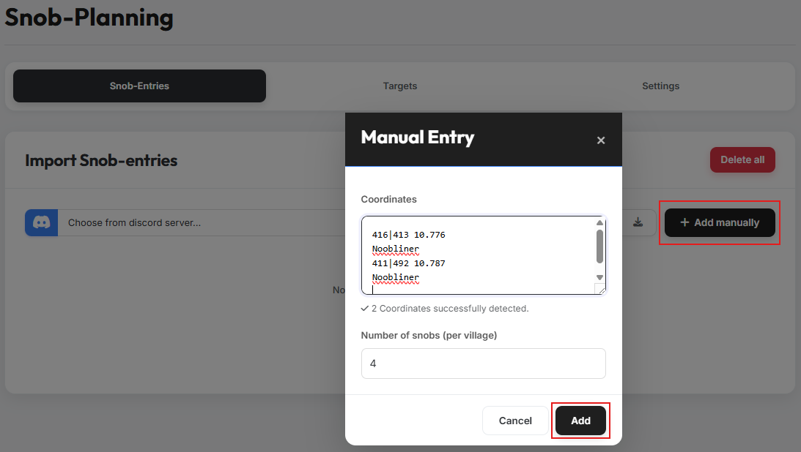

# Tab 1: Snob-Entries

{ .screenshot }

In Tab 1 you specify the noblemen you want to plan with.

There are two ways to import noblemen into the tool:

## 1. Import via the Discord bot

{ .screenshot }

Select the appropriate Discord server and click the import button. The
noblemen reported on the Discord server are then transferred to the tool
automatically.

!!! info "Multiple Discord servers"
    You can also import noblemen from several Discord servers. Just run the
    import one after another for each server.

## 2. Manual import

{ .screenshot }

Clicking the button for manual entries opens a modal. Paste the coordinates
of the source villages here — any additional text around them does not affect
the coordinate detection. Then enter the number of noblemen per village and
confirm your selection.

!!! info "Repeated imports"
    You can run the import multiple times in a row. If the same coordinate is
    imported again, the noblemen count from the most recent import takes
    precedence.

## 3. Overview of imported noblemen

{ .screenshot }

After the import, all noblemen are listed in a clear overview table. You can
also adjust the number of noblemen per coordinate here after the import.
