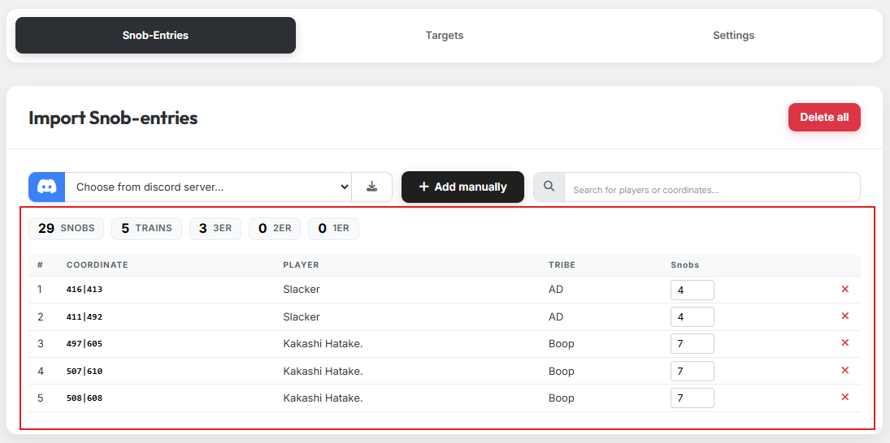

# Tab 1: AG-Meldungen

{ .screenshot }

In Tab 1 gibst du die Adelsgeschlechter an, die du verplanen möchtest.

Es gibt zwei Wege, Adelsgeschlechter in das Tool zu importieren:

## 1. Import über den Discord-Bot

{ .screenshot }

Wähle den passenden Discord-Server aus und klicke auf den Import-Button. Die
im Discord-Server gemeldeten Adelsgeschlechter werden automatisch in das
Tool übernommen.

!!! info "Mehrere Discord-Server"
    Du kannst Adelsgeschlechter auch von mehreren Discord-Servern importieren.
    Führe den Import dafür nacheinander für jeden Server aus.

## 2. Manueller Import

{ .screenshot }

Mit Klick auf den Button für manuelle Einträge öffnet sich ein Modal. Füge
hier die Koordinaten der Herkunftsdörfer ein — ob zusätzlicher Text dabei
steht, ist für die Erkennung der Koordinaten egal. Gib anschließend die
Anzahl der Adelsgeschlechter pro Dorf an und bestätige deine Auswahl.

!!! info "Mehrfach-Import"
    Du kannst den Import auch mehrmals hintereinander ausführen. Wird die
    gleiche Koordinate erneut importiert, gilt die Anzahl der
    Adelsgeschlechter aus dem zuletzt durchgeführten Import.

## 3. Übersicht der importierten Adelsgeschlechter

{ .screenshot }

Nach dem Import werden alle Adelsgeschlechter in einer Tabelle übersichtlich
aufgelistet. Hier kannst du die Anzahl der Adelsgeschlechter pro Koordinate
auch nachträglich noch korrigieren.
