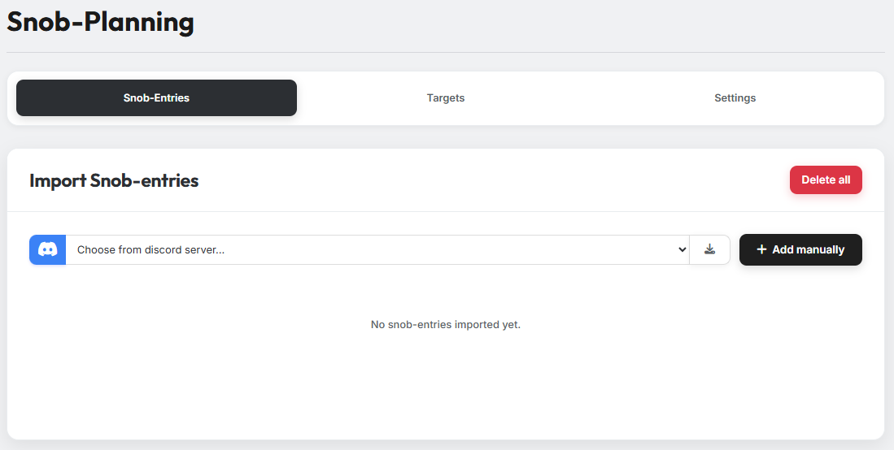
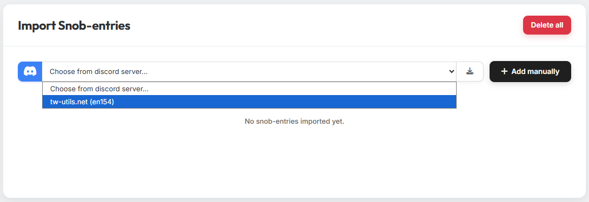

# Tab 1: AG-Meldungen

In Tab 1 gibst du die Adelsgeschlechter an, die du verplanen möchtest.

Es gibt zwei Wege, Adelsgeschlechter in das Tool zu importieren:

## 1. Import über den Discord-Bot

Wähle den passenden Discord-Server aus und klicke auf den Import-Button. Die
im Discord-Server gemeldeten Adelsgeschlechter werden automatisch in das
Tool übernommen.

## 2. Manueller Eintrag

Mit Klick auf den Button für manuelle Einträge öffnet sich ein Modal. Füge
hier die Koordinaten der Herkunftsdörfer ein — ob zusätzlicher Text dabei
steht, ist für die Erkennung der Koordinaten egal. Gib anschließend die
Anzahl der Adelsgeschlechter pro Dorf an und klicke auf **Add**.
