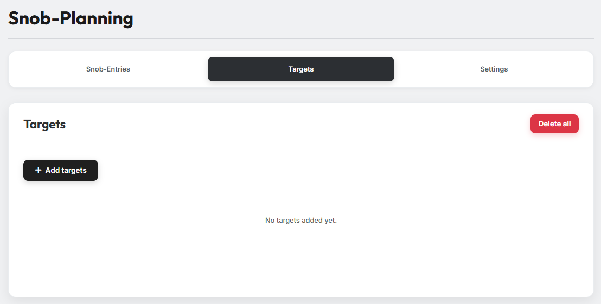
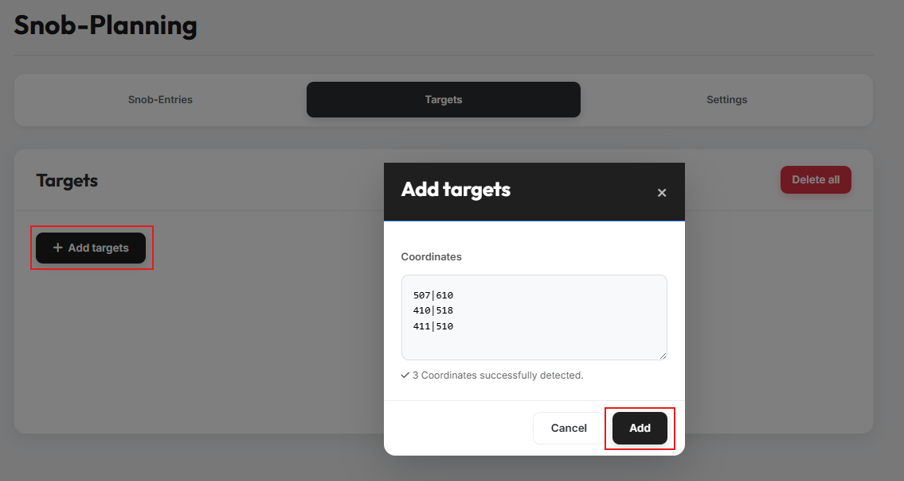
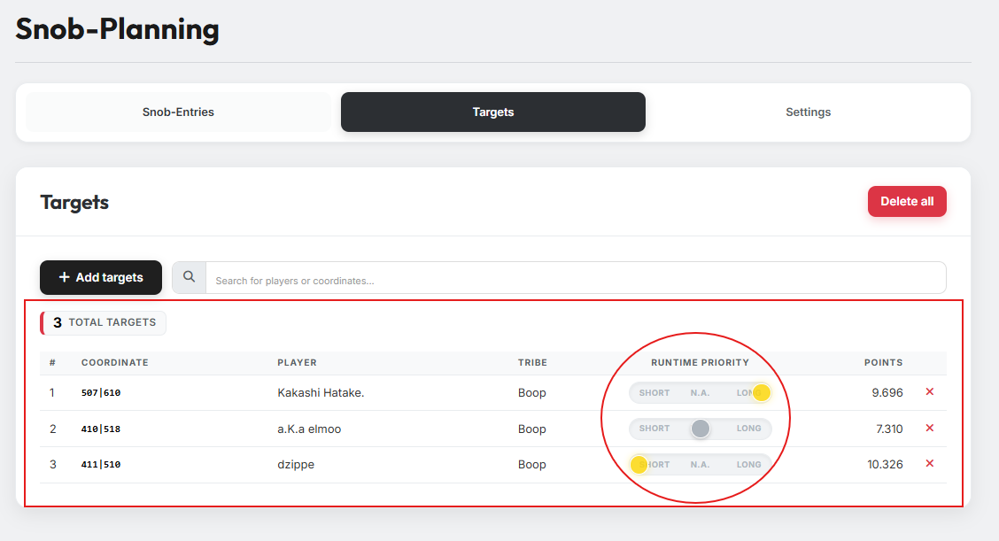

# Tab 2: Zieldörfer

{ .screenshot }

In Tab 2 trägst du die Dörfer ein, die du mit deinen Adelsgeschlechtern
angreifen möchtest.

## 1. Ziele hinzufügen

{ .screenshot }

Über den Button **„Ziele hinzufügen"** öffnet sich ein Modal. Füge dort die
Koordinaten der Zieldörfer ein — ob zusätzlicher Text zwischen oder neben den
Koordinaten steht, ist für die Erkennung egal. Das Tool zeigt dir an, wie
viele Koordinaten erkannt wurden. Bestätige anschließend mit **„Hinzufügen"**.

!!! info "Mehrfach-Import"
    Du kannst den Vorgang beliebig oft wiederholen, um weitere Ziele zu
    ergänzen.

## 2. Übersicht der Ziele

{ .screenshot }

Nach dem Hinzufügen werden alle Ziele in einer Tabelle übersichtlich
aufgelistet. Sie enthält die Koordinate, den Spieler und den Stamm sowie die
Punkte des Dorfes — und einen Slider für die **Laufzeit-Priorität** jedes
Ziels.

## 3. Laufzeit-Priorität

Über den Slider in der Spalte **„Runtime Priority"** legst du fest, mit
welcher Laufzeit ein Ziel angegriffen werden soll. Es gibt drei mögliche
Einstellungen:

- **Short** — Es wird versucht, eine möglichst **kurze** Laufzeit auf dieses
  Ziel zu realisieren. Der Planer wählt dafür ein möglichst **nah** am Ziel
  liegendes Herkunftsdorf. Short-Ziele werden zuerst verplant.
- **Long** — Es wird versucht, eine möglichst **lange** Laufzeit auf dieses
  Ziel zu realisieren. Der Planer wählt dafür ein möglichst **weit
  entferntes** Herkunftsdorf. Long-Ziele werden nach den Short-Zielen
  verplant.
- **N. A.** (Egal) — Es gibt keine Präferenz; der Planer ist bei der Auswahl
  des Herkunftsdorfs frei. Diese Ziele werden zuletzt verplant.
