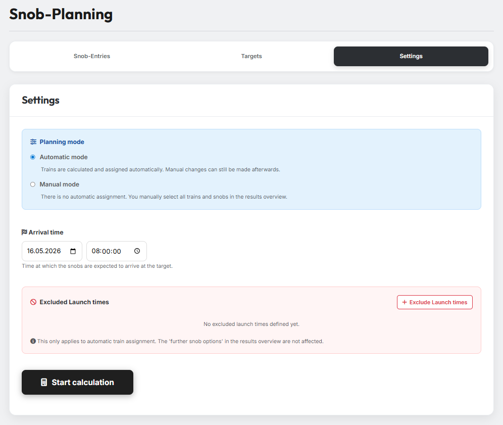
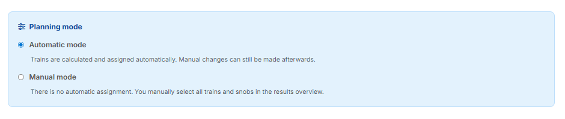
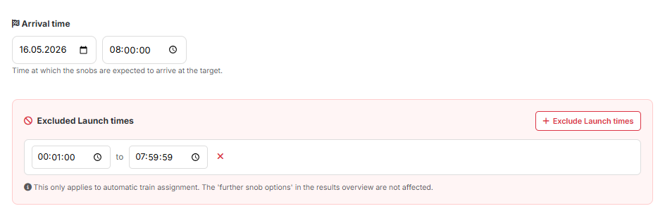

# Tab 3: Einstellungen

{ .screenshot }

In Tab 3 legst du fest, wie der Planer arbeiten soll und wann die
Adelsgeschlechter ihre Ziele erreichen.

## 1. Planungsmodus

{ .screenshot }

Der **Planungsmodus** bestimmt, ob die Zuordnung der Adelsgeschlechter
automatisch oder manuell erfolgt:

- **Automatik-Modus** — Trains und Adelsgeschlechter werden automatisch
  berechnet und zugeordnet. Manuelle Anpassungen sind danach trotzdem möglich.
- **Manueller Modus** — Es findet keine automatische Zuordnung statt. Du
  wählst alle Trains und Adelsgeschlechter in der Ergebnisübersicht selbst
  aus.

## 2. Ankunftszeit & Abschickzeiten

{ .screenshot }

Im Feld **Ankunftszeit** legst du Datum und Uhrzeit fest, an dem die
Adelsgeschlechter am Ziel eintreffen sollen. Daraus berechnet der Planer
automatisch die passenden Abschickzeiten der einzelnen Trains.

Über **„Abschickzeiten ausschließen"** kannst du zusätzlich ein oder mehrere
Zeitfenster festlegen, in denen keine Adelsgeschlechter abgeschickt werden
sollen — zum Beispiel nachts oder während deiner Arbeitszeit. Der Planer
berücksichtigt diese Sperrzeiten in seiner Berechnung.

!!! info "Gilt nur für die automatische Train-Zuordnung"
    Die ausgeschlossenen Abschickzeiten wirken sich ausschließlich auf die
    automatische Train-Zuordnung aus. Die „weiteren AG-Optionen" in der
    Ergebnisübersicht sind davon nicht betroffen.

## 3. Berechnung starten

Mit einem Klick auf den Button **„Berechnung starten"** führt das Tool die
Planung aus. Die Ergebnisse findest du anschließend in Tab 4.
