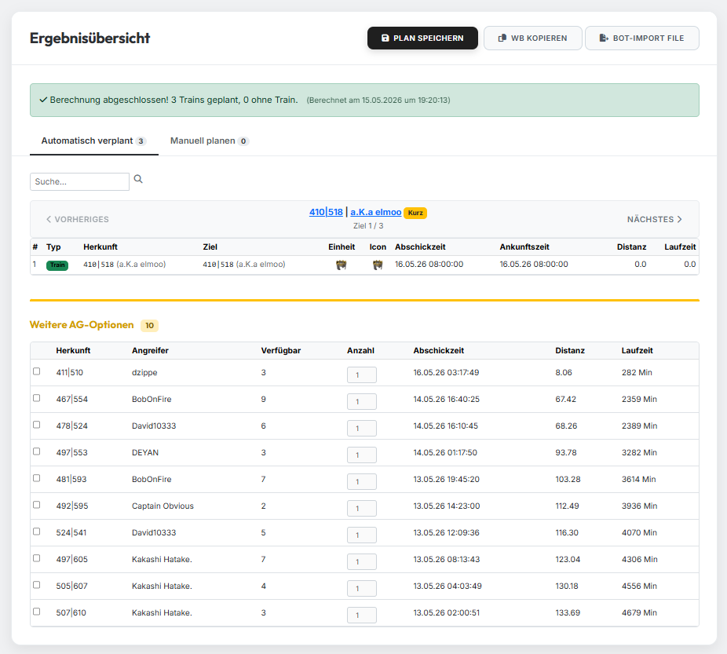
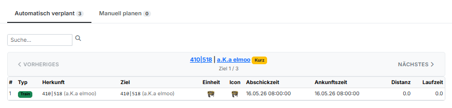
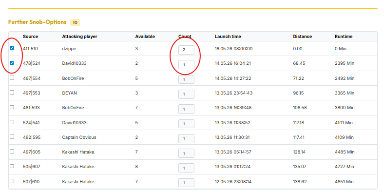
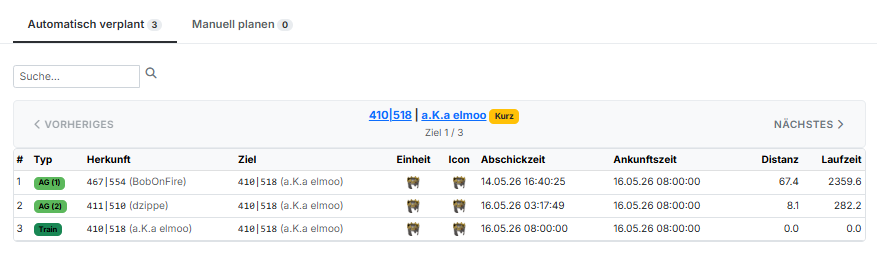
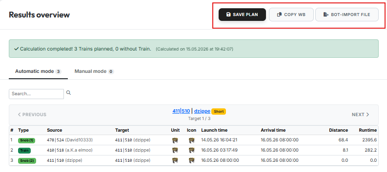

# Tab 4: Results Overview

{ .screenshot }

Tab 4 only appears once a calculation has been started in Tab 3. Here you
see the finished plan and can extend it manually if needed.

## 1. Train table

{ .screenshot }

For each target, the train table shows the planned train with source and
target village, slowest unit, launch and arrival time, distance and runtime.

Use the **"Previous"** and **"Next"** buttons to flip through the targets —
or jump directly to a specific coordinate via the search field.

## 2. Further Snob-Options

{ .screenshot }

Below the train table you find the **"Further Snob-Options"** section. Here
you can manually plan additional noblemen for the currently displayed
target by ticking the desired option's checkbox.

In the **"Count"** field you define how many noblemen from the respective
village should be used for this target. You can enter at most the number
shown under **"Available"**.

!!! info "Only runtime-feasible options"
    The list only shows options that are technically feasible in terms of
    runtime — i.e. depending on the world settings.

!!! info "Dynamic availability"
    The **"Available"** column always reflects only the noblemen that are
    actually still free in a village. If you assign, for example, 2 of 4
    available noblemen to another target, only 2 noblemen from that village
    remain available for the other targets — and that is exactly what is
    displayed here.

## 3. Result after manual selection

{ .screenshot }

As soon as you tick an option from "Further Snob-Options", it is added to
the train table above and shown there as an additional row (e.g.
**Snob (1)**, **Snob (2)**) alongside the planned train.

## 4. Saving & exporting the plan

{ .screenshot }

Above the results overview you have two options at your disposal:

- **Save Plan** — saves the current plan to your account so you can open it
  again later.
- **Copy WB** — copies the ready-to-paste Workbench commands to your
  clipboard.
