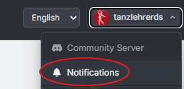
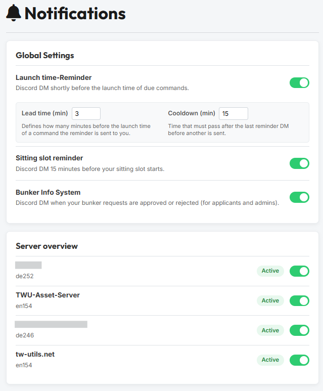
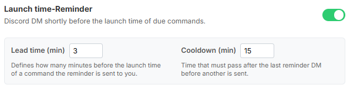
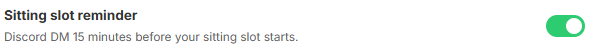
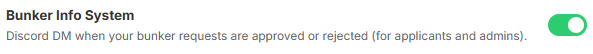
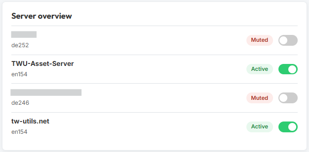
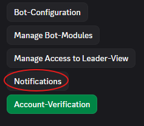
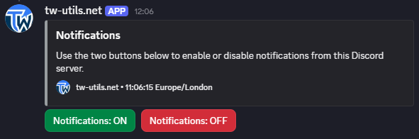

# Benachrichtigungen

Der tw-utils-Bot kann dich per Discord-DM an wichtige Ereignisse erinnern — etwa kurz bevor deine Befehle abgeschickt werden, vor dem Start eines übernommenen Sitting-Slots oder wenn ein Bunker-Antrag bearbeitet wurde. Du kannst genau steuern, **welche** dieser Erinnerungen du bekommst und **aus welchen Discord-Servern** sie überhaupt verschickt werden dürfen.

Es gibt zwei Wege, diese Einstellungen zu pflegen:

1. **Mit Account auf [tw-utils.net](https://tw-utils.net)** — granular pro Reminder-Typ und pro Server, inklusive Vorlaufzeit und Cooldown.
2. **Ohne Website-Account** — einfacher Komplett-Schalter `Notifications: ON / OFF` pro Server direkt über den Discord-Bot.

## 1. Voraussetzung: Discord-Account verknüpft

Benachrichtigungen werden ausschließlich als Discord-Direktnachricht zugestellt. Wer keinen Discord-Account mit seinem tw-utils-Profil verknüpft hat, sieht auf der Notifications-Seite den Hinweis:

> Du hast keinen Discord-Account verknüpft. Notification-Einstellungen sind nur für Discord-verknüpfte Accounts verfügbar.

Sobald die Verknüpfung steht, sind alle Einstellungen aus den folgenden Abschnitten verfügbar.

## 2. Einstellungen für User mit Website-Account

### 2.1 Wo finde ich die Einstellungen?

Klicke oben rechts auf deinen Benutzer-Namen und wähle im Dropdown den Eintrag `Benachrichtigungen`.

{ .screenshot }

Du landest auf der Seite `Benachrichtigungen` mit zwei Karten: `Globale Einstellungen` und `Server-Übersicht`.

{ .screenshot }

### 2.2 Globale Einstellungen

Die Karte `Globale Einstellungen` steuert pro Reminder-Typ, ob du diese Art von DM überhaupt bekommen möchtest. Es gibt drei Typen.

#### Abschick-Reminder

> *Discord-DM kurz vor Abschickzeit fälliger Befehle.*

Sobald du den Toggle aktivierst, klappen zwei Zusatzfelder auf, mit denen du den Reminder feinjustieren kannst.

{ .screenshot }

- **`Vorlaufzeit (Min)`** — Definiert wie viele Minuten vor der Abschickzeit eines Befehls die Erinnerung an dich gesendet wird.
    *Wertebereich: 1–15 Minuten. Default: 5 Minuten.*
- **`Cooldown (Min)`** — Zeit die nach der letzten Reminder-DM vergehen muss, bevor eine weitere gesendet wird.
    *Wertebereich: 1–60 Minuten. Default: 15 Minuten.*

!!! info "Beispiel"
    Vorlaufzeit `5`, Cooldown `15`. Ein Befehl ist um `14:00` fällig → die DM kommt um `13:55`. Wird zwischen `13:55` und `14:10` ein weiterer Befehl fällig, sendet der Bot keine zweite DM — er wartet bis das Cooldown-Fenster abgelaufen ist. Mehrere zeitgleich fällige Befehle derselben Welt werden ohnehin in **einer** DM zusammengefasst.

#### UV-Slot-Reminder

> *Discord-DM 15 Minuten vor Beginn deines Sitting-Slots.*

{ .screenshot }

Diese Erinnerung gehört zum [Account-Sitting-System](discord-bot/sitting-system.md) und feuert 15 Minuten vor Beginn eines Sitting-Slots, den du übernommen hast. Die Vorlaufzeit ist fix und nicht einstellbar.

#### Bunker-Info-System

> *Discord-DM bei Annahme/Ablehnung deiner Bunker-Anträge (für Antragsteller und Admins).*

{ .screenshot }

Diese Erinnerung gehört zum [Bunker-Information-System](discord-bot/bunker-info.md). Du bekommst eine DM, sobald ein Admin deinen Bunker- oder Top-Up-Antrag annimmt oder ablehnt. Auch Admins können die DM für ihre eigenen bearbeiteten Anträge aktivieren.

### 2.3 Server-Übersicht

Die Karte `Server-Übersicht` listet alle Discord-Server, in denen du in einer für tw-utils relevanten Guild Mitglied bist. Pro Server kannst du DMs aus diesem Server komplett unterdrücken — unabhängig davon, welche der drei Reminder-Typen oben aktiv sind.

{ .screenshot }

- **`Aktiv`** (grüne Pill, Toggle an) — DMs aus diesem Server werden zugestellt.
- **`Stumm`** (rote Pill, Toggle aus) — DMs aus diesem Server werden komplett unterdrückt.

Unter dem Servernamen steht zusätzlich die Welt, mit der dein TW-Account in dieser Guild verknüpft ist (z. B. `de252`).

Falls die Liste leer ist, zeigt die Karte den Hinweis:

> Keine Server zur Anzeige. Sobald du in einer Guild verknüpft bist oder einen Server-Schalter setzt, erscheint diese Liste hier.

## 3. Einstellungen für User ohne Website-Account

Wer keinen Account auf tw-utils.net hat, kann pro Discord-Server trotzdem grob steuern, ob er DMs vom Bot bekommen möchte — über einen Button im Bot-Setup-Channel.

### 3.1 Notifications-Button im bot-config-Channel

Im `bot-config`-Channel (oder dem Channel, in dem die Bot-Setup-Buttons liegen) gibt es eine Schalter-Leiste. Dort findest du den Button `Notifications`.

{ .screenshot }

### 3.2 Notifications: ON / OFF

Ein Klick auf `Notifications` postet ein Embed mit zwei farbigen Buttons.

{ .screenshot }

- **`Notifications: ON`** (grün) — aktiviert DMs für diesen Discord-Server. Beim allerersten Klick werden zusätzlich die drei Reminder-Typen (`Abschick-Reminder`, `UV-Slot-Reminder`, `Bunker-Info-System`) mit ihren Default-Werten aktiviert, damit überhaupt etwas verschickt wird. Hattest du die Typen vorher schon individuell auf der Website konfiguriert, bleiben deine Werte erhalten.
- **`Notifications: OFF`** (rot) — schaltet diesen Server auf stumm. Die globalen Reminder-Typ-Einstellungen werden dabei nicht angefasst, du bekommst aus diesem Server schlicht keine DMs mehr.

!!! info "Mehr Kontrolle? Account auf tw-utils.net anlegen"
    Wer einzelne Reminder-Typen abschalten oder die Vorlaufzeit/den Cooldown des Abschick-Reminders anpassen möchte, legt sich am besten einen Account auf [tw-utils.net](https://tw-utils.net) an und verknüpft seinen Discord. Der Discord-Button bleibt dann weiterhin funktional und steuert dieselbe Server-Einstellung.

## 4. Zusammenspiel der Schalter

!!! info "DM kommt nur, wenn beide Schalter AN sind"
    Vor jeder DM prüft der Bot **zwei** Bedingungen — beide müssen erfüllt sein:

    1. Der zugehörige Reminder-Typ ist in den `Globalen Einstellungen` aktiv (`Abschick-Reminder` / `UV-Slot-Reminder` / `Bunker-Info-System`).
    2. Der Discord-Server, aus dem das Event stammt, steht in der `Server-Übersicht` auf `Aktiv` (gleichbedeutend mit `Notifications: ON` im Bot-Channel).

    Die Server-Steuerung ist auf beiden Wegen **dieselbe** Einstellung: Was du im Discord-Bot mit `Notifications: ON/OFF` umlegst, siehst du anschließend auch in der `Server-Übersicht` auf der Website — und umgekehrt.
