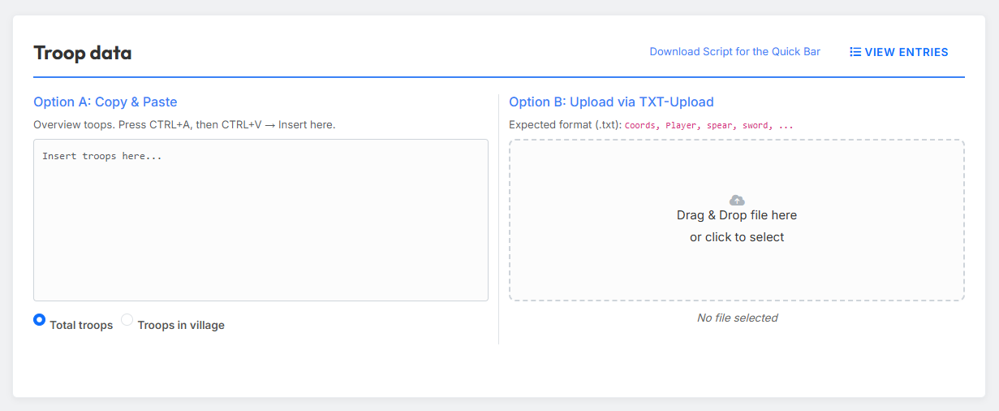
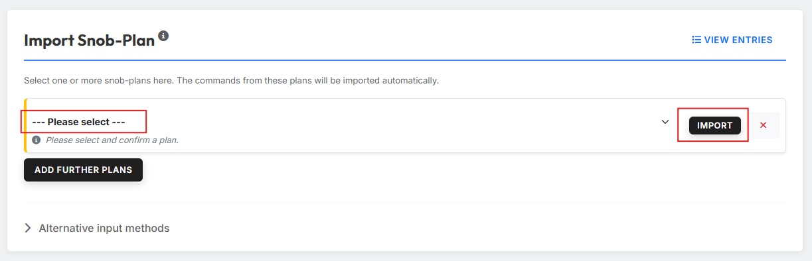
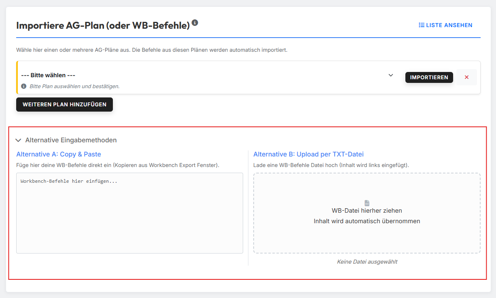
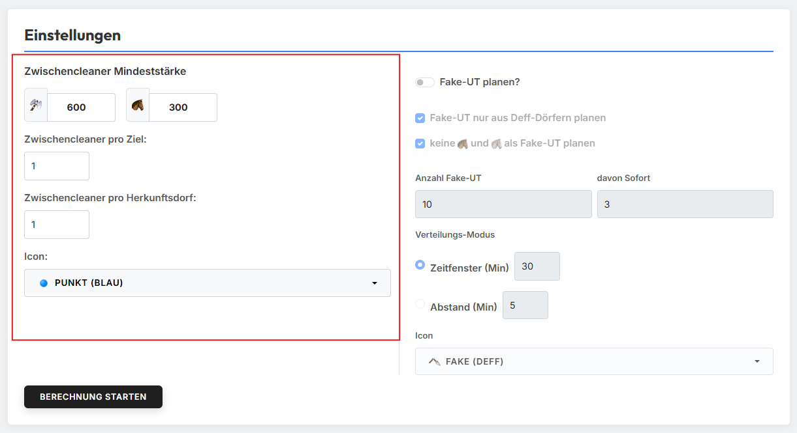
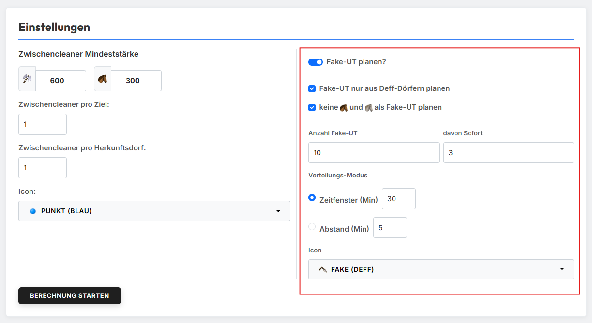

# Anleitung

Das Tool berechnet **Zwischencleaner** und **Fake-UT-Befehle**, deren
Abschickzeiten möglichst nah an einem anderen Befehl liegen — typischerweise
einem Adelsgeschlecht bzw. Train. So lassen sich Cleaner und Fake-UT
zeitlich passgenau zu einem bestehenden AG-Plan ergänzen.

## 1. Truppen importieren

{ .screenshot }

Im Bereich **„Troop data"** lädst du die Truppen hoch, aus denen die
Zwischencleaner und Fake-UT berechnet werden sollen. Es stehen zwei Wege
zur Verfügung.

### Option A: Copy & Paste

Kopiere die Truppen-Übersicht aus dem Ingame-Truppendaten-Bildschirm
(Strg+A, Strg+C) und füge sie in das linke Textfeld ein. Über die beiden
Radio-Buttons legst du fest, welche Spalte aus der Ingame-Ansicht das Tool
verwenden soll:

- **Total troops** — die insgesamt vorhandenen Truppen (eigene + unterwegs).
- **Troops in village** — nur die aktuell im Dorf stehenden Truppen.

### Option B: TXT-Upload

Alternativ kannst du eine TXT-Datei in einem festen Format hochladen
(Koordinaten, Spieler, Speere, Schwerter usw. pro Zeile). Diese Datei
erzeugst du am bequemsten über das
[Schnellleisten-Script „Download Tribe Info"](https://forum.tribalwars.net/index.php?threads/download-tribe-info.285469/).

!!! info "Liste ansehen"
    Über den Button **„Liste ansehen"** kannst du dir die importierten
    Truppen jederzeit anzeigen lassen und prüfen.

## 2. AG-Plan importieren

{ .screenshot }

Im Bereich **„Importiere AG-Plan (oder WB-Befehle)"** wählst du einen
bereits in tw-utils erstellten AG-Plan aus. Die Befehle aus diesem Plan
werden automatisch übernommen — auf Basis dieser Befehle berechnet das Tool
anschließend die passenden Zwischencleaner und Fake-UT.

Über **„Weiteren Plan hinzufügen"** kannst du mehrere Pläne nacheinander
importieren.

!!! info "Liste ansehen"
    Über den Button **„Liste ansehen"** kannst du dir die importierten
    AG-Befehle jederzeit anzeigen lassen.

### Alternative Eingabemethoden

{ .screenshot }

Hast du keinen tw-utils-Plan zur Hand, kannst du den Klappbereich
**„Alternative Eingabemethoden"** ausklappen und auf zwei weiteren Wegen
einlesen:

- **Alternative A: Copy & Paste** — füge die Workbench-Befehle direkt in
  das Textfeld ein (z. B. kopiert aus dem Workbench-Export-Fenster).
- **Alternative B: Upload per TXT-Datei** — lade eine TXT-Datei mit
  Workbench-Befehlen hoch; der Inhalt wird automatisch ins Textfeld
  übernommen.

## 3. Einstellungen

### Zwischencleaner

{ .screenshot }

Über das Feld **„Zwischencleaner Mindeststärke"** legst du die geforderte
Stärke des Cleaners fest — als Anzahl **Äxte** und Anzahl **leichter
Kavallerie**.

!!! info "So wird die Mindeststärke ausgewertet"
    Aus deinen Eingaben berechnet das Tool die **Angriffsstärke** des
    Cleaners. Anschließend wird jede beliebige Kombination offensiver
    Einheiten als Zwischencleaner zugelassen, solange sie diese
    Angriffsstärke erreicht. Es können also auch reine Lkav-Cleaner
    verplant werden, sofern genügend leichte Kavallerie im Dorf vorhanden
    ist, um die geforderte Angriffsstärke abzudecken.

Zusätzlich kannst du festlegen:

- **Zwischencleaner pro Ziel** — wie viele Cleaner pro Ziel verplant werden.
- **Zwischencleaner pro Herkunftsdorf** — wie viele Cleaner aus demselben
  Herkunftsdorf maximal verschickt werden.
- **Icon** — welches Icon die Cleaner-Befehle in der Workbench erhalten
  sollen.

### Fake-UT

{ .screenshot }

Über den Schalter **„Fake-UT planen?"** aktivierst du die Berechnung der
Fake-UT. Anschließend stehen dir zwei Ankreuzkästchen zur Verfügung:

- **„Fake-UT nur aus Deff-Dörfern planen"** — beschränkt die Auswahl der
  Herkunftsdörfer auf rein defensive Dörfer.
- **„keine Lkav und Späher als Fake-UT planen"** — schließt schnelle
  Einheiten als Fake-UT aus.

!!! info "Welteneinstellungen werden berücksichtigt"
    Das Tool berücksichtigt bei der Planung der Fake-UT die
    Welteneinstellungen rund um Unterstützungen im eigenen Stamm.

Zusätzlich kannst du die **Anzahl Fake-UT** festlegen sowie das **Icon**
auswählen, das den Fake-UT-Befehlen in der Workbench zugewiesen wird.

## 4. Berechnung starten

Mit Klick auf den Button **„Berechnung starten"** führt das Tool die
Berechnung der Zwischencleaner und Fake-UT aus.
