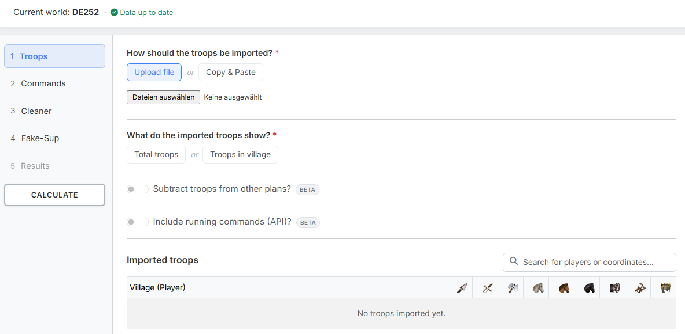
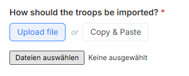
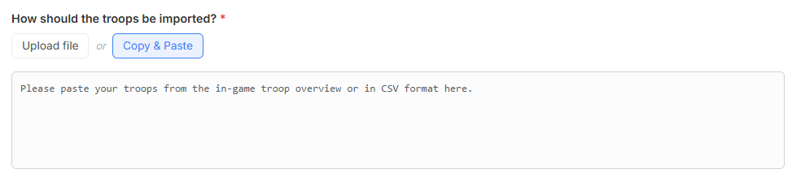
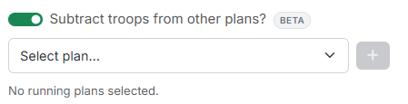
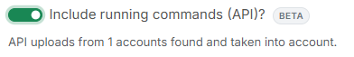
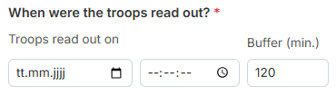

# Step 1: Troops

The tool calculates **catapult-cleaners** and **Fake-Sup** whose launch times
lie as close as possible to another command — typically a nobleman or train.
This is how cleaners and Fake-Sup can be added to an existing snob-plan with
precise timing.

In step 1 you define **which villages** may be planned from.

{ .screenshot }

On the left you find the **step bar**. You can jump between the steps at any
time — the tool does not enforce a fixed order. At the very bottom sits the
**"Calculate"** button, which is reachable from everywhere. Step **5. Results**
stays locked until a calculation has run.

Above the step bar the currently selected world is shown. It comes from the
world selection in the main menu — all plans, world data and travel times refer
to it.

## 1. Importing troops

Under **"How should the troops be imported?"** you switch between two equivalent
ways. **"Upload file"** is preselected; only the way that is currently switched
on is visible.

### Upload file

{ .screenshot }

Via **"Upload file"** you load one or more TXT files. The most convenient way
to create these files is the
[quickbar script "Download Tribe Info"](https://forum.tribalwars.net/index.php?threads/download-tribe-info.285469/).

Expected format:

```
Coords,Player,spear,sword,axe,archer,spy,light,marcher,heavy,ram,catapult,knight,snob
483|520,Testuser A,2421,6099,100,5963,50,50,3632,200,5,279,0,8
543|538,Testuser A,100,100,6027,100,6,3014,100,100,159,5,0,0
467|559,Testuser A,3779,4836,100,4803,40,50,6309,1584,5,80,0,0
465|523,Testuser B,4298,5495,100,6752,23,50,5761,1131,5,35,0,0
468|515,Testuser B,721,4160,100,2280,61,50,5935,832,5,308,0,4
```

What matters is the **header row**: it must contain the word `Coords`, and the
columns after it must name the units in the same order in which they appear in
the rows. Which units occur depends on the world — on worlds without archers,
`archer` and `marcher` simply drop out. The first column is always the
coordinate, the second always the player name.

### Copy & Paste

{ .screenshot }

Via **"Copy & Paste"** you paste the troops straight from the in-game troop
overview (Ctrl+A, Ctrl+C). Alternatively the field also accepts the same CSV
data as the file upload — header row included.

!!! info "The way that is switched on counts"
    File upload and copy & paste are **not** merged. The tool calculates with
    whichever way is currently switched on. So if you switch back to "Upload
    file" after pasting, the file applies again — and vice versa.

## 2. What do the imported troops show?

This choice is mandatory for **both** import paths and is **not preselected**:

- **"Total troops"** — all troops of the village, including the ones currently
  on their way.
- **"Troops in village"** — only the troops currently standing in the village.

When pasting from the in-game overview, the tool looks for exactly those rows
that begin with the selected keyword.

!!! info "Without this choice seemingly nothing happens"
    As long as no troop type is selected, the tool cannot evaluate the pasted
    in-game text — the table below then stays empty although there is data in
    the field. The field is therefore highlighted in red as soon as troops are
    present and the choice is still missing. If you start the calculation
    anyway, it aborts with a corresponding message.

## 3. Subtracting troops from other plans

{ .screenshot }

The switch **"Subtract troops from other plans?"** is the heart of
**consecutive planning**: when an operation is already running, the troops
planned there are no longer available for the new plan — yet they are still
contained in your uploaded troop data, because you read it out before sending.

Select the running plans in the dropdown **"Select plan…"** and add them with
the plus button. The selected plans appear as a list below and can be removed
individually via the red ×. As long as nothing is selected, it reads *"No
running plans selected."*

The tool then works out which units are bound in which village and subtracts
them.

## 4. Including running commands (API)

{ .screenshot }

The switch **"Include running commands (API)?"** goes one step further than the
previous one: instead of calculating from saved plans, it uses the **actually
running commands** that your fellow players have uploaded through the tw-utils
API — for instance with a userscript of their own (see
[Running Commands](../leader-view/laufende-befehle.md)). That is more precise,
because it also covers commands that never came from a plan at all.

Below the switch you see a line such as *"API uploads from 12 accounts found
and taken into account."* — or *"No uploads available for this world."* if
nobody has uploaded anything yet.

The switch only appears if you hold the right to read running commands on a
Discord server for this world.

!!! info "Both switches are independent"
    You can use them individually or together. Both work in both troop modes —
    "Troops in village" shows what has not been sent yet, "Total troops" also
    what has not returned yet.

## 5. When were the troops read out?

{ .screenshot }

As soon as one of the two switches from section 3 or 4 is active, this shared
section appears. It is a **mandatory field**, because without it the tool
cannot decide which commands were already on their way at the time you read out
your troops and which were not.

- **"Troops read out on"** — date and time at which you copied the troop
  overview or created the file.
- **"Buffer (min.)"** — a safety window around that point in time, default
  `120`. It absorbs anything that happened between reading out and planning.

Both fields apply to **both** switches — you only enter them once.

## 6. Imported troops

At the very bottom sits the permanent table **"Imported troops"**. Per row it
shows the **village (player)** and behind it the units that exist on this
world. Use the search field to filter by player or coordinate.

This is how you see immediately whether the import really contains what you
expected.

---

Next up: [Step 2: Commands](schritt2-befehle.md).
