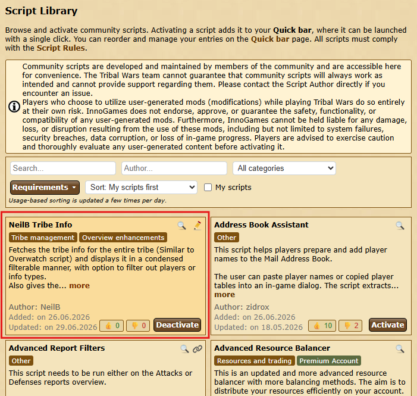

# Schritt 1: Truppen

Das Tool berechnet **Zwischencleaner** und **Fake-UT**, deren Abschickzeiten
möglichst nah an einem anderen Befehl liegen — typischerweise an einem
Adelsgeschlecht bzw. Train. So lassen sich Cleaner und Fake-UT zeitlich
passgenau zu einem bestehenden AG-Plan ergänzen.

In Schritt 1 legst du fest, **aus welchen Dörfern** geplant werden darf.

{ .screenshot }

Links steht die **Schrittleiste**. Du kannst jederzeit zwischen den Schritten
hin- und herspringen — eine feste Reihenfolge erzwingt das Tool nicht. Ganz
unten sitzt der Knopf **„Berechnen"**, der von überall aus erreichbar ist.
Schritt **5. Ergebnis** bleibt gesperrt, bis eine Berechnung durchgelaufen
ist.

Über der Schrittleiste steht die aktuell gewählte Welt. Sie kommt aus der
Weltauswahl im Hauptmenü — alle Pläne, Weltdaten und Laufzeiten beziehen sich
darauf.

## 1. Truppen importieren

Unter **„Wie sollen die Truppen importiert werden?"** schaltest du zwischen zwei
gleichwertigen Wegen um. Vorbelegt ist **„Datei hochladen"**; sichtbar ist immer
nur der Weg, der gerade eingeschaltet ist.

### Datei hochladen

{ .screenshot }

Über **„Datei hochladen"** lädst du eine oder mehrere Dateien ein — erlaubt
sind die Endungen `.txt`, `.csv` und `.json`. Angenommen werden **zwei
Formate**; welches vorliegt, erkennt das Tool am **Inhalt**. Du musst nirgends
auswählen, welches du hochlädst.

Die Datei muss Truppen enthalten — ein reiner Gebäude-Export wird
abgelehnt. Ebenso abgelehnt wird
eine Datei mit Einheiten, die es auf der gewählten Welt gar nicht gibt (etwa
die Datei einer Bogenschützen-Welt auf einer Welt ohne Bogenschützen); sie wird
dann nicht halb eingelesen, sondern mit einer Meldung zurückgewiesen.

**Format 1: „Download Tribe Info"** — das
[Schnellleisten-Script](https://forum.tribalwars.net/index.php?threads/download-tribe-info.285469/)
lädt eine fertige Datei herunter.

Erwartetes Format:

```
Coords,Player,spear,sword,axe,archer,spy,light,marcher,heavy,ram,catapult,knight,snob
483|520,Testuser A,2421,6099,100,5963,50,50,3632,200,5,279,0,8
543|538,Testuser A,100,100,6027,100,6,3014,100,100,159,5,0,0
467|559,Testuser A,3779,4836,100,4803,40,50,6309,1584,5,80,0,0
465|523,Testuser B,4298,5495,100,6752,23,50,5761,1131,5,35,0,0
468|515,Testuser B,721,4160,100,2280,61,50,5935,832,5,308,0,4
```

Entscheidend ist die **Kopfzeile**: Sie muss das Wort `Coords` enthalten, und
die Spalten danach müssen die Einheiten in der Reihenfolge benennen, in der
sie in den Zeilen stehen. Welche Einheiten vorkommen, hängt von der Welt ab —
auf Welten ohne Bogenschützen fallen `archer` und `marcher` einfach weg. Die
erste Spalte ist immer die Koordinate, die zweite immer der Spielername.

**Format 2: „NeilsTribeInfo"** — dieses Script lädt **keine** Datei herunter,
sondern kopiert das Ergebnis über **„Copy CSV"** bzw. **„Copy JSON"** in die
Zwischenablage. Im Planer ist das kein Umweg: Du fügst den Inhalt direkt in das
Feld **„Copy & Paste"** ein — eine Datei musst du dafür gar nicht erst anlegen.
Nur der Leader-View und der Discordbot kennen ausschließlich den Datei-Upload;
für sie speicherst du den Inhalt vorher als `.txt`, `.csv` oder `.json`.

Wo es die Ingame-**Skriptbibliothek** gibt — auf den .net-Welten etwa —, musst
du dafür nichts installieren: Dort steht es als **„NeilB Tribe Info"**, und ein
Klick auf **„Activate"** legt es in deine Schnellleiste. Im Bild steht
stattdessen **„Deactivate"**, weil das Script dort schon aktiv ist.

{ .screenshot }

### Copy & Paste

{ .screenshot }

Über **„Copy & Paste"** fügst du die Truppen direkt aus der
Ingame-Truppenübersicht ein (Strg+A, Strg+C). Alternativ nimmt das Feld
dieselben Daten wie der Datei-Upload entgegen — inklusive Kopfzeile. Das gilt
für beide Dateiformate, also auch für das, was „NeilsTribeInfo" über **„Copy
CSV"** bzw. **„Copy JSON"** in die Zwischenablage legt.

!!! info "Es zählt der eingeschaltete Weg"
    Datei-Upload und Copy & Paste werden **nicht** zusammengeführt. Gerechnet
    wird mit dem Weg, der gerade eingeschaltet ist. Schaltest du nach dem
    Einfügen zurück auf „Datei hochladen", gilt also wieder die Datei — und
    umgekehrt.

## 2. Was zeigen die importierten Truppen?

Diese Auswahl ist für **beide** Importwege Pflicht und **nicht vorbelegt**:

- **„Truppen insgesamt"** — alle Truppen des Dorfes, also auch die gerade
  unterwegs befindlichen.
- **„Truppen im Dorf"** — nur die aktuell im Dorf stehenden Truppen.

Beim Einfügen aus der Ingame-Übersicht sucht das Tool genau die Zeilen, die
mit dem gewählten Schlüsselwort beginnen.

Das Format **„NeilsTribeInfo"** nennt seinen Truppen-Typ selbst: Die Seite
„Truppen" ergibt **„Truppen insgesamt"**, die Seite „Verteidigung" ergibt
**„Truppen im Dorf"** — unterwegs befindliche Truppen werden dabei bewusst
nicht übernommen. Nennt eine Datei genau einen Truppen-Typ, springt die
Auswahl automatisch darauf; beim Format „Download Tribe Info" passiert das
nicht. Entscheidend bleibt in jedem Fall deine Auswahl: Passt sie nicht zur
Datei, kommt eine Meldung, die nennt, was tatsächlich drinsteht.

Ein Wechsel des Truppen-Typs liest bereits hochgeladene Dateien neu ein — du
musst sie also nicht noch einmal auswählen.

!!! info "Ohne diese Wahl passiert scheinbar nichts"
    Solange kein Truppen-Typ gewählt ist, kann das Tool den eingefügten
    Ingame-Text nicht auswerten — die Tabelle unten bleibt dann leer, obwohl
    Daten im Feld stehen. Das Feld wird deshalb rot hervorgehoben, sobald
    Truppen da sind und die Wahl noch fehlt. Startest du die Berechnung
    trotzdem, bricht sie mit einem entsprechenden Hinweis ab.

## 3. Truppen aus anderen Plänen abziehen

{ .screenshot }

Der Schalter **„Truppen aus anderen Plänen abziehen?"** ist der Kern der
**konsekutiven Planung**: Wenn bereits eine Aktion läuft, stehen die dort
verplanten Truppen für die neue Planung nicht mehr zur Verfügung — sie sind
aber trotzdem noch in deinen hochgeladenen Truppendaten enthalten, weil du sie
vor dem Abschicken ausgelesen hast.

Wähle im Dropdown **„Plan wählen…"** die laufenden Pläne aus und füge sie mit
dem Plus-Knopf hinzu. Die ausgewählten Pläne erscheinen als Liste darunter und
lassen sich über das rote × einzeln wieder entfernen. Solange nichts gewählt
ist, steht dort *„Keine laufenden Pläne ausgewählt."*

Das Tool rechnet dann aus, welche Einheiten in welchem Dorf gebunden sind, und
zieht sie ab.

## 4. Laufende Befehle (API) einbeziehen

{ .screenshot }

Der Schalter **„Laufende Befehle (API) einbeziehen?"** geht einen Schritt
weiter als der vorige: Statt aus gespeicherten Planungen zu rechnen, nutzt er
die **tatsächlich laufenden Befehle**, die deine Mitspieler über die
tw-utils-API hochgeladen haben — etwa mit einem eigenen Userscript (siehe
[Laufende Befehle](../leader-view/laufende-befehle.md)). Das ist genauer, weil
es auch Befehle erfasst, die gar nicht aus einer Planung stammen.

Unter dem Schalter steht eine Zeile wie *„API-Uploads von 12 Accounts gefunden
und berücksichtigt."* — oder *„Keine Uploads für diese Welt vorhanden."*, wenn
noch niemand hochgeladen hat.

Der Schalter erscheint nur, wenn du auf einem Discord-Server dieser Welt das
Recht hast, laufende Befehle zu lesen.

!!! info "Beide Schalter sind unabhängig"
    Du kannst sie einzeln oder zusammen benutzen. Beide arbeiten in beiden
    Truppen-Modi — „Truppen im Dorf" zeigt, was noch nicht abgeschickt wurde,
    „Truppen insgesamt" auch das, was noch nicht zurück ist.

## 5. Wann wurden die Truppen ausgelesen?

{ .screenshot }

Sobald einer der beiden Schalter aus Abschnitt 3 oder 4 aktiv ist, erscheint
dieser gemeinsame Bereich. Er ist ein **Pflichtfeld**, denn ohne ihn kann das
Tool nicht entscheiden, welche Befehle zum Zeitpunkt deines Truppen-Auslesens
schon unterwegs waren und welche noch nicht.

- **„Truppen ausgelesen am"** — Datum und Uhrzeit, zu der du die
  Truppenübersicht kopiert bzw. die Datei erzeugt hast.
- **„Puffer (Min.)"** — ein Sicherheitsfenster um diesen Zeitpunkt herum,
  Standard `120`. Es fängt ab, dass zwischen Auslesen und Planung noch etwas
  passiert ist.

Beide Felder gelten für **beide** Schalter — du trägst sie nur einmal ein.

## 6. Eingelesene Truppen

Ganz unten steht dauerhaft die Tabelle **„Eingelesene Truppen"**. Sie zeigt je
Zeile das **Dorf (Spieler)** und dahinter die Einheiten, die es auf dieser
Welt gibt. Über das Suchfeld filterst du nach Spieler oder Koordinate.

So siehst du sofort, ob der Import wirklich das enthält, was du erwartet hast.

---

Weiter geht es mit [Schritt 2: Befehle](schritt2-befehle.md).
