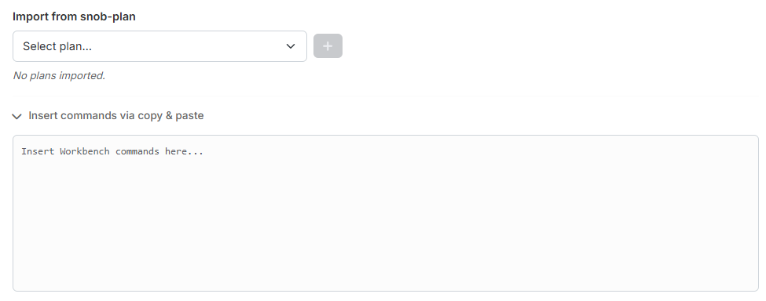

# Step 2: Commands

In step 2 you load the commands that cleaners and Fake-Sup should **line up
with** — as a rule the noblemen of a train. From their launch times the tool
derives when the cleaners and Fake-Sup have to set off.

{ .screenshot }

## 1. Import from snob-plan

Under **"Import from snob-plan"** you select a snob-plan already created in
tw-utils in the dropdown **"Select plan…"** and apply it with the plus button.
The snob-plans of the currently selected world are offered.

The imported plan appears in a list below, each with the number of its
commands. Via the red × you take it out again. As long as nothing is imported,
it reads *"No plans imported."*

You can import **several plans** one after another.

!!! info "Changing the world empties the list"
    The plans belong to a world. If you change the world in the main
    navigation, the imported plans are discarded and the dropdown is filled
    with the plans of the new world.

## 2. Insert commands via copy & paste

If you have a plan that does not live in tw-utils, you unfold the section
**"Insert commands via copy & paste"** and paste the **workbench commands**
straight into the text field — for example from the workbench window in the
game.

The table below fills up as you type or paste.

!!! info "Both ways can be combined"
    Unlike the troop import in
    [step 1](schritt1-truppen.md#1-importing-troops), the two ways do **not**
    exclude each other here: pasted commands and imported plans are merged. So
    you can import a snob-plan and additionally paste individual commands.

## 3. Imported commands

At the bottom sits the permanent table **"Imported commands"** with these
columns:

- **"#"** — sequential number.
- **"Source"** — where the command comes from: the name of the snob-plan or
  *"Manual / Upload"* for pasted commands.
- **"Origin (Attacker)"** — coordinate and player of the origin village.
- **"Target (Defender)"** — coordinate and player of the target.
- **"Unit"** — the slowest unit of the command.
- **"Launch time"** and **"Arrival time"**.

Use the search field to filter by player or coordinate. The first 500 commands
are displayed; the calculation always uses all of them.

---

Next up: [Step 3: Cleaner](schritt3-cleaner.md).
