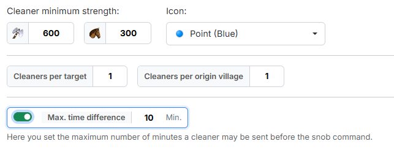

# Step 3: Cleaner

In step 3 you define **what the catapult-cleaners should look like** and how
many of them are planned.

{ .screenshot }

## 1. Cleaner minimum strength

Under **"Cleaner minimum strength:"** you enter the required strength of the
cleaner — as a number of **axemen** (default `600`) and a number of **light
cavalry** (default `300`).

!!! info "How the minimum strength is evaluated"
    From your entries the tool calculates the **attack strength** of the
    cleaner. Afterwards any combination of **axemen and light cavalry** that
    reaches that attack strength is accepted — only those two units count
    towards the strength. So pure light cavalry cleaners can be planned as
    well, provided the village holds enough light cavalry.

To the right you choose the workbench icon the cleaner commands receive via
**"Icon:"**. The default is **"Point (Blue)"**.

## 2. Number of cleaners

- **"Cleaners per target"** — how many cleaners are planned **per imported
  command**. Default `1`, minimum `1`.
- **"Cleaners per origin village"** — how many cleaners may start from the same
  origin village at most. Default `1`, minimum `1`.

!!! info "The value applies per command, not per target village"
    If you imported a four-snob train onto **one** village in step 2 and set
    `1` here, **four** cleaners are created for it — one per snob command, each
    from a different origin village.

The second value is the brake against individual overloaded villages: without
it the tool would keep planning from the best-placed villages over and over.

## 3. Max. time difference

The switch **"Max. time difference"** is off by default. If you switch it on,
the field next to it becomes usable (default `10` minutes).

It defines how many minutes a cleaner may be sent **before** the snob command
at most. Without this limit the tool also takes origin villages further away,
whose cleaners would have to start correspondingly earlier.

!!! info "What the limit is good for"
    The longer the lead time, the bigger the risk: the cleaner is already on
    its way while something at the train can still change. A tight limit keeps
    the launch times close together — but it costs origin villages, because
    villages further away drop out. If the tool finds too few cleaners, this
    value is one of the first levers.

---

Next up: [Step 4: Fake-Sup](schritt4-fake-ut.md).
