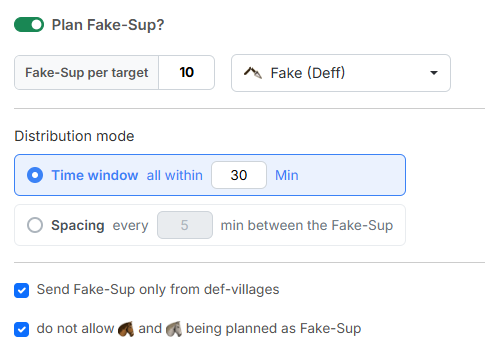

# Schritt 4: Fake-UT

In Schritt 4 planst du **Fake-Unterstützungen** auf dieselben Ziele. Sie
laufen aus deinen Dörfern beim Gegner ein und sollen ihn glauben lassen, das
Ziel werde gestützt.

{ .screenshot }

## 1. Fake-UT planen?

Der Schalter **„Fake-UT planen?"** ist standardmäßig **aus** — ohne ihn plant
das Tool nur Zwischencleaner. Erst wenn du ihn einschaltest, werden die
Einstellungen darunter nutzbar.

- **„Fake-UT pro Ziel"** — wie viele Fake-UT jedes Ziel bekommt. Standard `10`.
- Das Dropdown daneben bestimmt das **Icon** der Fake-UT-Befehle. Standard ist
  **„Fake (Deff)"**.

## 2. Verteilungs-Modus

Der **„Verteilungs-Modus"** bestimmt, wie sich die Fake-UT eines Ziels
zeitlich verteilen. Es gibt zwei Möglichkeiten:

- **„Zeitfenster — alle innerhalb X Min"** (Standard `30`) — alle Fake-UT
  eines Ziels werden innerhalb von X Minuten **nach** dem AG-Befehl
  abgeschickt, gleichmäßig über dieses Fenster verteilt.
- **„Abstand — je X Min zwischen den Fake-UT"** (Standard `5`) — die Fake-UT
  bilden eine Kette: Jede startet mindestens X Minuten nach der vorherigen.
  Nach oben gibt es keine Grenze; die Kette endet, sobald eine weitere Fake-UT
  nicht mehr rechtzeitig ankäme.

!!! info "Wann die Fake-UT unterwegs sind"
    Fake-UT starten immer **nach** dem AG-Befehl und treffen **genau mit ihm**
    ein. Der Modus entscheidet nur, wie eng die Abschickzeiten beieinander
    liegen: Das Zeitfenster hält alle in einem festen Rahmen, der Abstand zieht
    sie gleichmäßig auseinander — dafür ohne Obergrenze.

!!! info "Ein Bezugsbefehl je Zieldorf"
    Hast du mehrere Befehle auf dasselbe Zieldorf importiert, richten sich
    **alle** Fake-UT dieses Ziels an **einem** davon aus: an dem mit der
    **spätesten Ankunft**. Die übrigen Befehle auf dieses Dorf bleiben für die
    Fake-UT-Planung unberücksichtigt.

## 3. Woher die Fake-UT kommen dürfen

Zwei Häkchen schränken die Auswahl der Herkunftsdörfer ein, beide sind
standardmäßig gesetzt:

- **„Fake-UT nur aus Deff-Dörfern planen"** — beschränkt die Herkunft auf rein
  defensive Dörfer. So bleiben deine Off-Dörfer für die eigentliche Aktion
  frei.
- **„keine Leichte Kavallerie und Späher als Fake-UT planen"** — schließt
  schnelle Einheiten aus. Sie wären für den Gegner ein deutliches Zeichen,
  dass es sich nicht um echte Unterstützung handelt.

!!! info "Welteneinstellungen werden berücksichtigt"
    Das Tool berücksichtigt bei der Planung der Fake-UT die
    Welteneinstellungen rund um Unterstützungen. Erlaubt die Welt nur
    Unterstützung innerhalb des eigenen Stammes, plant das Tool die Fake-UT
    ausschließlich aus Dörfern des angreifenden Stammes.

---

Weiter geht es mit [Schritt 5: Ergebnis](schritt5-ergebnis.md).
