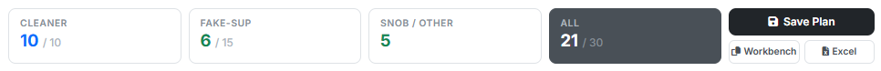
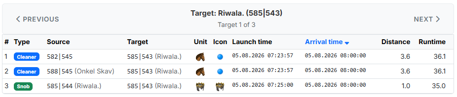
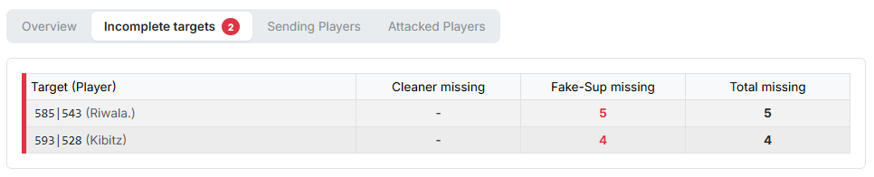
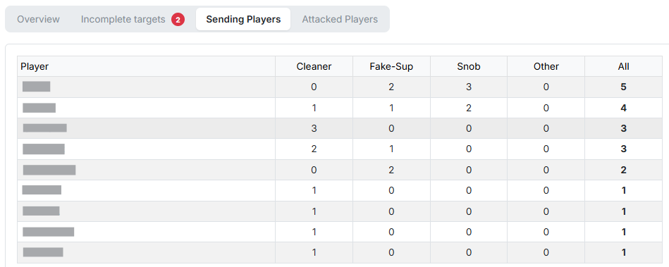
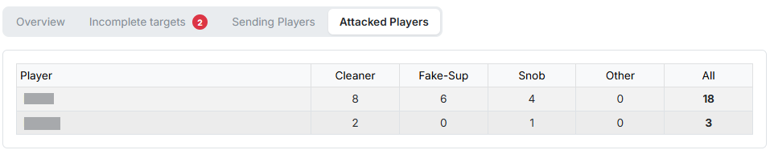

# Step 5: Results

Step 5 shows the finished plan. The step stays **locked** in the step bar until
a calculation has run; afterwards the tool jumps here by itself.

The calculation is started via the button **"Calculate"** at the bottom of the
step bar — it is reachable from every step.

## 1. Result cards and actions

{ .screenshot }

At the top sits a row of cards comparing **actual and target figures**: on the
left the number that could actually be planned, on the right after the slash
the number that should have been planned according to your settings.

- **"Cleaner"** — the catapult-cleaners from [step 3](schritt3-cleaner.md).
- **"Fake-Sup"** — the fake support from [step 4](schritt4-fake-ut.md).
- **"Snob / Other"** — the imported commands from
  [step 2](schritt2-befehle.md). They only show one number, because they were
  not planned but taken over.
- **"All"** — all commands together, highlighted in dark.

If actual and target match, the plan is complete. If the actual figure is
lower, the tab [Incomplete targets](#3-incomplete-targets) tells you what
exactly is missing.

Next to it are three actions:

- **"Save Plan"** — opens a window in which you give the plan a name under
  **"Name of the plan"**. Saved plans are then available under "My Plans &
  Containers" — and can be published, shared and reused from there.
- **"Workbench"** — copies all commands as workbench strings to the clipboard.
- **"Excel"** — downloads the complete result as an Excel file.

!!! info "The imported commands are part of the plan"
    What gets saved, copied and exported is not only the newly planned cleaners
    and Fake-Sup but also the snob commands from step 2. That way a single
    export contains everything belonging to this operation.

## 2. Overview

{ .screenshot }

The tab **"Overview"** shows all commands **per target**. Use **"Previous"** /
**"Next"** to page through target by target; in the search field at the top you
jump straight to a particular target by entering its coordinate (`123|456`).

The columns:

- **"#"** — sequential number within the target.
- **"Type"** — command type as a coloured badge: `Cleaner`, `Fake-Sup`, `Snob`
  or `AG-Fake`.
- **"Source"** — origin coordinate and player.
- **"Target"** — target coordinate and player.
- **"Unit"** — the slowest unit, which determines the travel time.
- **"Icon"** — the command icon of the workbench.
- **"Launch time"** / **"Arrival time"** — both columns can be sorted by
  clicking them.
- **"Distance"** — distance in fields.
- **"Runtime"** — travel time in minutes.

This is how you check at a glance whether the cleaners really are sent close to
the snob command.

## 3. Incomplete targets

{ .screenshot }

This tab lists all targets for which **not** all required commands could be
planned. A red badge on the tab name shows their number. They are sorted by the
total number of missing commands, the most urgent first.

The columns name the **Target (Player)** and then how many are missing —
**Cleaner missing**, **Fake-Sup missing** and **Total missing**. Where nothing
is missing, a "-" is shown.

If all targets are supplied, the green message *"All targets are complete."*
appears instead.

!!! info "What to do when commands are missing"
    Missing commands almost always mean that too few origin villages qualified.
    Worthwhile levers: set the
    [max. time difference](schritt3-cleaner.md#3-max-time-difference) more
    generously or switch it off entirely, lower the
    [minimum strength](schritt3-cleaner.md#1-cleaner-minimum-strength), raise
    **"Cleaners per origin village"** or untick **"Send Fake-Sup only from
    def-villages"** for the Fake-Sup.

## 4. Sending players

{ .screenshot }

Shows **which player sends how many commands** — sorted descending by the total
number. Columns: **Player**, **Cleaner**, **Fake-Sup**, **Snob**, **Other** and
**All**.

Helpful for spreading the load evenly and for spotting when a single player is
overloaded.

## 5. Attacked players

{ .screenshot }

The counterpart: **which enemy player receives how many commands**. The columns
are the same as in section 4, but here they refer to the attacked player.

## 6. Repeating the calculation

If you are not happy with the result, simply jump back into the step concerned,
adjust the settings and press **"Calculate"** again. Your inputs are preserved.
