# Bunker-Information-System

Im Bunker-Information-System verwaltet Ihr eure Bunker. Stammesmember stellen Bunker-Anfragen, TWU-Mods genehmigen oder lehnen sie ab. Genauso können auch Aufstockungen (Top-Up) beantragt und genehmigt oder Bunker aufgelöst werden. Daneben bietet das Modul für die Leader einen schnellen Bunker-Health-Check sowie eine Möglichkeit zur Kontrolle und Identifizierung von Flexbunkern.

## 1. Kanäle des Moduls

Nach der [Installation](modul-verwaltung.md) legt der Bot die Kategorie `🧱 BUNKER-INFORMATION-SYSTEM` mit vier Kanälen an:

- `#⚫-request-bunker` — zentraler Anfrage-Kanal mit den Buttons zum Anfragen, Aufstocken, Anzeigen und Auflösen eigener Bunker
- `#⚫-leaderview-bunker` — Leader-View mit Bunker-Health-Übersicht aller genehmigten Bunker
- `#⚫-leaderview-flexbunker` — Leader-View mit der Flexbunker-Kontrolle
- `#⚫-report-bunker` — Kanal zum Melden und Verwalten feindlicher Bunker

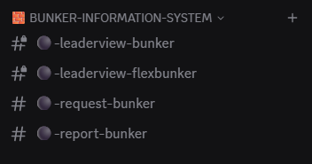{ .screenshot }

Sobald jemand eine Anfrage oder eine Aufstockung stellt, legt der Bot pro Koordinate **einen eigenen Kanal** in derselben Kategorie an (z. B. `❓-bunker-for-500-501-Spielername` bzw. `❓-top-up-500-501`). In diesem Per-Request-Kanal läuft der gesamte Genehmigungs-Workflow.

## 2. Bunker anfragen

Wechsle in den Kanal `#⚫-request-bunker`.

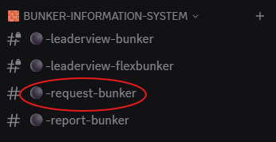{ .screenshot }

Klicke auf den Button `Request Bunker`.

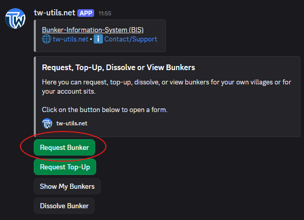{ .screenshot }

Es öffnet sich das Modal `Request Bunker` mit drei Eingabefeldern:

- `Coordinates` — eine oder mehrere Koordinaten (z. B. `500|501, 503|502, 540|589`)
- `Bunker Size (Dual-Strength)` — gewünschte Dual-Stärke des Bunkers (z. B. `20000`)
- `Reason` — Begründung, warum dieser Bunker benötigt wird

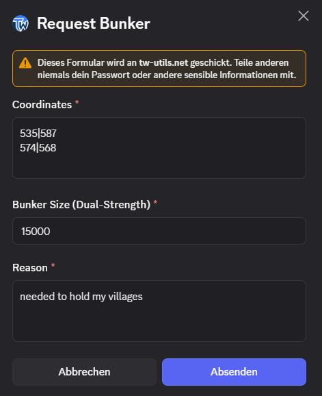{ .screenshot }

Nach dem Absenden legt der Bot pro Koordinate einen eigenen Kanal `❓-bunker-for-XXX-YYY-Spielername` in der Kategorie an.

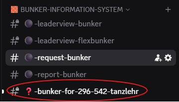{ .screenshot }

Im neuen Kanal postet der Bot ein Anfrage-Embed mit Spieler, Koordinate, gewünschter Größe und Begründung sowie den Genehmigungs-Buttons für TWU-Mods.

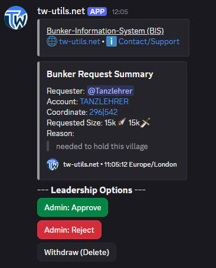{ .screenshot }

!!! info "Mehrere Koordinaten pro Anfrage"
    In einer einzelnen Anfrage könnt ihr beliebig viele Koordinaten eintragen — komma- oder leerzeichengetrennt. Der Bot legt **pro Koordinate einen eigenen Anfrage-Kanal** an. Jeder Kanal wird einzeln genehmigt, abgelehnt oder zurückgezogen.

## 3. Workflow: Genehmigen, Ablehnen, Zurückziehen

Im Per-Request-Kanal sehen TWU-Mods den Button `Admin: Approve`.

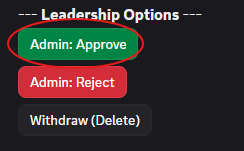{ .screenshot }

Ein Klick öffnet das Approval-Modal — der Mod kann die endgültig genehmigte Größe eintragen oder die ursprünglich angefragte Größe übernehmen.

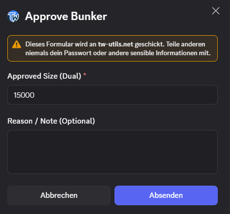{ .screenshot }

Nach erfolgreicher Genehmigung erhält der Anfragende sowie derjenige, der die Anfrage genehmigt hat, eine Discord-Direktnachricht mit dem Titel `Bunker Approved` (bzw. `Top-Up Approved`). Die DM enthält alle Eckdaten plus einen fertigen Text-String zur direkten Übernahme ins Stammesforum. Der Anfrage-Kanal wird im Anschluss an die Genehmigung automatisch gelöscht.

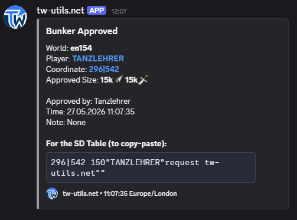{ .screenshot }

Statt zu genehmigen, können TWU-Mods die Anfrage mit `Admin: Reject` ablehnen. Sowohl der Anfragende als auch der ablehnende TWU-Mod erhalten anschließend eine Discord-Direktnachricht zur Ablehnung; der Anfrage-Kanal wird ebenfalls automatisch gelöscht.

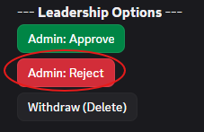{ .screenshot }

Der Anfragende selbst — oder ein TWU-Mod — kann die Anfrage über `Withdraw (Delete)` jederzeit zurückziehen. Der Per-Request-Kanal wird dabei mit gelöscht.

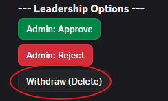{ .screenshot }

!!! info "Genehmigung mit Größen-Override"
    Im Approval-Modal kann der TWU-Mod eine abweichende Größe vergeben — etwa weil das Dorf eine andere Stärke haben soll als ursprünglich angefragt. Diese Größe wird zur verbindlichen Soll-Größe und ist Basis für die Bunker-Health-Ampel im Leader-View.

!!! info "SD-Befehl aus Approval-DM kopieren"
    Die `Bunker Approved`-DM enthält am Ende einen fertig formatierten SD-Befehl-String (`{coord} {units}"{Spieler}"request tw-utils.net""`). Diesen Block kannst du direkt ins Stammesforum einfügen, ohne ihn manuell zusammenzubauen.

## 4. Aufstockung anfragen

Für bereits genehmigte Bunker, deren Stärke nicht (mehr) ausreicht, kannst du im Kanal `#⚫-request-bunker` über den Button `Request Top-Up` eine Aufstockung beantragen.

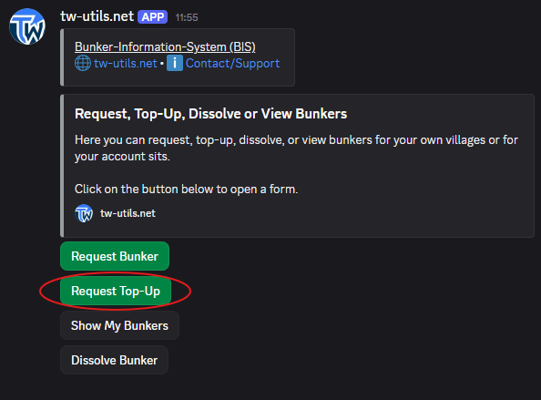{ .screenshot }

Im Modal `Request Top-Up` gibst du an:

- `Coordinates` — Koordinate(n) der bereits genehmigten Bunker
- `Additional Size (Dual-Strength)` — **nur** die zusätzliche Dual-Stärke (z. B. `+5000`)
- `Reason` — Grund für die Aufstockung

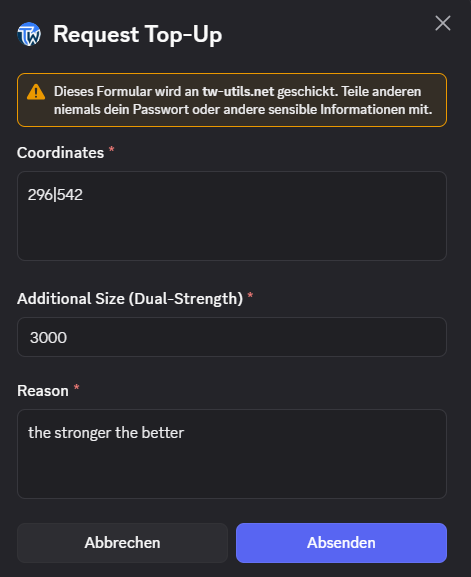{ .screenshot }

Der Bot legt analog zur Bunker-Anfrage pro Koordinate einen eigenen Kanal `❓-top-up-XXX-YYY` an.

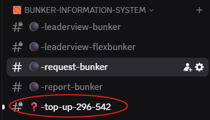{ .screenshot }

Im Kanal postet der Bot eine Aufstockungs-Zusammenfassung. Der Genehmigungs-Workflow ist identisch zu Abschnitt 3 — bei Genehmigung erhält der Anfragende eine DM mit dem Titel `Top-Up Approved`, und die zusätzliche Stärke wird auf die bestehende Soll-Größe addiert.

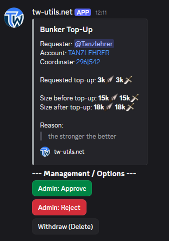{ .screenshot }

## 5. Eigene Bunker anzeigen und auflösen

Im Kanal `#⚫-request-bunker` kann jeder Spieler über `Show My Bunkers` jederzeit eine Übersicht seiner genehmigten Bunker abrufen.

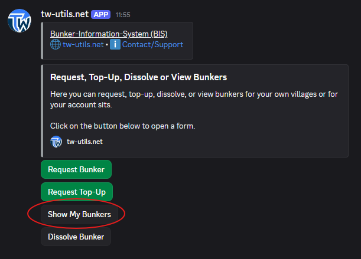{ .screenshot }

Der Bot postet eine ephemerale Liste (nur für dich sichtbar), gruppiert nach deinem verknüpften Tribalwars-Account, mit Koord-Link und genehmigter Größe pro Bunker. Voraussetzung ist eine abgeschlossene Account-Verifizierung.

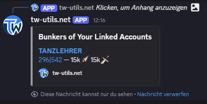{ .screenshot }

Wenn ein Bunker nicht mehr notwendig ist (z. B. weil das Dorf im Savegebiet liegt), lösen Spieler ihre eigenen Bunker über den Button `Dissolve Bunker` auf.

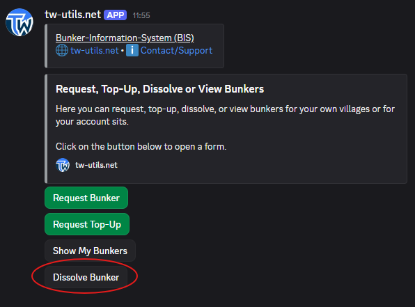{ .screenshot }

Im Modal `Dissolve Bunker` gibst du die aufzulösenden Koordinaten ein — das Feld `Coordinate(s) / Text` akzeptiert auch mehrere Koordinaten oder Text mit eingebetteten Koordinaten. Nach einer Bestätigung entfernt der Bot die betroffenen Bunker aus der Datenbank und aktualisiert den Leader-View. TWU-Mods können fremde Bunker auf dem gleichen Weg auflösen.

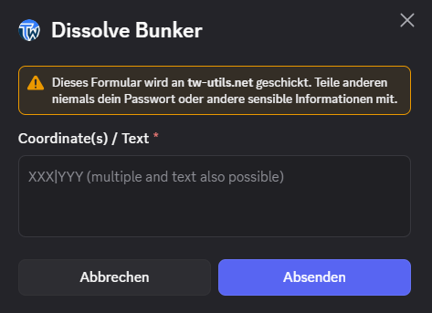{ .screenshot }

## 6. Leader-View: Bunker-Health & FlexControl

Im Kanal `#⚫-leaderview-bunker` sehen TWU-Mods alle genehmigten Bunker im Überblick.

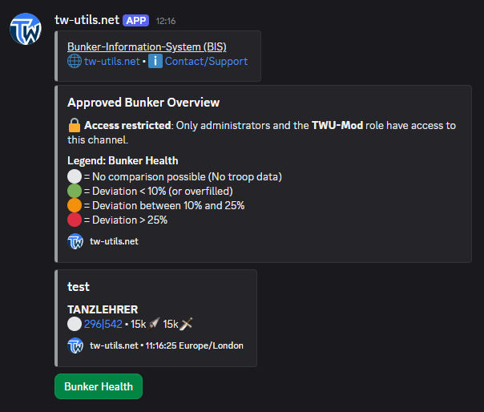{ .screenshot }

Der Button `Bunker Health` aktualisiert die Übersicht und vergleicht für jeden Bunker die genehmigte Soll-Größe mit den aktuell hochgeladenen Truppendaten. Das Ergebnis wird als Ampel pro Bunker angezeigt.

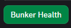{ .screenshot }

Im zweiten Leader-View-Kanal `#⚫-leaderview-flexbunker` steht der Button `Flexbunker Control` zur Verfügung — er hilft, Dörfer zu identifizieren, die hohe defensive Kapazitäten binden, gleichzeitig aber keine genehmigten Bunker sind.

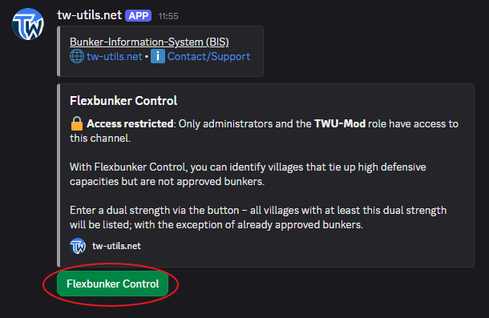{ .screenshot }

Im Modal `Flexbunker Control` gibst du die Schwellwert-Dual-Stärke ein:

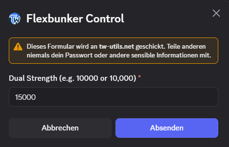{ .screenshot }

Als Ergebnis bekommst du eine Tabelle aller Dörfer im Stamm, deren tatsächliche Dual-Stärke den Schwellwert erreicht — gruppiert nach Stamm und Spieler, absteigend nach Stärke sortiert. Genehmigte Bunker werden dabei ausgeblendet, sodass nur zusätzliche Flex-Bunker erscheinen.

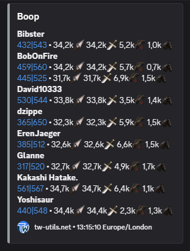{ .screenshot }

!!! info "Bunker-Health-Ampel-Legende"
    Die Health-Übersicht nutzt eine vierstufige Ampel pro Bunker:

    - ⚪ keine Truppendaten — für diesen Bunker liegen keine Truppendaten vor
    - 🟢 weniger als 10 % Abweichung von der Soll-Größe
    - 🟠 10 % bis 25 % Abweichung
    - 🔴 mehr als 25 % Abweichung

!!! warning "Rate-Limit Bunker-Health & FlexControl"
    Sowohl `Bunker Health` als auch `Flexbunker Control` sind aus Performance-Gründen **auf eine Ausführung pro Minute pro Server** begrenzt. Wer den Button kurz hintereinander zweimal drückt, erhält beim zweiten Klick eine Hinweismeldung — einfach kurz warten und erneut klicken.

## 7. Feindliche Bunker melden

Im Kanal `#⚫-report-bunker` werden bekannte feindliche Bunker gesammelt. Der Bot stellt dort vier Buttons bereit.

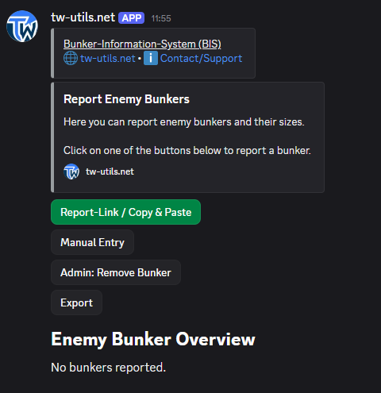{ .screenshot }

Über `Report-Link / Copy & Paste` lassen sich Feindbunker direkt aus einem Bericht heraus eintragen — per TW-Berichts-Link, `[report]`-Tag oder kopiertem Berichtstext. `Manual Entry` ermöglicht die manuelle Eingabe von Koordinate, Truppen und Info-Zeitpunkt, falls kein Bericht vorliegt. Mit `Admin: Remove Bunker` können TWU-Mods einzelne Feindbunker-Einträge wieder entfernen, und `Export` liefert die komplette Liste als TSV-Datei für Excel & Co.

Über `Report-Link / Copy & Paste` öffnet sich ein Modal, das einen Berichts-Link, `[report]`-Tag oder kopierten Bericht-Text entgegennimmt. Der Bot parst Truppen, Koordinate und Info-Zeitpunkt automatisch aus dem Bericht.

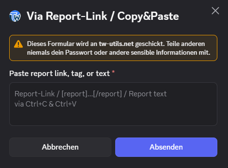{ .screenshot }

Liegt kein Bericht vor, hilft `Manual Entry` mit dem Modal `Report Enemy Bunker (Manual)` und drei Feldern: `Coordinate (XXX|YYY)`, `Units (...)` mit allen Einheiten der jeweiligen Welt und `Info Date (DD.MM.YYYY HH:MM:SS)`.

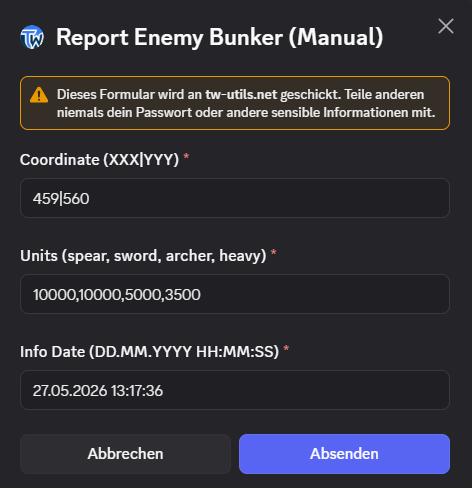{ .screenshot }

Egal welcher Weg gewählt wurde — der Bot zeigt eine Vorschau und bittet mit den Buttons `Confirm` / `Cancel` um Bestätigung, bevor der Eintrag gespeichert wird.

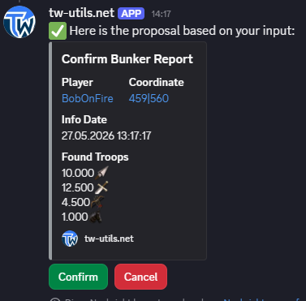{ .screenshot }

Nach `Confirm` wird der Eintrag gespeichert und der Bot bestätigt den erfolgreichen Vorgang.

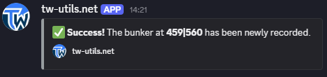{ .screenshot }

Anschließend taucht der Eintrag in der Feindbunker-Übersicht im Kanal auf — gruppiert nach gegnerischem Stamm, dann nach Spieler, mit Koordinate, Truppenanzahl und Info-Zeitpunkt.

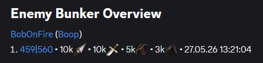{ .screenshot }
