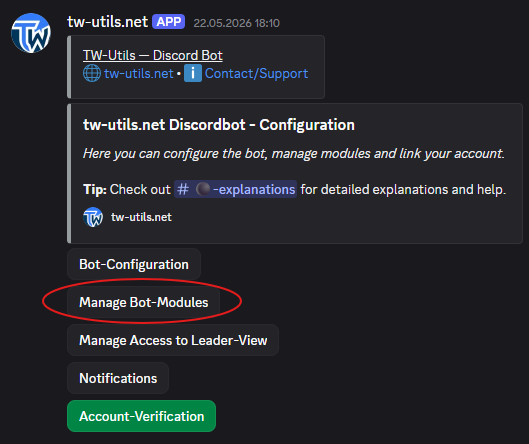
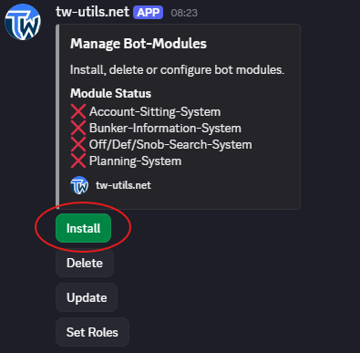
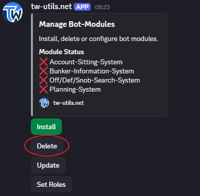
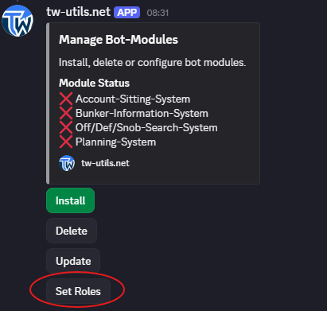

# Setup

The central management of all bot modules runs via the `Manage Bot-Modules` button in the `#⚫-bot-config` channel. From there you can install, update, or remove modules — and define for each module which Discord roles are allowed to see the corresponding channels. The module-specific configuration is documented on the respective linked subpages of each module.

!!! warning "Prerequisite"
    Module management is only accessible to Discord users with **administrator permissions** or the **TWU-Mod** role.

{ .screenshot }

## 1. Install a module

On your tribe Discord, switch to the `#⚫-bot-config` channel and click on the `Manage Bot-Modules` button. The module management menu opens. Click on the `Install` button there to start the installation of a new module. In the dropdown that appears, select the desired module. The bot then installs the module automatically and creates the corresponding channels on your Discord server. Repeat the process for every additional module you want to use.

{ .screenshot }

## 2. Update a module

In the module management menu, click on the `Update` button to update an installed module to the current version. Select the desired module in the dropdown that appears. Existing data and configurations are preserved.

{ .screenshot }

## 3. Uninstall a module

In the module management menu, click on the `Delete` button to remove an installed module. Select the module to be uninstalled in the dropdown that appears.

{ .screenshot }

!!! warning "Warning: Data will be lost"
    When a module is uninstalled, the corresponding channels are deleted along with all their contents (requests, planning, lists, etc.) — this cannot be undone.

## 4. Define visibility roles

For each installed module, you can define which Discord roles are allowed to see the corresponding module channels. To do this, click on the `Set Roles` button in the module management menu. Then select the module for which the roles should be set, followed by the desired Discord roles.

{ .screenshot }

!!! info "Public by default"
    Without an explicit role assignment, the module channels are visible to **all members** on your Discord server. If you want to restrict access, you have to assign specific roles via `Set Roles`.
