# Planning-System

Das Planning-System ist die Discord-seitige Brücke zum Off-Planner auf [tw-utils.net](https://tw-utils.net). Die Spieler melden über den Bot **AG-Befehle, Abschickzeiten und Off-Ausschlüsse** für ihre Accounts an die Planer; die Stammes-Führung verteilt im Gegenzug die fertig geplanten Befehle als persönliche DM-Pakete, kann coord-spezifische Plan-Informationen schnell nachschlagen, und das angeschlossene Nuke-Ersatzsystem organisiert spontane Nuke-Replacements innerhalb des Stammes.

!!! info "Voraussetzung Welt-Setup"
    Vor der Modulnutzung muss die Welt einmalig mit dem Slash-Command `/admin set_world` gesetzt sein. Ohne gesetzte Welt liefert der Bot eine Fehlermeldung statt einer Antwort.

!!! info "Voraussetzung verifizierter TW-Account"
    Damit ein Spieler eigene AG-Meldungen, Abschickzeiten und Off-Ausschlüsse pflegen und persönliche Pläne empfangen kann, muss sein TW-Account im `#⚫-bot-config`-Kanal verifiziert sein. Ohne verknüpften Account stehen die Eingabe-Buttons und der `Download`-Button im Plan-Verteilungs-Kanal nicht zur Verfügung.

## 1. Kanäle des Moduls

Nach der [Installation](modul-verwaltung.md) legt der Bot die Kategorie `🪓 PLANNING-SYSTEM` mit vier Basis-Kanälen an:

- `#⚫-queries` — Meldungs-Kanal für Spieler (AG-Berichte, Abschickzeiten, Off-Ausschluss) und Admin-Aktionen
- `#⚫-plan-distribution` — Spieler holen sich hier ihre persönlich geplanten Befehle als DM-Paket ab
- `#⚫-leaderview-planinfo` — Leader können hier per Koordinate alle aktuell geplanten Befehle auf ein Ziel-Dorf abrufen (nur für TWU-Mod sichtbar)
- `#⚫-nuke-replacement` — Nuke-Ersatzsystem für spontane Nuke-Replacement-Anfragen

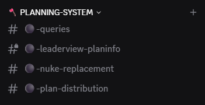{ .screenshot }

!!! info "Nur Buttons — keine Textnachrichten"
    In `#⚫-queries`, `#⚫-leaderview-planinfo` und `#⚫-plan-distribution` werden alle User-Textnachrichten automatisch wieder gelöscht. Diese Kanäle akzeptieren ausschließlich Button- und Modal-Eingaben — direkte Textbeiträge sind hier nicht vorgesehen.

## 2. AG-Meldungen im `#⚫-queries`-Kanal

Im `#⚫-queries`-Kanal steht das `Queries`-Embed und darunter stehen drei farblich markierte Buttons: `Snob Report`, `Launch Times`, `Off-Exclusion`.

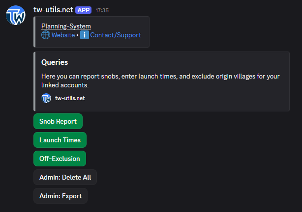{ .screenshot }

{ .screenshot }

Klick auf `Snob Report` öffnet ein ephemerales Sub-Menü mit den Buttons `Add`, `Show` und `Delete`.

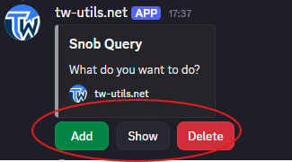{ .screenshot }

`Add` führt zunächst zur Account-Auswahl: Der Spieler wählt im Dropdown den verifizierten TW-Account, für den die Meldung gilt.

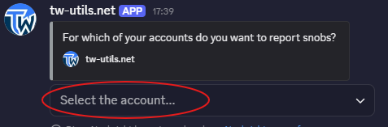{ .screenshot }

Anschließend öffnet sich das AG-Meldungs-Modal mit den Eingabefeldern.

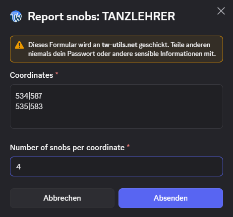{ .screenshot }

Nach erfolgreichem Absenden bestätigt der Bot mit einer ephemeralen Erfolgsmeldung.

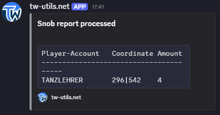{ .screenshot }

`Show` listet alle bereits gemeldeten AGs für den ausgewählten Account auf.

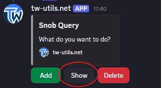{ .screenshot }

`Delete` löscht eine konkrete AG-Meldung per Auswahl.

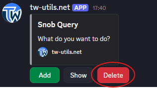{ .screenshot }

## 3. Abschickzeiten im `#⚫-queries`-Kanal

`Launch Times` öffnet analog ein Sub-Menü mit den Buttons `Add`, `Show` und `Delete`.

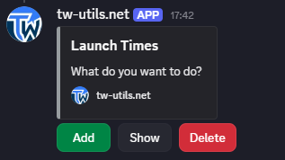{ .screenshot }

`Add` führt zunächst zur Account-Auswahl per Dropdown.

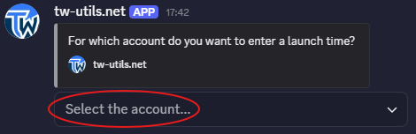{ .screenshot }

Anschließend öffnet sich das Abschickzeiten-Modal mit den Zeitfenster-Feldern.

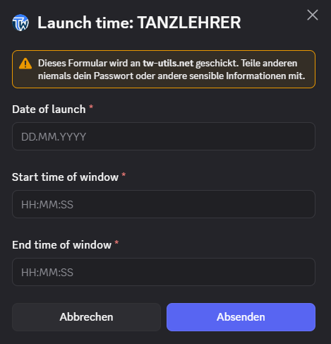{ .screenshot }

`Show` und `Delete` verhalten sich analog zum AG-Workflow: `Show` listet alle hinterlegten Zeitfenster für den ausgewählten Account auf, `Delete` löscht ein konkretes Zeitfenster per Auswahl.

## 4. Off-Ausschluss im `#⚫-queries`-Kanal

`Off-Exclusion` öffnet das Sub-Menü mit den Buttons `Add`, `Show` und `Delete`.

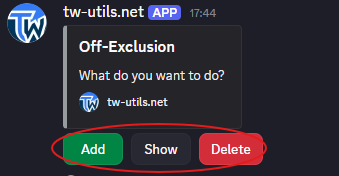{ .screenshot }

`Add` führt zunächst zur Account-Auswahl per Dropdown.

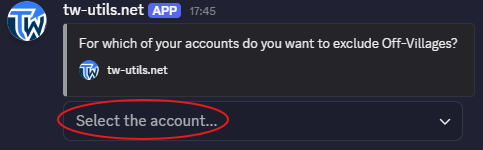{ .screenshot }

Anschließend öffnet sich das Off-Ausschluss-Modal zur Eingabe der auszuschließenden Herkunfts-Dörfer.

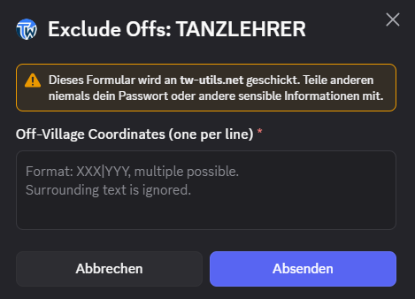{ .screenshot }

`Show` und `Delete` verhalten sich analog zum AG-Workflow: `Show` listet alle aktuell hinterlegten Off-Ausschlüsse für den ausgewählten Account auf, `Delete` entfernt einen konkreten Eintrag per Auswahl.

## 5. Admin-Funktionen im `#⚫-queries`-Kanal

Unterhalb der Spieler-Buttons stehen im `#⚫-queries`-Kanal zwei Admin-Buttons.

`Admin: Delete All` löscht **alle** AG-Meldungen, Abschickzeiten und Off-Ausschluss-Einträge auf dem gesamten Server. Vor dem Löschen erscheint eine Bestätigungs-Abfrage mit den Buttons `Confirm` und `Cancel`.

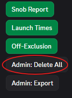{ .screenshot }

`Admin: Export` exportiert alle aktuell vorliegenden Meldungen als Datei, sodass sie z. B. in der Stammes-Führung weiterverarbeitet werden können.

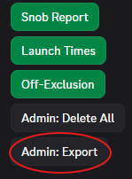{ .screenshot }

!!! info "Wer darf Admin-Funktionen?"
    Die Buttons `Admin: Delete All` und `Admin: Export` können nur User mit der Rolle `TWU-Mod` oder Discord-Administrator-Rechten ausführen. Für normale Mitglieder sind diese Buttons zwar sichtbar, aber ein Klick wird vom Bot mit einer Berechtigungs-Fehlermeldung abgelehnt.

## 6. Plan-Verteilung im `#⚫-plan-distribution`-Kanal

Der `#⚫-plan-distribution`-Kanal enthält das `Plan Distribution`-Embed und darunter den Button `Download`.

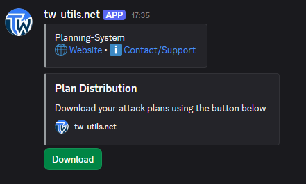{ .screenshot }

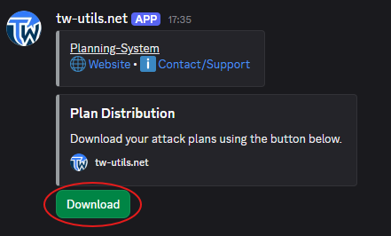{ .screenshot }

Klick auf `Download`: Der Bot prüft die verknüpften TW-Accounts des Spielers, sammelt alle für ihn geplanten Befehle aus den aktiven Plan-Containern auf [tw-utils.net](https://tw-utils.net) und schickt sie als persönliche DM mit Spieler-Listen und DSU-Download-Links.

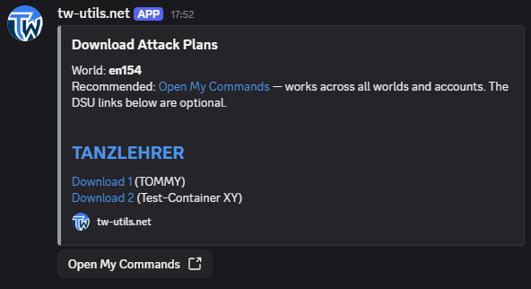{ .screenshot }

!!! info "Plan-Download per DM"
    Damit der Bot die Pläne zustellen kann, müssen Direktnachrichten vom Bot in den Discord-Einstellungen erlaubt sein. Andernfalls erscheint eine ephemerale Fehlermeldung im Kanal mit dem Hinweis, die DMs zu aktivieren.

## 7. Plan-Informationen im `#⚫-leaderview-planinfo`-Kanal

Im `#⚫-leaderview-planinfo`-Kanal steht das `Plan Information`-Embed und darunter der Button `Retrieve Plan Information`.

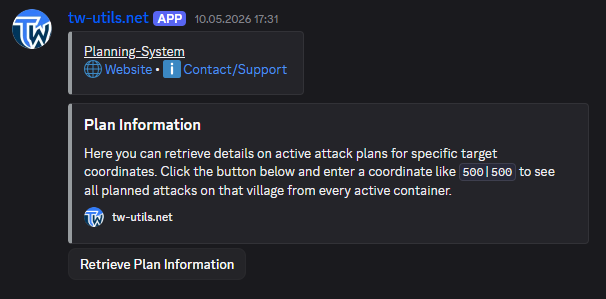{ .screenshot }

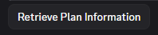{ .screenshot }

Klick öffnet das Modal `Plan Information` mit dem Feld `Coordinate` im Format `XXX|YYY`.

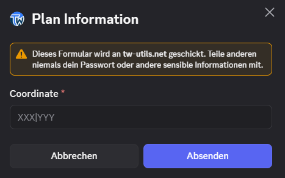{ .screenshot }

Der Bot rendert daraufhin für die angegebene Koordinate eine Übersicht aller aktuell geplanten Befehle aus allen aktiven Plan-Containern direkt im Kanal.

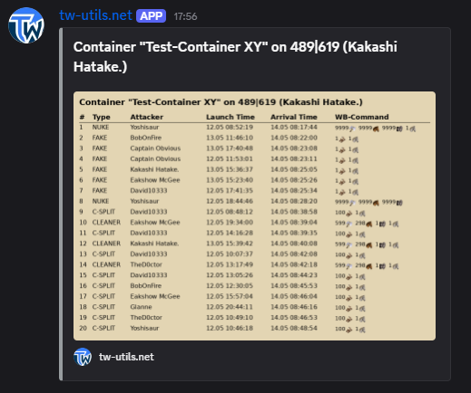{ .screenshot }

Die detailliertere Ansicht zeigt die einzelnen Befehle mit Herkunfts-Dorf, Spieler, Befehlstyp sowie Abschick- und Ankunftszeit.

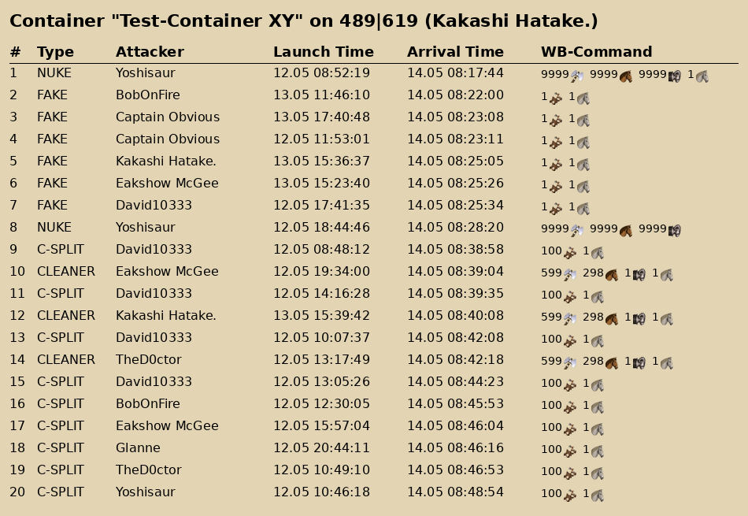{ .screenshot }

!!! info "Sichtbarkeit Leaderview-PlanInfo"
    Der `#⚫-leaderview-planinfo`-Kanal ist standardmäßig **nur für User mit der Rolle `TWU-Mod` sichtbar**. Normale Mitglieder sehen den Kanal nicht — Plan-Informationen bleiben damit innerhalb der Stammes-Führung.

## 8. Nuke-Ersatz im `#⚫-nuke-replacement`-Kanal

Der `#⚫-nuke-replacement`-Kanal zeigt das `Nuke-Replacement`-Embed mit zwei Status-Listen (`NOT DONE` und `DONE`) und darunter fünf Buttons.

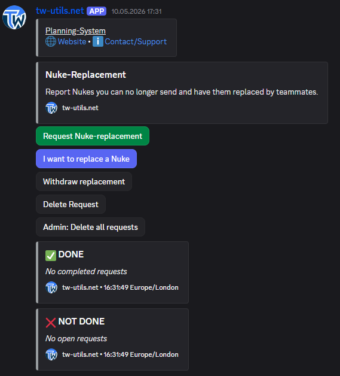{ .screenshot }

Über den Button `Request Nuke-replacement` stellt ein Spieler eine neue Ersatz-Anfrage.

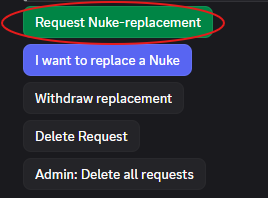{ .screenshot }

Klick öffnet das Anfrage-Modal mit Feldern für Zielkoordinate, gewünschtem Abschickzeitpunkt und Notiz.

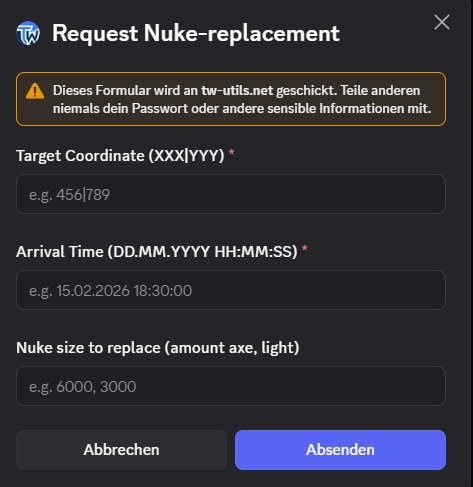{ .screenshot }

Nach dem Abschicken wird die Anfrage unter `NOT DONE` einsortiert.

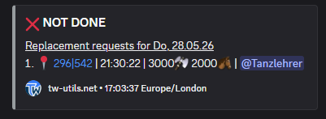{ .screenshot }

Mit `I want to replace a Nuke` übernimmt ein anderer Spieler eine offene Anfrage.

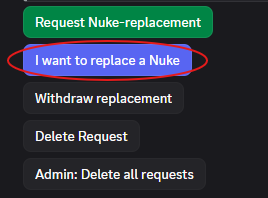{ .screenshot }

Klick öffnet zuerst ein Dropdown mit allen offenen Anfragen.

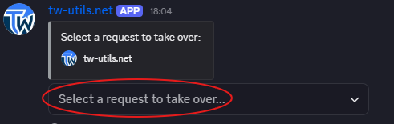{ .screenshot }

Danach folgt ein zweites Dropdown zur Auswahl des eigenen verifizierten Accounts, mit dem die Übernahme erfolgt.

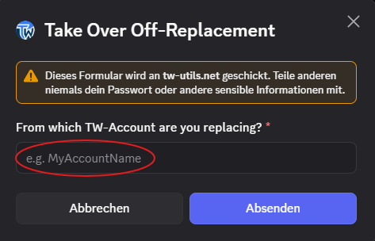{ .screenshot }

Nach erfolgreicher Übernahme wandert die Anfrage in den `DONE`-Bereich.

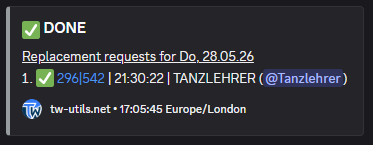{ .screenshot }

`Withdraw replacement` zieht eine bereits zugesagte Übernahme zurück; die Anfrage geht zurück in den `NOT DONE`-Bereich.

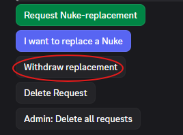{ .screenshot }

`Delete Request` löscht eine eigene Anfrage komplett.

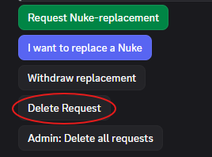{ .screenshot }

`Admin: Delete all requests` löscht alle Nuke-Ersatz-Anfragen auf einen Schlag (Bestätigungs-Abfrage erscheint).

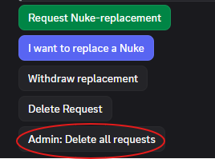{ .screenshot }

!!! info "Wer darf Nuke-Ersatz-Anfragen löschen?"
    Eine einzelne Anfrage kann nur der Ersteller selbst oder ein User mit der Rolle `TWU-Mod` über `Delete Request` löschen. Der Button `Admin: Delete all requests` zum gesammelten Löschen aller Anfragen steht ausschließlich Usern mit der Rolle `TWU-Mod` oder Discord-Administrator-Rechten zur Verfügung.
