# Quick-Setup-Guide

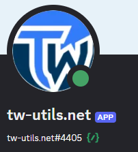{ .screenshot }

This guide walks you through the initial setup of the Discord bot on your tribe Discord in six steps — from inviting the bot to installing your first module. Detailed explanations for each topic can be found on the respective linked subpages.

!!! warning "Prerequisite"
    **Administrator permissions** on the Discord server are required for the setup.

## 1. Invite the bot to your Discord server

Invite the bot to your tribe Discord via the link below. You will be automatically redirected to Discord, where you have to select the server on which the bot should be installed. Then confirm the requested permissions.

[Invite Bot to Discord](https://discord.com/oauth2/authorize?client_id=1457061148980547715&permissions=8&integration_type=0&scope=bot+applications.commands){ .cta-discord target=_blank rel=noopener }

!!! info "Permissions"
    The permissions included in the invite link are required so the bot can independently create the setup category and the configuration channel. If permissions are revoked afterwards, the setup will no longer work fully.

## 2. Automatically created configuration channel

Right after the invite, the bot automatically creates the category `⚙️ TWU-SETUP` together with the channel `#⚫-bot-config` on your Discord server. This channel is the **central control** for the bot — all further setup steps as well as the later management of the modules run exclusively through buttons in this channel.

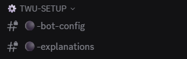{ .screenshot }

## 3. Set the game world

Switch to the `#⚫-bot-config` channel and click on the `Bot-Configuration` button. A new menu opens with the available configuration options.

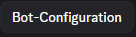{ .screenshot }

In this menu, click on the `Set World` button. An input window (modal) appears in which you can enter the game world.

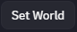{ .screenshot }

In the `World Name` field, enter the game world your tribe plays on (e. g. `de236` or `en154`). Then click on `Submit` to save the entry. The bot is now linked to your game world.

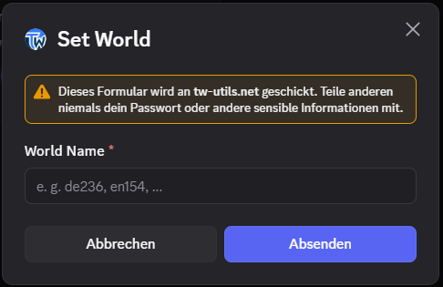{ .screenshot }

## 4. Verify your own account

In the `#⚫-bot-config` channel, click on the `Account-Verification` button. This opens the menu for verifying your player account.

{ .screenshot }

Click on the `Verify your tribalwars-account` button. An input window opens for your ingame account name.

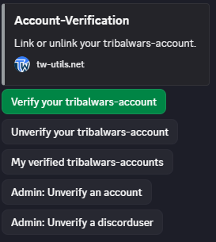{ .screenshot }

In the `Account name (exactly as in game)` field, enter your ingame account name — exactly as it is spelled in the game (mind capitalization and special characters). Then click on `Submit`.

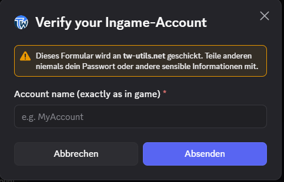{ .screenshot }

The bot now shows you an individual verification code. Log into the game, open your player profile, paste the code into the profile description, and save the profile. Then switch back to the Discord channel and click on the `Verify` button in the bot. The bot automatically checks whether the code is stored in your profile and completes the verification.

{ .screenshot }

## 5. Assign Leader status

In order for the [Leader-View](../leader-view/uebersicht.md) to be usable, at least one Discord user must be granted leader permissions. In the `#⚫-bot-config` channel, click on the `Manage Access to Leader-View` button. A menu for managing Leader-View access opens.

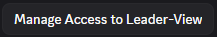{ .screenshot }

Click on the `Grant Access` button to grant a Discord user leader permissions.

{ .screenshot }

In the first dropdown, select the role the user should receive — choose `Leader` here.

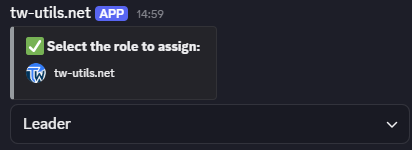{ .screenshot }

Then, in the second dropdown, select the Discord user who should receive the leader status. The assignment takes effect immediately and the selected user can access the Leader-View from now on.

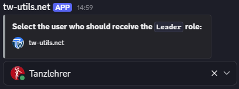{ .screenshot }

## 6. Install bot modules

In order for the bot to provide additional functions for your tribe beyond the basic setup, the desired modules have to be installed separately. In the `#⚫-bot-config` channel, click on the `Manage Bot-Modules` button. The module management menu opens.

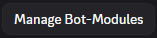{ .screenshot }

In this menu, click on the `Install` button to start the installation of a new module.

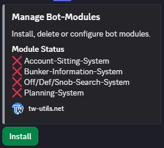{ .screenshot }

In the dropdown that appears, select the desired module. The bot then installs the module automatically and creates the corresponding channels on your Discord server. Repeat the process for every additional module you want to use.

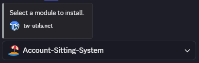{ .screenshot }

The following modules are available:

- 🏖️ **[Account-Sitting-System](sitting-system.md)** — Vacation replacement for accounts
- 🧱 **[Bunker-Information-System](bunker-info.md)** — Request and approve bunkers
- 🔍 **[Off/Deff/Snob-Search-System](search-system.md)** — Find matching off, deff, or snob commands
- 🪓 **[Planning-System](planning-system.md)** — Organize offensive planning

!!! info "Setup complete"
    The basic setup is now finished. The detailed configuration of the individual modules can be found on the respective linked pages. More on managing installed modules (update, uninstall, visibility roles) can be found on the [Bot Modules – Setup](modul-verwaltung.md) page.
