# Off/Deff/Snob-Search-System

Mit dem ODS-System können Spieler Off-, Deff- oder Snob-Befehle für eine bestimmte Zielkoordinate suchen. Das ODS-System besitzt Ähnlichkeit zum Single Village Snipe-Skript — während dort nur die Truppen eines einzelnen Spielers berücksichtigt werden, fließen im ODS-System die Dörfer des **gesamten Stammes** in die Auswahl ein. Der Bot gleicht ankommende Suchanfragen mit den hinterlegten Truppendaten ab und liefert eine Liste der Spieler, die einen passenden Off-, Deff- oder Snob-Befehl abschicken können.

!!! info "Voraussetzung Truppen-Upload"
    Der Bot kann nur Treffer melden für Spieler, deren Truppendaten aktuell hochgeladen sind. Liegen keine Daten vor, bleibt die Trefferliste leer. Für aussagekräftige Ergebnisse sollten die Admins (TWU-Mod) die Truppendaten regelmäßig per `/admin troops_upload` aktualisieren.

## 1. Kanäle des Moduls

Nach der [Installation](modul-verwaltung.md) legt der Bot die Kategorie `🔍 OFF/DEFF/SNOB-SEARCHER` mit zwei Basis-Kanälen an:

- `#⚫-ods-search` — zentraler Such-Kanal mit den drei Such-Buttons und dem Admin-Panel
- `#⚫-ods-overview` — Dashboard-Kanal mit der Liste aller laufenden und erledigten Suchanfragen

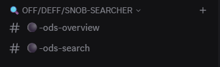{ .screenshot }

Sobald jemand ein Suchergebnis in einen eigenen Kanal exportiert (siehe [Abschnitt 5](#5-suche-in-einen-eigenen-kanal-exportieren)), legt der Bot zusätzlich **einen eigenen Kanal pro Anfrage** in derselben Kategorie an, nach dem Schema `❌-off-XXX-YYY-PLAYERNAME` bzw. `❌-deff-…` / `❌-ag-…`. Sobald die Anfrage abgearbeitet ist, wechselt das Präfix auf `✅` — siehe [Abschnitt 6](#6-in-der-exportierten-suchanfrage-status-notizen-loschen-folgesuchen).

## 2. Truppendaten hochladen, anzeigen, löschen

Damit der Bot überhaupt Suchanfragen beantworten kann, müssen die Truppendaten der Stammesmitglieder im Bot hinterlegt sein. Im Such-Kanal `#⚫-ods-search` steht dafür das `ODS Panel`-Embed mit drei Admin-Buttons: `Upload Troops`, `Delete Troops`, `Show Troop Status` zur Verfügung.

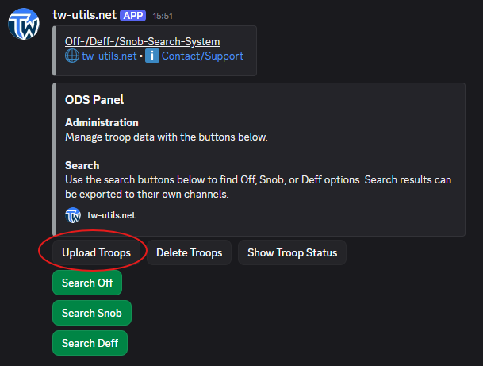{ .screenshot }

`Upload Troops` führt zum Slash-Command `/admin troops_upload`, über die der TWU-Mod die TW-Truppen-CSV-Datei einliest.

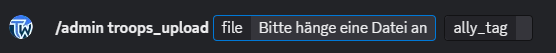{ .screenshot }

Die CSV-Datei erzeugst du am bequemsten über das Schnellleisten-Script [„Download Tribe Info"](https://forum.tribalwars.net/index.php?threads/download-tribe-info.285469/). Erwartetes Dateiformat:

```
Coords,Player,spear,sword,axe,archer,spy,light,marcher,heavy,ram,catapult,knight,snob
483|520,Testuser A,2421,6099,100,5963,50,50,3632,200,5,279,0,8
543|538,Testuser A,100,100,6027,100,6,3014,100,100,159,5,0,0
```

Nach erfolgreichem Upload bestätigt der Bot mit einer kurzen Erfolgs-Nachricht.

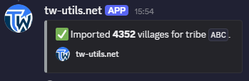{ .screenshot }

Über den Button `Delete Troops` können hochgeladene Truppendaten wieder entfernt werden.

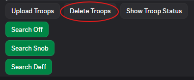{ .screenshot }

`Show Troop Status` öffnet das `Troop Uploads Overview`-Embed mit allen hochgeladenen Truppendateien je Stamm und ihrem jeweiligen Upload-Zeitstempel.

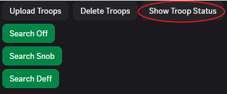{ .screenshot }

So sieht man auf einen Blick, welche Stämme aktuelle Truppendaten hinterlegt haben und wo die Daten veraltet sind.

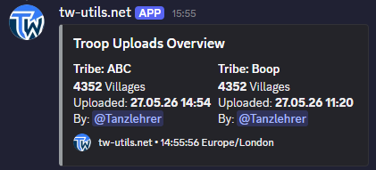{ .screenshot }

!!! info "Wer darf Truppen hochladen?"
    Nur User mit der Rolle `TWU-Mod` oder Discord-Administrator-Rechten können die Buttons `Upload Troops` und `Delete Troops` ausführen und den Slash-Command `/admin troops_upload` benutzen. Den Button `Show Troop Status` können auch normale Mitglieder verwenden.

## 3. Off-, Deff- oder Snob-Befehl suchen

Unterhalb des Admin-Panels stehen im Such-Kanal `#⚫-ods-search` die drei Such-Buttons `Search Off`, `Search Snob`, `Search Deff`, mit denen jeder Spieler eine Suche starten kann.

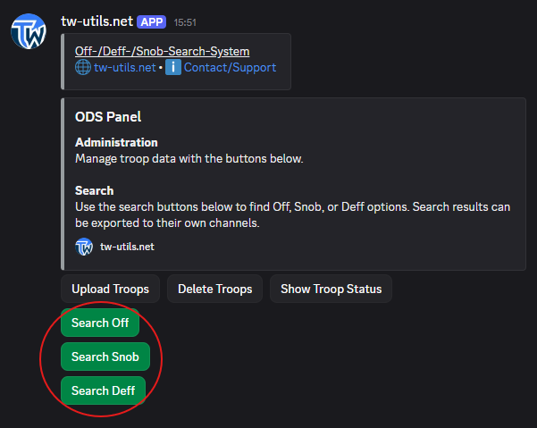{ .screenshot }

Klick auf `Search Off` öffnet das Modal `Find Off Options`:

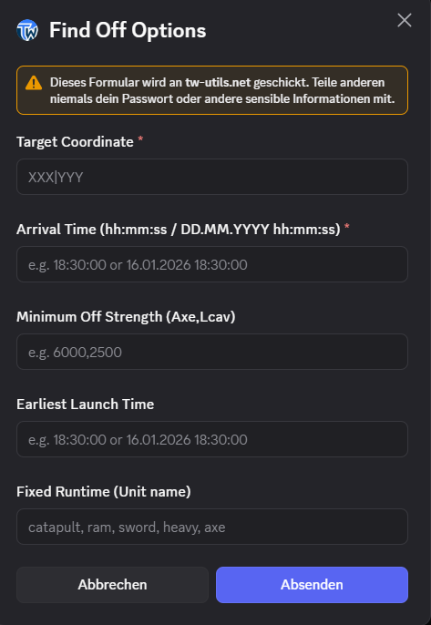{ .screenshot }

- `Target Coordinate` — Koordinate des Zieldorfes im Format `XXX|YYY`.
- `Arrival Time (hh:mm:ss / DD.MM.YYYY hh:mm:ss)` — gewünschte Ankunftszeit; nur `hh:mm:ss` reicht für „heute", `DD.MM.YYYY hh:mm:ss` für ein späteres Datum.
- `Minimum Off Strength (Axe,Lcav)` (optional) — Mindeststärke der gesuchten Offs, angegeben als Axt- und Leichte Kavalerie-Anzahl (z. B. `7000,3000`). Offs unter diesem Schwellwert werden nicht mit in der Trefferliste ausgegeben.
- `Earliest Launch Time` (optional) — frühester erlaubter Abschickzeitpunkt; Befehle, die schon davor losgeschickt werden müssten, werden rausgefiltert.
- `Fixed Runtime (Unit name)` (optional) — beschränkt die Suche auf eine bestimmte Einheitenlaufzeit (z. B. nur Axt-Laufzeit), wenn der Off-Befehl mit einer fixen Einheit laufen werden soll.

Klick auf `Search Snob` öffnet das Modal `Find Snob Options`:

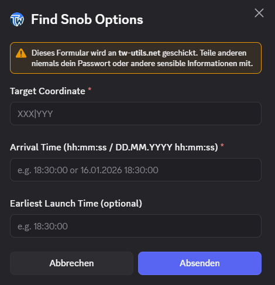{ .screenshot }

- `Target Coordinate` — Koordinate des Ziel-Dorfs.
- `Arrival Time (hh:mm:ss / DD.MM.YYYY hh:mm:ss)` — gewünschte Ankunftszeit des AGs.
- `Earliest Launch Time (optional)` — frühester erlaubter Abschickzeitpunkt für das AG.

Klick auf `Search Deff` öffnet das Modal `Find Deff Options`:

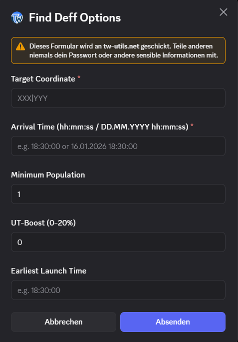{ .screenshot }

- `Target Coordinate` — Koordinate des Ziel-Dorfs im Format `XXX|YYY`.
- `Arrival Time (hh:mm:ss / DD.MM.YYYY hh:mm:ss)` — gewünschte Ankunftszeit der Deff.
- `Minimum Off Strength (Axe,Lcav)` (optional) — Mindeststärke der einlaufenden Offs (Axt-/Leichte-Kavalerie-Anzahl), gegen die das Deff-Dorf rechnerisch standhalten soll.
- `Earliest Launch Time` (optional) — frühester erlaubter Abschickzeitpunkt; Deff-Befehle, die schon davor losgeschickt werden müssten, werden rausgefiltert.
- `Fixed Runtime (Unit name)` (optional) — beschränkt die Suche auf eine bestimmte Einheitenlaufzeit, wenn die Deff mit einer fixen Einheit laufen soll.
- `Minimum Population` — Mindesteinwohnerzahl des Herkunftsdorfs; verhindert, dass kleine Dörfer in die Trefferliste fallen.
- `UT-Boost (0-20%)` — Möglichkeit zur Berücksichtigung eines UT-Boosts bei der Suchanfrage.

## 4. Das Suchergebnis

Nach dem Abschicken eines Such-Modals antwortet der Bot mit einem **ephemeralen Embed**, das nur der Suchende selbst sieht. Es listet alle möglichen Befehle mit Dorf-Koordinate, Truppenzusammensetzung, Abschick- und Ankunftszeit auf.

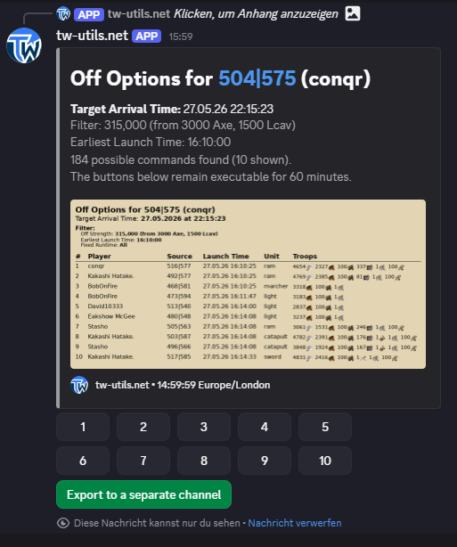{ .screenshot }

Die möglichen Befehle werden übersichtlich in tabellarischer Form dargestellt:

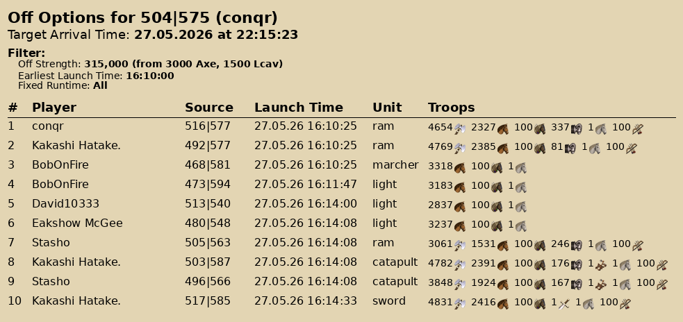{ .screenshot }

Unter dem Suchergebnis stehen bis zu zehn Buttons zur Verfügung — jeder dieser Buttons generiert den jeweiligen WB-Befehl.

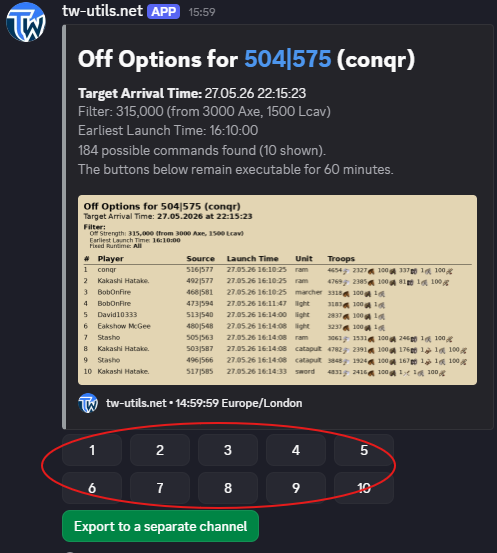{ .screenshot }

Im Antwort-Embed steht zusätzlich ein `Rally Point`-Button: Per Klick wird man direkt zum Ingame-Versammlungsplatz des Herkunftsdorfs weitergeleitet, sodass der Befehl unmittelbar abgeschickt werden kann.

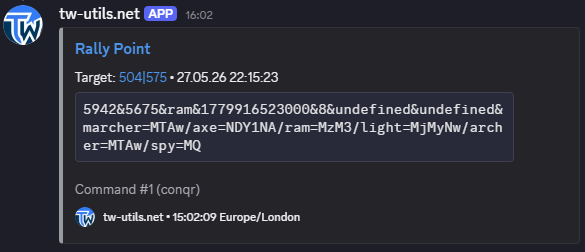{ .screenshot }

!!! info "Ephemerale Antwort nur für den Suchenden"
    Die Trefferliste ist eine ephemerale Discord-Nachricht: Nur der Suchende sieht sie und sie verschwindet beim nächsten Discord-Neuladen. Wer das Ergebnis dauerhaft sichtbar machen und dem Stamm sichtbar machen will, exportiert die Suche in einen eigenen Kanal — siehe [Abschnitt 5](#5-suche-in-einen-eigenen-kanal-exportieren).

## 5. Suche in einen eigenen Kanal exportieren

Im ephemeralen Suchergebnis (siehe [Abschnitt 4](#4-das-suchergebnis)) steht ein Export-Button, der die Anfrage in einen neuen, separaten Kanal auslagert.

{ .screenshot }

Der Bot legt daraufhin in der Kategorie `🔍 OFF/DEFF/SNOB-SEARCHER` einen neuen Kanal `❌-<typ>-XXX-YYY-PLAYERNAME` an.

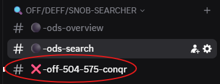{ .screenshot }

Im neuen Kanal postet der Bot das Suchergebnis mit allen Details und den Verwaltungs-Buttons. Das Ergebnis ist nun für den ganzen Stamm sichtbar, andere Spieler können mitdiskutieren, der Suchende kann den Status pflegen, Notizen anfügen und Folge-Suchen direkt aus der exportierten Suchanfrage heraus starten — siehe [Abschnitt 6](#6-in-der-exportierten-suchanfrage-status-notizen-loschen-folgesuchen).

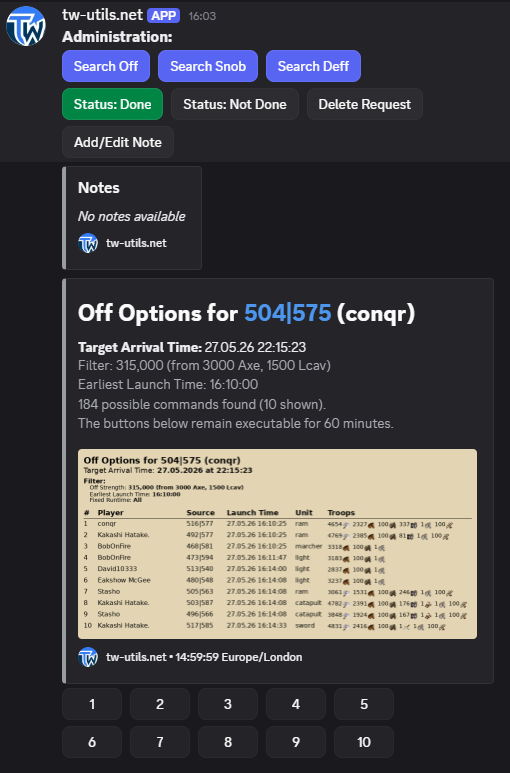{ .screenshot }

## 6. In der exportierten Suchanfrage: Status, Notizen, Löschen, Folgesuchen

In der exportierten Suchanfrage stehen oberhalb des Such-Embeds die Verwaltungs-Buttons `Status: Done` / `Status: Not Done`, mit denen die Anfrage als erledigt markiert bzw. wieder auf offen gesetzt wird.

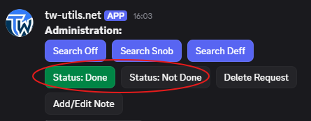{ .screenshot }

Über den Button `Add/Edit Note` können der Anfragesteller oder andere User Notizen zur Anfrage hinterlegen.

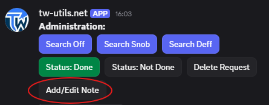{ .screenshot }

`Delete Request` löscht die Anfrage inklusive Kanal nach Bestätigung mit `Yes, delete`.

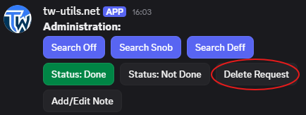{ .screenshot }

!!! info "Voraussetzung Löschen"
    Die Anfrage kann nur vom Ersteller selbst oder von einem User mit der Rolle `TWU-Mod` gelöscht werden.

Zusätzlich stehen in der exportierten Suchanfrage die Such-Buttons `Search Off`, `Search Snob`, `Search Deff` erneut zur Verfügung.

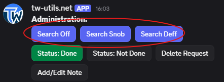{ .screenshot }

Klickst du dort z. B. auf `Search Snob`, ist das Such-Modal bereits mit den Werten der ursprünglichen Anfrage (Zielkoordinate, Ankunftszeit) vorausgefüllt — so kann ohne erneutes Eintippen direkt eine Folge-Suche zur gleichen Koord gestartet werden.

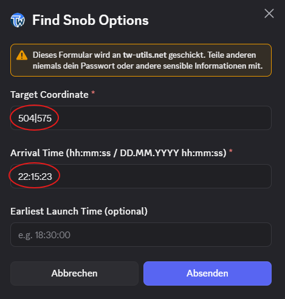{ .screenshot }

Sobald sich der Status ändert, benennt der Bot den Kanal automatisch um — Präfix `❌` wechselt auf `✅` und umgekehrt. So ist im Kanal-Tree auf einen Blick sichtbar, welche Anfragen noch offen sind.

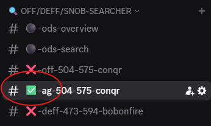{ .screenshot }

!!! warning "Rate-Limit Status-Änderung"
    Der Status `Done` / `Not Done` kann pro exportierter Suchanfrage nur alle 10 Minuten gewechselt werden. Bei zu schnellem Hin- und Her-Klicken meldet der Bot eine Rate-Limit-Fehlermeldung mit Restwartezeit.

## 7. Übersicht im `#⚫-ods-overview`

Der Dashboard-Kanal `#⚫-ods-overview` zeigt jederzeit den aktuellen Stand aller Such-Anfragen — gruppiert nach Status `✅ DONE` und `❌ NOT DONE`, je Eintrag mit Typ (Off/Deff/Snob), Koordinate, Suchendem und Anfrage-Zeitpunkt. Das Embed wird vom Bot automatisch aktualisiert, sobald eine Anfrage hinzukommt, ihren Status ändert oder gelöscht wird.

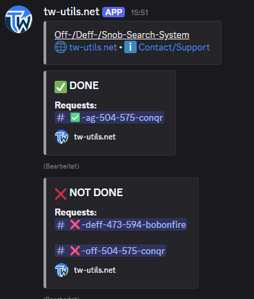{ .screenshot }
