# Account-Sitting-System

Das Account-Sitting-System verwaltet und organisiert Urlaubsvertretungen. Spieler können tageweise Sitting-Anfragen stellen, andere Spieler übernehmen einzelne oder mehrere Zeit-Slots, und der Bot räumt nach Ende des Sittings automatisch wieder auf. Anfragen sind ohne Genehmigung sofort sichtbar — jedes normale Mitglied kann offene Slots übernehmen.

## 1. Kanäle des Moduls

Nach der [Installation](modul-verwaltung.md) legt der Bot die Kategorie `🏖️ ACCOUNT-SITTING-SYSTEM` mit zwei Basis-Kanälen an:

- `#⚫-request-account-sitting` — zentraler Anfrage-Kanal mit dem Button zum Erstellen einer neuen Anfrage
- `#⚫-overview-account-sitting` — Dashboard mit allen aktuell laufenden bzw. übernommenen Sittings sowie allen noch offenen Slots

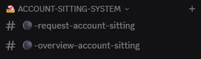{ .screenshot }

Sobald jemand eine Anfrage stellt, legt der Bot zusätzlich **einen eigenen Kanal pro Anfrage** in derselben Kategorie an. In diesem Per-Request-Kanal läuft der gesamte Übernahme-Workflow (übernehmen, zurückziehen, löschen). Nach Ende der Sitting-Zeit räumt sich dieser Kanal automatisch wieder auf — siehe Abschnitt 7.

## 2. Sitting-Anfrage stellen

Wechsle in den Kanal `#⚫-request-account-sitting` und klicke auf den Button `Request Account-Sitting`.

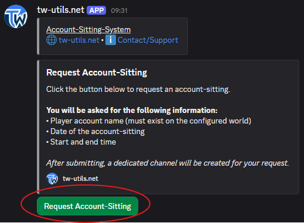{ .screenshot }

Es öffnet sich das Modal `Create Sitting-Request` mit fünf Eingabefeldern:

- `Tribalwars Account` — Name des Accounts, für den die Vertretung gesucht wird
- `Date (DD.MM.YYYY)` — der Tag, an dem das Sitting laufen soll
- `Start Time (HH:MM)` — Start-Uhrzeit der Vertretung
- `End Time (HH:MM)` — End-Uhrzeit der Vertretung
- `Additional Notes (optional)` — freier Hinweis-Text an den Vertreter

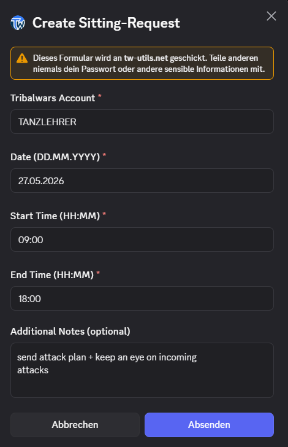{ .screenshot }

!!! info "Tageweise Anfragen"
    Jede Anfrage gilt für **genau einen Tag**. Wenn du mehrere Tage abdecken möchtest (z. B. ein langes Wochenende oder eine ganze Urlaubswoche), erstelle pro Tag eine eigene Anfrage.

!!! info "Zeitangaben in Welt-Zeit"
    Alle Zeitangaben in den Sitting-Anfragen und im Dashboard beziehen sich auf die Zeit der **Spielwelt** — nicht auf eure lokale Zeitzone. Gerade bei internationalen Welten kann das von eurer Realzeit abweichen.

Nach dem Absenden legt der Bot einen neuen Kanal in der Kategorie an und postet darin den Anfrage-Embed mit allen Details und den Übernahme-Buttons.

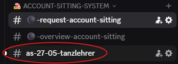{ .screenshot }

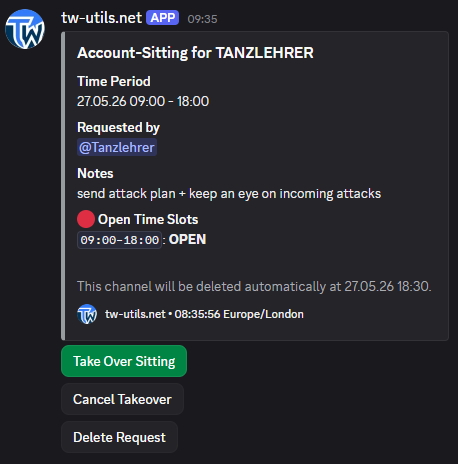{ .screenshot }

## 3. Sitting übernehmen

Im Anfrage-Kanal sehen alle Spieler den Button `Take Over Sitting`. Damit kann jeder normale Server-User einen Slot (oder einen Teil davon) übernehmen.

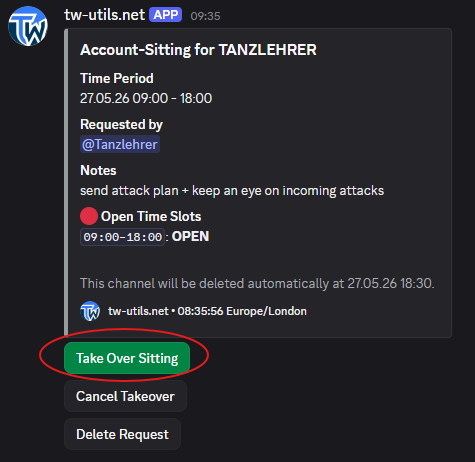{ .screenshot }

Im Modal `Take Over Sitting` gibst du an, in welchem Zeitraum du den Account übernehmen möchtest:

- `From (HH:MM)` — ab wann du das Sitting übernimmst
- `Until (HH:MM)` — bis wann du das Sitting übernimmst

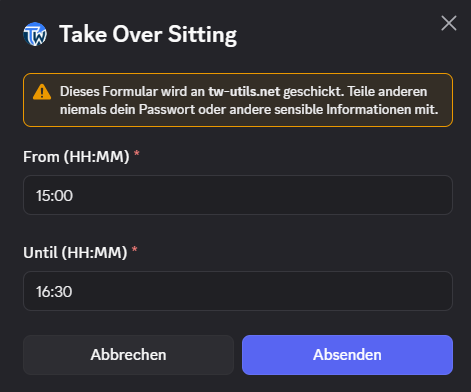{ .screenshot }

So sind auch Teil-Übernahmen möglich — z. B. übernimmt Spieler A die ersten vier Stunden, Spieler B den Rest. Nach erfolgreicher Übernahme wird im Kanal eine Bestätigung gepostet.

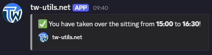{ .screenshot }

Der Anfrage-Embed aktualisiert sich automatisch — übernommene Zeit-Slots werden als „covered" angezeigt, der Rest bleibt als „open time slots" sichtbar.

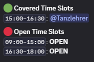{ .screenshot }

## 4. Übernahme zurückziehen oder Anfrage löschen

Wer einen Slot übernommen hat und doch nicht kann, klickt im Anfrage-Kanal auf `Cancel Takeover`.

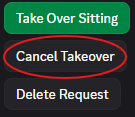{ .screenshot }

Im erscheinenden Dropdown wählst du die Übernahme aus, die du zurückziehen möchtest. Der freigewordene Zeit-Slot wird im Embed wieder als „open" markiert.

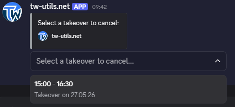{ .screenshot }

Falls die gesamte Anfrage hinfällig wird (z. B. weil das Sitting doch nicht nötig ist), kann der Ersteller — oder ein User mit der Rolle TWU-Mod — die Anfrage über den Button `Delete Request` komplett entfernen. Der zugehörige Kanal wird dabei direkt mit gelöscht.

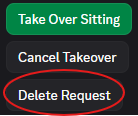{ .screenshot }

## 5. Übersichts-Dashboard

Der Dashboard-Kanal `#⚫-overview-account-sitting` zeigt jederzeit den aktuellen Stand aller Sittings in eurem Stamm — sowohl bereits übernommene Slots als auch noch offene Anfragen. Das Embed wird vom Bot automatisch aktualisiert, sobald sich etwas ändert.

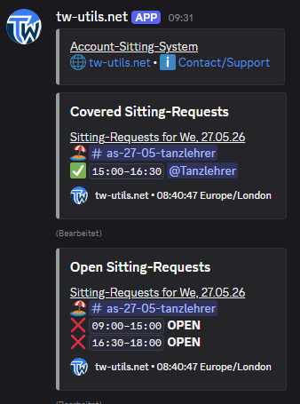{ .screenshot }

## 6. Erinnerungs-DM

15 Minuten vor Beginn eines übernommenen Slots schickt der Bot dem Urlaubsvertreter automatisch eine Discord-Direktnachricht (`Account-Sitting Reminder!`). Die DM enthält:

- den zu vertretenden Tribalwars-Account
- die Spielwelt
- Start- und End-Zeit des übernommenen Slots

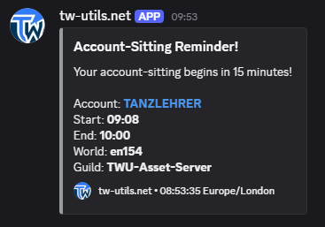{ .screenshot }

!!! info "Erinnerungs-DM abschalten"
    Wer keine Erinnerungs-DM vom Bot erhalten möchte, kann das jederzeit über den Button `Notifications` im Kanal `#⚫-bot-config` pro Discord-User deaktivieren. Wer einen Account auf [tw-utils.net](https://tw-utils.net) hat, kann die Benachrichtigung alternativ auch dort unter den Profileinstellungen steuern.

## 7. Automatisches Clean-Up

Der zur Anfrage erstellte Kanal wird **30 Minuten nach dem Ende des angefragten Zeitraums automatisch gelöscht** — inklusive aller Nachrichten darin. Du musst nichts manuell aufräumen. Im Anfrage-Embed steht zusätzlich ein Hinweis, wann genau der Kanal entfernt wird.
