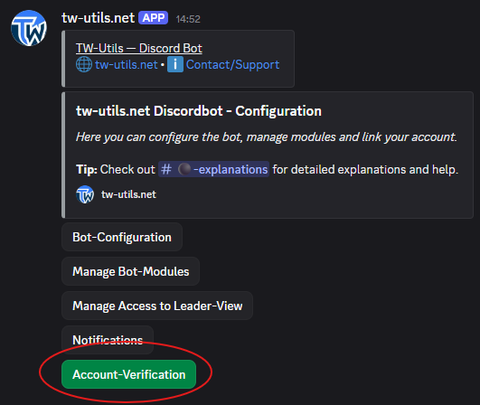
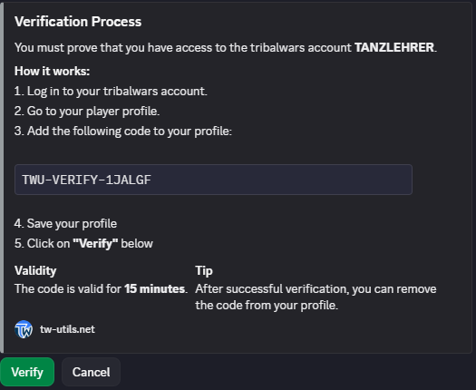
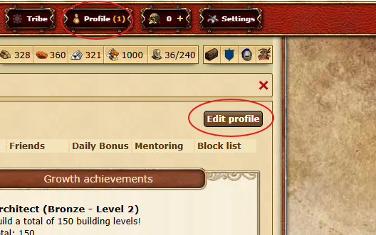
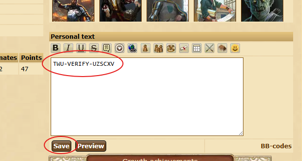
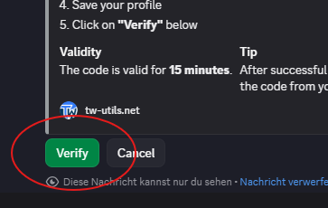
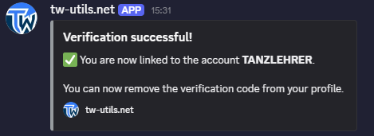
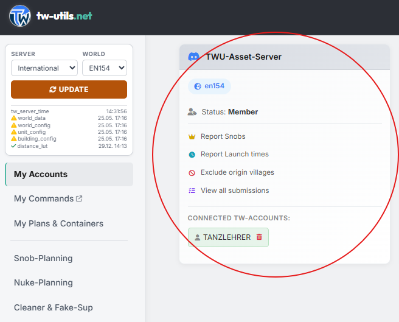

# Account-Verification

The account verification ensures that only authorized users can link themselves to a player account — meaning only those who actually have access to the respective account. Only on the basis of this verification do the personalized functions of the individual bot modules become available to you.

With every successful verification, a unique **triangular link** is created between your TW account, your Discord user, and the tribe Discord server. These three reference points ensure that bot functions, permissions, and notifications can always be unambiguously assigned to the right player on the right server.

## 1. Open the Bot-Config channel

Switch to the `#⚫-bot-config` channel on your tribe Discord. This channel was automatically created in the `⚙️ TWU-SETUP` category when the bot was invited and is the central control for all bot functions — there you will find all actions as buttons. **Click on the `Account-Verification` button** to start the verification.

{ .screenshot }

## 2. Start the verification flow

In the opened menu, click on the green `Verify your tribalwars-account` button to start linking a new account.

{ .screenshot }

## 3. Enter the ingame account name

An input window with the title `Verify your Ingame-Account` opens. In the `Account name (exactly as in game)` field, enter your player name — exactly as it is spelled in the game (mind capitalization and special characters). Then click on `Submit`.

{ .screenshot }

## 4. Receive the verification code

The bot checks whether the entered account exists on the configured game world and then shows you an embed with the title `Verification Process`. It contains an individual verification code as well as a short step-by-step instruction. Copy the code — you will need it in the next step in the game.

{ .screenshot }

!!! info "Code validity"
    The verification code is valid for **15 minutes**. If you do not complete the process within this time, you have to start the flow again and will receive a new code.

## 5. Open your profile in the game

Log into the corresponding game world, open your own player profile, and switch to the edit mode of the profile description.

{ .screenshot }

## 6. Paste the verification code into your profile

Paste the previously copied verification code into your profile description. The exact location within the description does not matter — the bot searches the entire text. Then save your profile.

{ .screenshot }

!!! warning "Don't forget to save the profile"
    Without saving, the code is not stored in your profile and the verification will fail.

## 7. Complete the verification in Discord

Switch back to the `#⚫-bot-config` Discord channel and click on the `Verify` button in the bot's verification embed. The bot then fetches your profile and automatically checks whether the individual code is stored there.

{ .screenshot }

## 8. Success message

If the code is found in your profile, the bot confirms the successful link with a success message. The verification is now complete — your Discord user is linked to the player account from now on and you can use the personalized functions of the bot modules.

{ .screenshot }

!!! tip "Remove the code from your profile"
    After a successful verification, you can remove the code from your profile description again — the link remains in place regardless.

!!! info "Verify multiple accounts"
    On the same world, you can link **multiple accounts** to your Discord user — simply repeat this flow for every additional account. With the `My verified tribalwars-accounts` button you can view the list of your linked accounts at any time. With `Unverify your tribalwars-account` you can release a link again.

## 9. Result on tw-utils

If you already have an account on tw-utils, you can additionally check the successful verification through the website — the corresponding card for your tribe Discord with your member status will now be displayed there.

{ .screenshot }

---

!!! info "Note for Admins"
    Admins can release links for other users via the `Admin: Unverify an account` and `Admin: Unverify a discorduser` buttons (e. g. for abandoned accounts or a Discord user change).
