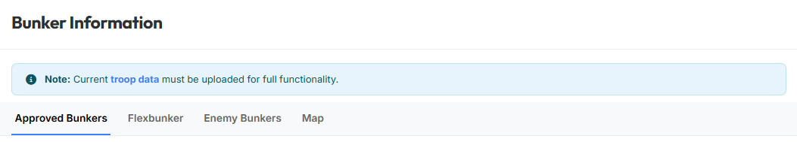
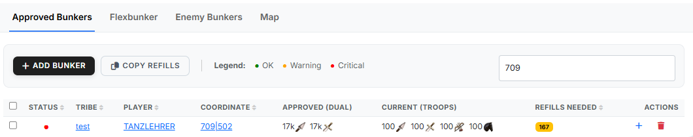
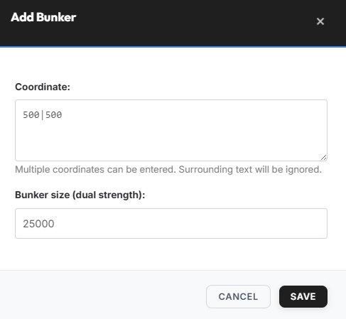
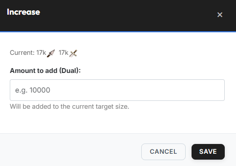
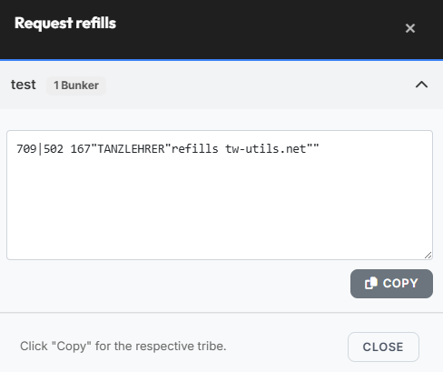
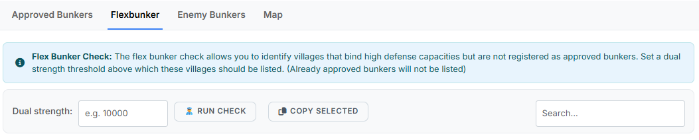
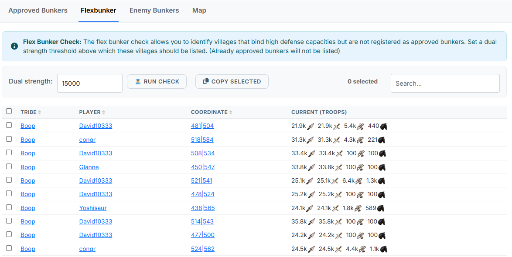
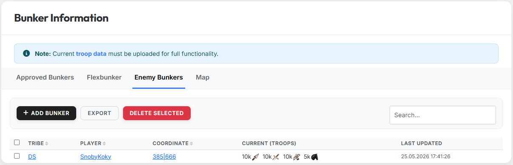
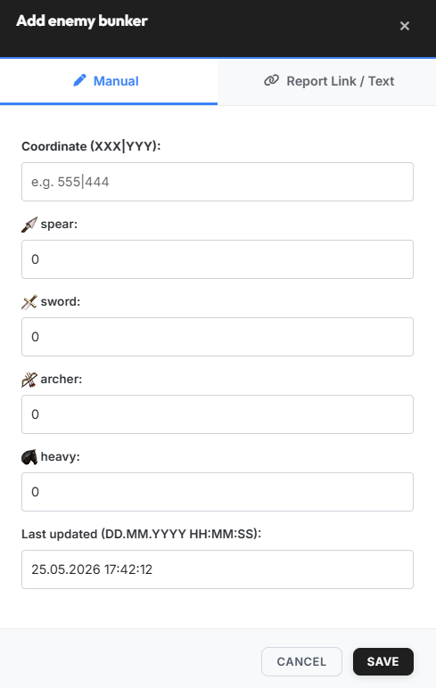
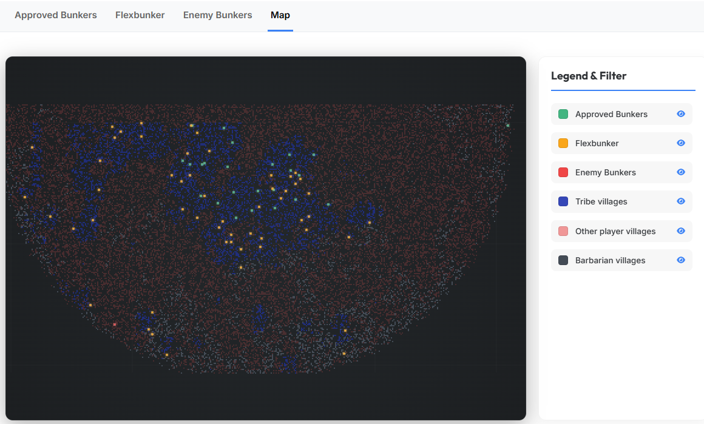

# Bunker-Info

{ .screenshot }

Der Tab **„Bunker-Informationen"** ist das zentrale Werkzeug für die
Bunker-Verwaltung des Stammes. Du verwaltest hier die genehmigten
Bunker, identifizierst zusätzliche Flexbunker, dokumentierst
feindliche Bunker und hast die Möglichkeit Dir die Bunker-Situation
auf einer Karte visualisieren zu lassen.

!!! info "Hinweis"
    Für den vollen Funktionsumfang müssen aktuelle Truppendaten im Tab
    [„Truppen"](truppen.md) hochgeladen sein. Ohne Truppendaten können
    weder Soll-/Ist-Vergleiche bei genehmigten Bunkern noch die
    Flexbunker-Kontrolle ausgewertet werden.

Die Seite hat vier Unterreiter:

- **Genehmigte Bunker**
- **Flexbunker**
- **Feindliche Bunker**
- **Karte**

## Genehmigte Bunker

In diesem Unterreiter verwaltest du die offiziell genehmigten
Bunker-Dörfer des Stammes. Pro Dorf wird ein **Soll-Wert**
(Dual-Stärke) hinterlegt; das System vergleicht ihn fortlaufend mit
dem aktuellen **Ist-Wert** aus den Truppendaten und zeigt fehlende
Refills an.

In der Liste tauchen sowohl manuell eingetragene Bunker als auch
Bunker auf, die die Stammesmitglieder über das
[Bunker-Information-System](../discord-bot/bunker-info.md) des
tw-utils-Discordbots beantragt haben und die von einem Leader genehmigt
wurden.

{ .screenshot }

Die Tabelle hat folgende Spalten:

| Spalte | Bedeutung |
|---|---|
| **Status** | Farbige Ampel (siehe Legende) |
| **Stamm** | Stamm des Bunker-Dorfs |
| **Spieler** | Besitzer des Dorfs |
| **Koordinate** | Koordinaten des Bunkers |
| **Soll (Dual)** | Angestrebte Dual-Stärke |
| **Ist (Truppen)** | Aktuell vorhandene Defensiv-Truppen |
| **benötigte Refills** | Differenz Soll - Ist als Dual |
| **Aktionen** | Aufstocken (`+`), Löschen (Mülltonne) |

**Status-Ampel (Legende):**

| Farbe | Label |
|---|---|
| 🟢 grün | OK |
| 🟠 orange | Warnung |
| 🔴 rot | Kritisch |

### Bunker manuell eintragen

Der **Standardweg** für neue Bunker führt über das
[Bunker-Information-System](../discord-bot/bunker-info.md) des
Discordbots: Spieler beantragen dort Bunker, Leader genehmigen sie und
sie landen automatisch in dieser Liste.

Zusätzlich können Leader Bunker direkt im Leader-View eintragen. Über
den Button **„Bunker eintragen"** öffnet sich ein Dialog mit zwei
Feldern:

{ .screenshot }

- **Koordinate** — mehrere Koordinaten möglich, umgebender Text wird
  ignoriert.
- **Bunker-Größe (Dual-Stärke)** — z. B. `25000`.

### Aufstocken (Soll-Wert erhöhen)

Aufstockungen kommen normalerweise ebenfalls über den Discordbot.
Leader können sie aber jederzeit auch manuell vornehmen: Über das
blaue **`+`-Symbol** in der Spalte **„Aktionen"** lässt sich die
Soll-Größe eines bestehenden Bunkers nachträglich erhöhen.

{ .screenshot }

Der eingegebene Wert wird **zur aktuellen Soll-Größe addiert** (er
ersetzt sie nicht).

### Copy Refills

Über den Button **„Copy Refills"** öffnest du den Dialog
**„Refills anfordern"**. Er enthält pro Stamm einen aufklappbaren
Textblock, der über den **„Kopieren"**-Button in die Zwischenablage
übernommen werden kann.

{ .screenshot }

Den kopierten Text kannst du z. B. ins Stammesforum stellen.

## Flexbunker

Mit der **Flexbunker-Kontrolle** findest du Dörfer, die zwar hohe
Defensiv-Kapazitäten halten, aber nicht offiziell als Bunker
eingetragen sind.

{ .screenshot }

> Mit der Flexbunker-Kontrolle kannst du Dörfer identifizieren, die
> hohe Deff-Kapazitäten binden, aber nicht als genehmigte Bunker
> eingetragen sind. Lege eine Dual-Stärke fest, oberhalb derer diese
> Dörfer aufgelistet werden sollen. (Bereits genehmigte Bunker werden
> nicht aufgelistet.)

Ablauf:

1. **Dual-Stärke** eingeben (z. B. `15000`).
2. Auf **„Kontrolle durchführen"** klicken.
3. Die Ergebnisliste prüfen, gewünschte Einträge markieren und über
   **„Markierte kopieren"** in die Zwischenablage übernehmen.

{ .screenshot }

Die Ergebnistabelle zeigt **Stamm / Spieler / Koordinate / Ist
(Truppen)** für alle Dörfer, die den Schwellenwert übertreffen.

## Feindliche Bunker

In diesem Unterreiter dokumentierst du Bunker-Dörfer auf Feindseite,
um sie bei Off-Planungen besser einschätzen zu können.

{ .screenshot }

Aktionen oben:

- **„Bunker eintragen"** — eigener Dialog für Feind-Bunker (siehe
  unten).
- **„Export"** — alle Einträge exportieren.
- **„Markierte löschen"** — Bulk-Löschen markierter Einträge.

Spalten: **Stamm / Spieler / Koordinate / Ist (Truppen) / Info-Stand**.

### Feind-Bunker eintragen

Der Dialog **„Feind-Bunker eintragen"** bietet zwei Eingabewege als
Tabs:

{ .screenshot }

- **Manuell** — Koordinate (`XXX|YYY`), **Speer**, **Schwert**,
  **Bogen**, **SKav** sowie der **Info-Stand** (Format
  `TT.MM.JJJJ HH:MM:SS`).
- **Report-Link / Text** — entweder die Berichts-URL oder den
  Berichts-Text einfügen; das System parst die Truppen und den
  Zeitstempel automatisch.

## Karte

Der Unterreiter **„Karte"** visualisiert alle eingetragenen Bunker auf
der Welt-Karte. Über das Panel **„Legende & Filter"** kannst du die
einzelnen Layer ein- und ausblenden.

{ .screenshot }

Verfügbare Layer:

- **Genehmigte Bunker**
- **Flexbunker**
- **Feindliche Bunker**
- **Stammesdörfer**
- **Restliche Spielerdörfer**
- **Barbarendörfer**
