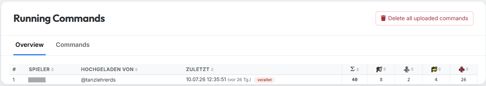
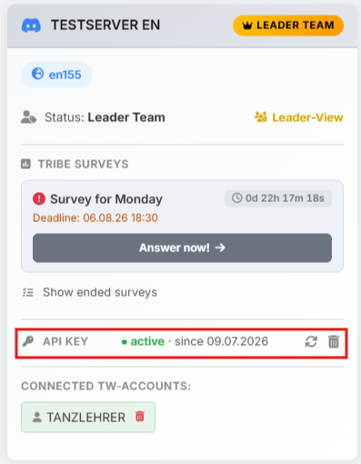
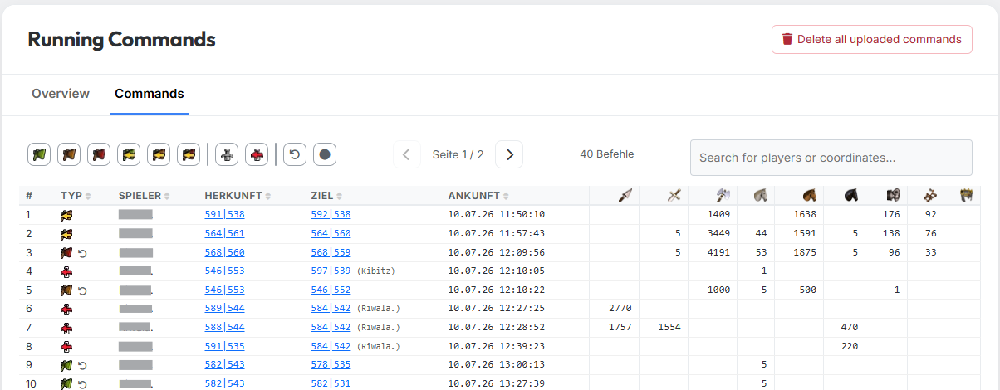

# Running Commands

{ .screenshot }

The **"Running Commands"** tab shows what is **actually on its way in
the game** right now — not what was planned. Attacks, supports and
returning troops of all players who have uploaded their command
overview come together here.

As tribe leadership this shows you at a glance which nukes are already
flying, where support is on its way and which troops are currently
tied up.

!!! warning "The data comes in exclusively through the tw-utils API"
    tw-utils reads **nothing** from the game. Running commands only
    end up here if a player uploads them through the **tw-utils
    API** — usually with a **userscript** that reads the command
    overview in the game.

    tw-utils provides **only the infrastructure** for that: the
    endpoint and the personal API key. A ready-made userscript is
    explicitly **not** part of the package — your tribe has to bring
    its own. How the interface works is described in the
    [API documentation](https://tw-utils.net/api/v1/docs){ target=_blank rel=noopener }.

!!! info "TWU-Planner and TWU-Leader only"
    The **"Running Commands"** tab is visible exclusively to users
    with the **TWU-Planner** or **TWU-Leader** role. Details under
    [Permission](uebersicht.md#which-role-sees-which-tab).

The tab has two sub-tabs: **Overview** (one row per player) and
**Commands** (every single command).

## What the data is used for

The uploaded commands are not just there to look at — they feed into
the planning in several places:

- **Leader-View** — this tab with the **Overview** and **Commands**
  sub-tabs.
- **Nuke-planning tool** — in step 1 the switch **"Include running
  commands (API)"** subtracts the troops that are already on their
  way. That is more precise than calculating from saved plans,
  because it also covers commands that never came from a plan at all.
  See [Step 1: Troops](../off-planner/schritt1-truppen.md).
- **Cleaner & Fake-Sup** — the same switch in step 1, see
  [Step 1: Troops](../cleaner-fake-ut/schritt1-truppen.md).

In both planning tools the switch only appears if you hold the right
to read running commands on a Discord server for this world.

## How the data gets here

Every player uploads their own commands — in two steps:

1. On **"My Accounts"** the player creates their personal **API key**
   in the account card.
2. A userscript reads the command overview in the game and sends it to
   tw-utils using that key.

{ .screenshot }

The two icons on the right let you regenerate or delete the key at any
time. It is to be treated like a password and always applies to one
Discord server only.

How an upload behaves, which limits apply and who may upload for which
accounts is described in the
[API documentation](https://tw-utils.net/api/v1/docs){ target=_blank rel=noopener }.

!!! info "No refresh button"
    The page deliberately has no refresh button: the data only ever
    changes when a player uploads again. Reloading the page is enough
    to see the current state.

## The "Overview" sub-tab

The overview shows one row per player who has ever uploaded: who it
was, who triggered the upload, when that last happened, and how many
commands came in — as a total and broken down into attacks, supports
and returning attacks and supports.

All columns except **#** can be sorted by clicking the header. Without
your own sorting, the **most recent upload is on top**.

!!! warning "The red \"outdated\" badge"
    If a player's last upload is more than **one hour** old, a red
    **"outdated"** badge appears behind the timestamp. The numbers in
    that row may then no longer reflect reality — in the meantime
    commands may have arrived or new ones may have started. For
    planning purposes you should ask that player to upload again.

## The "Commands" sub-tab

{ .screenshot }

This is where every single uploaded command of the tribe is listed.

| Column | Meaning |
|---|---|
| **#** | Running number, continues across pages |
| **Type** | Symbol of the command (kind and size), plus a state symbol if applicable |
| **Player** | Owner of the command — always the player who uploaded it |
| **Source** | Source village, linked into the game |
| **Target** | Target village with the owner in brackets |
| **Arrival time** | Arrival time in world time |
| *Units* | One column per unit of the world; empty cells mean 0 |

By default the table is sorted by **arrival ascending** — so the next
impact is on top. The columns **Type**, **Player**, **Source**,
**Target** and **Arrival time** can be re-sorted by clicking.

### Filters, search and pages

Above the table sits a bar of icon filters. From left to right:

| Icon | Filters for |
|---|---|
| Small attack flag | **Small attack** — up to 1,000 troops |
| Medium attack flag | **Medium attack** — up to 5,000 troops |
| Large attack flag | **Large attack** — more than 5,000 troops |
| Small returning flag | **Small attack (returning)** |
| Medium returning flag | **Medium attack (returning)** |
| Large returning flag | **Large attack (returning)** |
| Shield | **Support** |
| Shield with arrow | **Support (returning)** |
| ↺ | **Uncertain combat outcome** |
| ● | **Support already arrived** |

The filters can be **combined** — everything matching at least one of
the active filters is shown. With no filter active you see everything.

The last two filters do not describe a command type but a state:

- **Uncertain combat outcome** — an attack whose arrival time has
  already passed. tw-utils does not know whether it got through; the
  troops are presumably on their way home. In that case the type
  symbol additionally shows the estimated time of return.
- **Support already arrived** — a support whose arrival time has
  passed. The troops are therefore presumably stationed in the target
  village.

To the right of it sit the page arrows (**25 commands per page**), the
number of currently filtered commands and a search field. The search
covers **player names and coordinates** of both source and target at
once.

## Old commands and clean-up

Commands disappear by themselves — not by the clock, though, but **on
the next upload**: whenever any player of this Discord server uploads
again, tw-utils takes the opportunity to clear out everything whose
troop movement ended more than an hour ago. For **attacks** it is not
the arrival that counts but the **return flight** — after all, the
troops are tied up until they get home. For all other command types the
arrival counts.

So if nobody uploads any more, old rows stay put. In normal operation
manual clean-up is still not needed.

!!! warning "\"Delete all uploaded commands\" hits the whole server"
    The button at the top right deletes the running commands of
    **all** players of the Discord server, not just those of a single
    one. The action cannot be undone — the data only comes back once
    every player uploads again. Anyone who may see the tab can also
    press this button.
