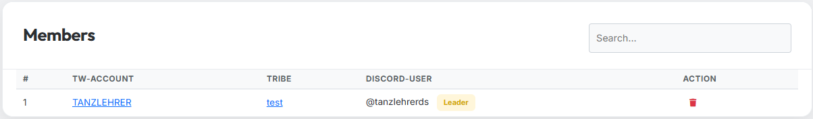

# Members

{ .screenshot }

The **"Members"** tab shows all Discord users who have verified one or
more TW-Accounts on the tribe Discord server. At a glance you can see
who in the tribe is even linked with the tw-utils Discord bot and
which role they have.

!!! info "Requirements for the Leader-View"
    Who is allowed to open the Leader-View and how the "Leader" role
    is granted is described in [Permission](uebersicht.md).

## Table columns

| Column | Meaning |
|---|---|
| **#** | Running number |
| **TW-Account** | Verified TW-Account |
| **Tribe** | Tribe the account currently plays in |
| **Discord-User** | Linked Discord account (+ optional **"Leader"** badge) |
| **Actions** | Remove link (trash icon) |

## Search & manage

- Via the **"Search..."** field at the top right you filter the list
  by TW-Account, tribe or Discord name.
- Via the red trash icon in the **"Actions"** column you can remove
  the link between a Discord user and a TW-Account. The Discord user
  can then re-verify via the bot afterwards.
