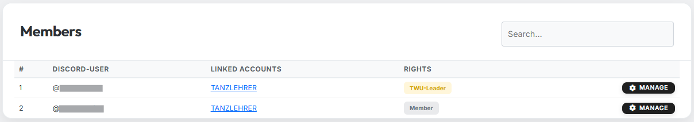
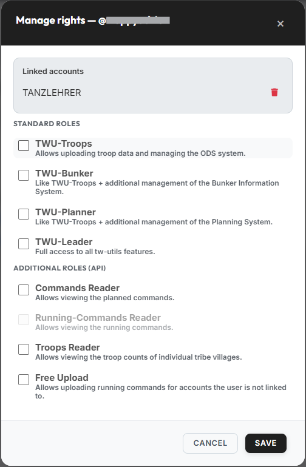

# Mitglieder

{ .screenshot }

Der Tab **„Mitglieder"** zeigt alle Discord-User, die sich auf dem
Stammes-Discordserver mit einem oder mehreren DS-Accounts verifiziert
haben. Du siehst auf einen Blick, wer im Stamm überhaupt mit dem
tw-utils-Discordbot verknüpft ist und wer welche Rechte besitzt. Hier
werden auch alle Rollen vergeben.

!!! info "Nur für TWU-Leader"
    Der Tab **„Mitglieder"** ist ausschließlich für User mit der Rolle
    **TWU-Leader** sichtbar. Welche Rolle welchen Tab sieht, steht
    unter [Berechtigung](uebersicht.md#welche-rolle-sieht-welchen-tab).

## Spalten der Tabelle

Pro Discord-User gibt es genau eine Zeile — auch dann, wenn er mehrere
DS-Accounts verifiziert hat.

| Spalte | Bedeutung |
|---|---|
| **#** | Laufende Nummer |
| **Discord-User** | Der verknüpfte Discord-Account |
| **Verknüpfte Accounts** | Alle verifizierten DS-Accounts dieses Users, verlinkt ins Spiel |
| **Rechte** | Die vergebenen Rollen als Badge; ohne Rolle steht dort **„Mitglied"** |
| | Button **„Verwalten"** zum Öffnen des Rechte-Dialogs |

Über das Suchfeld **„Suche..."** oben rechts filterst du die Liste nach
Discord-Namen oder DS-Account.

## Rechte verwalten

Über den Button **„Verwalten"** in einer Zeile öffnet sich der Dialog
**„Rechte verwalten"**:

{ .screenshot }

Ganz oben stehen die **verknüpften Accounts** des Users. Über das rote
Mülltonnen-Icon lässt sich eine einzelne Verknüpfung zwischen dem
Discord-User und einem DS-Account entfernen. Der Discord-User kann sich
danach jederzeit erneut über den Bot verifizieren.

Darunter folgen die Rollen in zwei Blöcken.

### Standard-Rollen

Diese vier Rollen steuern, was ein User auf tw-utils.net und im
Discordbot darf:

| Rolle | Bedeutung |
|---|---|
| **TWU-Troops** | Erlaubt das Hochladen von Truppendaten sowie die Verwaltung des ODS-Systems. |
| **TWU-Bunker** | wie TWU-Troops + zusätzlich Verwaltung des Bunker-Information-Systems. |
| **TWU-Planner** | wie TWU-Troops + zusätzlich Verwaltung des Planning-Systems. |
| **TWU-Leader** | Vollzugriff auf alle Funktionen von tw-utils. |

Die Rollen bauen aufeinander auf, und der Dialog setzt das direkt um:

- Setzt du **TWU-Leader**, werden TWU-Troops, TWU-Bunker und
  TWU-Planner automatisch mit angehakt und gesperrt — Vollzugriff
  schließt sie ohnehin ein.
- Setzt du **TWU-Bunker** oder **TWU-Planner**, wird **TWU-Troops**
  automatisch mit angehakt und gesperrt.

!!! warning "Zwei Sperren zum Schutz vor Aussperrung"
    Du kannst dir deine **eigene** TWU-Leader-Rolle nicht entziehen,
    und der **letzte** TWU-Leader eines Servers bleibt immer erhalten.
    In beiden Fällen ist das Häkchen fest gesetzt bzw. das Speichern
    wird mit einem Hinweis abgelehnt.

### Zusatzrollen (API)

Die Zusatzrollen betreffen ausschließlich die tw-utils-API, über die
Userscripts Daten austauschen. Für die normale Bedienung der Website
werden sie nicht gebraucht.

| Rolle | Bedeutung |
|---|---|
| **Befehls-Leser** | Erlaubt die Einsichtnahme in die geplanten Befehle. |
| **Laufende-Befehle-Leser** | Erlaubt die Einsichtnahme in die laufenden Befehle. |
| **Truppen-Leser** | Erlaubt die Einsichtnahme in den Truppenstand einzelner Stammesdörfer. |
| **Freier Upload** | Erlaubt den Upload von laufenden Befehlen für Accounts, mit denen der User nicht verknüpft ist. |

!!! info "Laufende-Befehle-Leser ist noch nicht vergebbar"
    Die Rolle **„Laufende-Befehle-Leser"** wird im Dialog ausgegraut
    angezeigt und lässt sich nicht anhaken. Für die laufenden Befehle
    gibt es aktuell keinen API-Lesezugriff — die Rolle ist für einen
    späteren Ausbau reserviert. Wer die laufenden Befehle im
    Leader-View sehen möchte, braucht TWU-Planner oder TWU-Leader
    (siehe [Laufende Befehle](laufende-befehle.md)).

Mit **„Speichern"** werden alle Änderungen übernommen; sie wirken
sofort.
