# Planning (Container)

The **"Planning"** tab is the largest area of the Leader-View. It is
split into two sub-tabs:

- **Container** — collect, coordinate and distribute attack plans to
  the players. That is what this page is about.
- **Tribe Surveys** — collect preparatory data from the members
  (snob entries, launch times, excluded source villages). They are
  described under [Tribe Surveys](stammes-umfragen.md) and are
  preselected when the tab is opened.

!!! info "TWU-Planner and TWU-Leader only"
    The **"Planning"** tab is visible exclusively to users with the
    **TWU-Planner** or **TWU-Leader** role. Details under
    [Permission](uebersicht.md#which-role-sees-which-tab).

## Container

In the **"Container"** sub-tab you manage the actual attack plans. A
**container** bundles an operation — e.g. a nuke wave, a snob action
or an interim cleaner — with all plans and commands and controls the
distribution to the individual players.

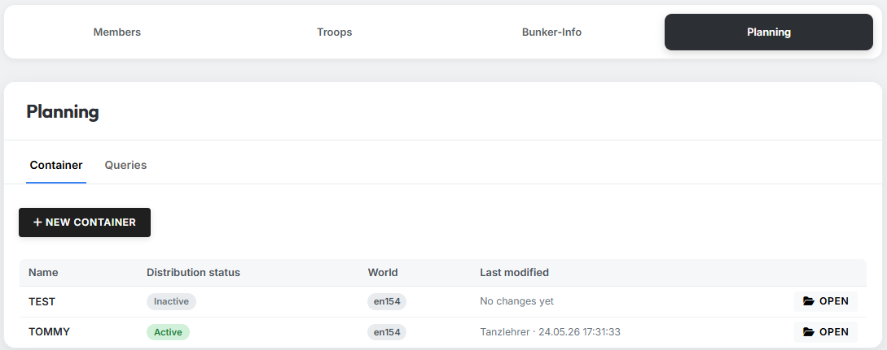{ .screenshot }

Here you can open existing containers and create new ones. Clicking
**"Open"** switches to the respective container overview.

### Create a new container

By clicking the **"New Container"** button you create a new container.
A modal opens in which you must set a **name** for the container
(max. 50 characters, e.g. `Op. Phoenix`).

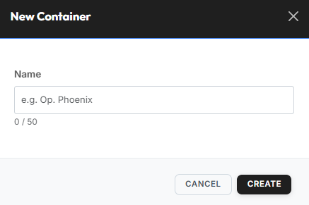{ .screenshot }

After confirming, the container is automatically assigned to the
current world, starts in the status **"Inactive"** and appears
immediately in the container overview.

### Structure of a container

Right after creation, a container is still completely empty — neither
plans nor commands are stored yet. The basic frame with header,
action bar and the two tabs is however already visible:

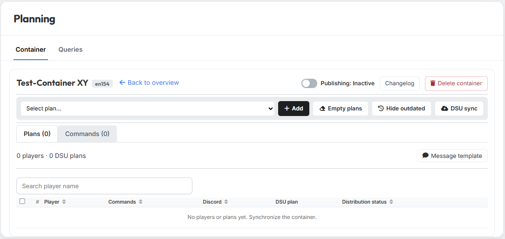{ .screenshot }

**Header area**

In the header area you find the container name and the world badge
of the associated TW world on the left. Via the **"Back to overview"**
link you return to the tribe's container overview.

On the right side you find the container-wide actions:

- the **publishing toggle** to activate / deactivate the container
  (see [Publishing](#publishing)),
- the **"Changelog"** button for the change history (see
  [Other](#other)),
- the **"Delete container"** button for completely removing the
  container (see [Other](#other)).

**Action bar**

Directly below the header sits the action bar with the tools to
populate and synchronize the container:

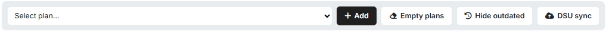{ .screenshot }

Via the **"Select plan…"** dropdown you choose a plan from your
saved plans and add it to the container with a click on **"Add"**.
After adding, the **"Plans"** and **"Commands"** tabs update
accordingly — the imported per-player plans and commands appear
there immediately. In the same way you can add further plans one
after another.

To empty the container completely, a click on **"Empty plans"**
removes all previously imported commands in one step. The
**"Hide outdated"** button hides, in one go, every command whose launch
time already lies in the past — they remain in the container but are
simply no longer displayed. You bring them back via the
**"Show hidden"** checkbox in the "Commands" tab (see
[The "Commands" tab](#commands-tab)).

!!! info "DSU plans persist after \"Empty plans\""
    If the container has previously been transferred to DS-Ultimate
    via **"DSU sync"**, the DSU plans created there (one per player +
    total plan) also remain after **"Empty plans"**. The commands
    within those DSU plans are however also removed by
    **"Empty plans"** — only the empty DSU plan stays behind.

A click on **"DSU sync"** transfers the commands currently in the
container to DS-Ultimate. The tool creates a separate DSU plan per
player as well as a "total plan" with all commands. Details on this
step can be found in the [DSU sync](#dsu-sync) section.

**"Plans" and "Commands" tabs**

In the lower area of the container the two tabs **"Plans"** and
**"Commands"** are available. Details for both tabs are in the
respective sections below.

### "Plans" tab

In the **"Plans"** tab you manage the players' attack plans — there
is one row per player for whom commands exist in the container.

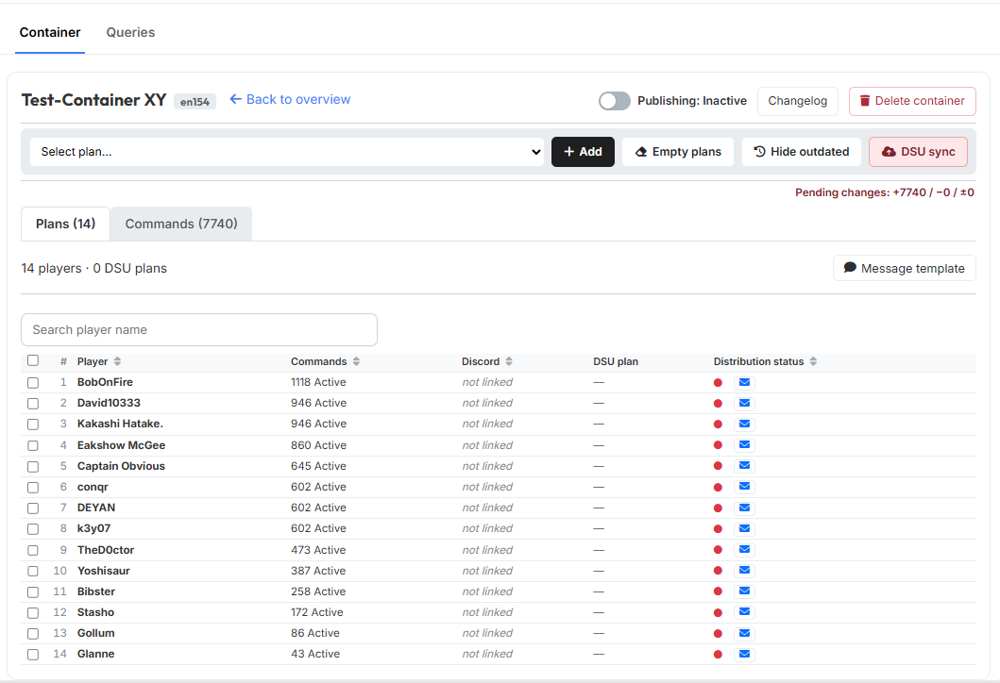{ .screenshot }

At a glance you can tell whether the player account is linked to a
Discord account; that immediately shows you whether the player can
download the plan themselves via the tw-utils Discord bot or whether
you need to send it to them via in-game message. You also see the
**DSU plan** link of the respective player — this only appears
after a [DSU sync](#dsu-sync) has been performed. The
**distribution status** finally turns green as soon as the plan has
been sent via in-game message **or** as soon as a linked Discord user
has downloaded the plan via the Discord bot.

In addition, several functions are available to you as tribe
leadership, described in the following sub-sections.

#### Functions

##### DSU sync

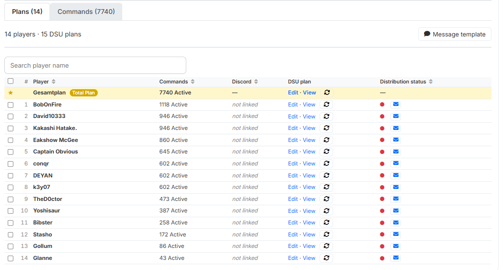{ .screenshot }

After clicking **"DSU sync"**, the tool creates a DSU plan on
DS-Ultimate for each player; in the **"DSU plan"** column the links
**"Edit · View"** appear.

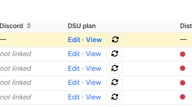{ .screenshot }

In addition, the highlighted row **`Gesamtplan`** appears at the very
top, carrying the yellow **"Total Plan"** badge — it contains all
commands of all players in a single DSU plan.

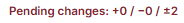{ .screenshot }

Below the plan bar the hint **"Pending changes: +X / −Y / ±Z"** shows
how many commands have been **added (+)**, **removed (−)** or
**changed (±)** since the last sync. As long as it is visible, the DSU
plans are not up to date — with nothing pending, the hint disappears
entirely.

!!! info "What gets synchronized?"
    Only commands that are present in the container **and** not
    hidden are transferred to the DSU plans. Hidden commands (via
    **"Hide outdated"** or manually) remain in the container but do
    not flow into the DSU sync.

##### Plan distribution

The finished plans can be distributed to the players in **three
ways**:

1. **Via the Discord bot** — players with completed account
   verification can download the plan themselves via the tribe's
   Discord server.
2. **Via in-game message** — the leader sends the plan individually
   via in-game message, optionally with the message template provided
   by tw-utils.
3. **Other distribution via export** — the DSU links can be exported
   as a TXT file and reused outside the game (e.g. forum posting,
   Discord DM, etc.).

**Distribution via the Discord bot**

Players who have completed their account verification with their TW
account can download the attack plan themselves via the
[Planning-System of the tw-utils Discord bot](../discord-bot/planning-system.md).
Active sending by the leader is not necessary here. Which players are
verified via the bot can be seen in the **Discord** column of the
overview.

**Distribution via in-game message**

If players are to receive the plan via in-game message, the
**message template** comes into play — the text template that is
individually filled in for each player when sending.

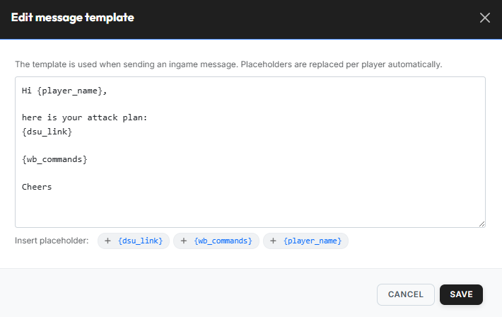{ .screenshot }

Via the **"Message template"** button you open the editor
**"Edit message template"**. The placeholders are replaced per
player automatically:

| Placeholder | Is replaced with |
|---|---|
| `{player_name}` | Name of the player the message goes to |
| `{dsu_link}` | Individual link to the DS-Ultimate plan of this player |
| `{wb_commands}` | All WB commands of the player in a spoiler block. |

Once the message template has been created and saved, you can start
the distribution by clicking the blue **letter icon** in the
**"Distribution status"** column:

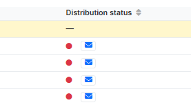{ .screenshot }

The **"Send in-game message"** dialog opens, showing the finished
message for the respective recipient (template with resolved
placeholders, including WB-commands spoiler).

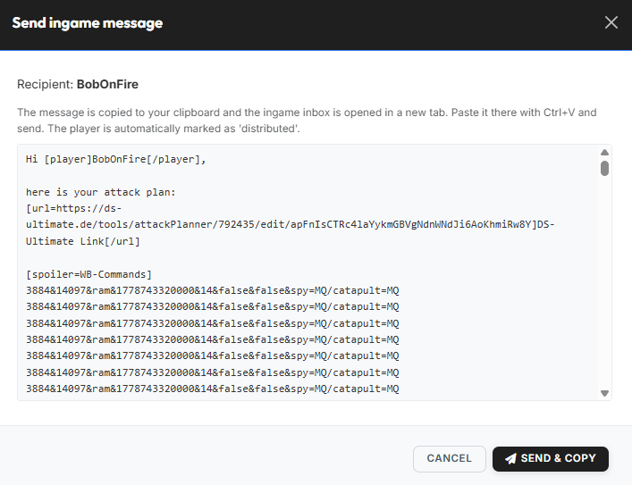{ .screenshot }

Via **"Send & copy"** the message is copied to the clipboard and at
the same time the in-game message is opened in a new tab — there
simply paste with `Ctrl+V` and send. The player is automatically
marked as **"distributed"**.

**Other distribution via export of DSU links**

If the distribution is to take place outside of Discord and in-game —
e.g. centrally in the tribe forum — you can download the DSU links of
the selected players as a TXT file via the bulk action
**"Export Links"**.

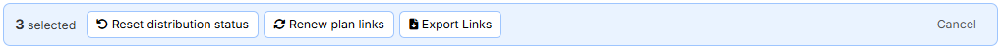{ .screenshot }

To do so, mark the desired players in the player table; in the action
bar that appears at the top, you then choose **"Export Links"**. The
TXT file contains one DSU link per marked player and can be reused
freely.

##### Status & link management (bulk actions)

To allow a single player to receive the plan again, or to manage
multiple players at once, there are two tools: the **reset icon** in
each individual row and the **action bar with bulk actions** above
the column selector.

**Reset distribution status individually**

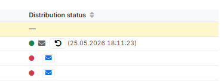{ .screenshot }

The **distribution status** in each row jumps to **green** after
sending and shows the timestamp of the distribution. Via the small
**reset icon** (arrow in circle) the status can be manually reset —
e.g. if a player should receive the plan again.

**Bulk actions for multiple players**

As soon as you check at least one entry in the player table, an
action bar appears at the top with bulk actions. Via
**"Reset distribution status"** you reset the distribution status of
all selected players to 🔴 — useful when the plans should be
distributed again. With **"Renew plan links"** a new DSU link is generated for the
selected players; the old link becomes invalid immediately, so the
affected players have to actively fetch the new link. The bulk action
**"Export Links"** is described in the
[Plan distribution](#plan-distribution) section. Via **"Cancel"** you
discard the current selection.

### "Commands" tab

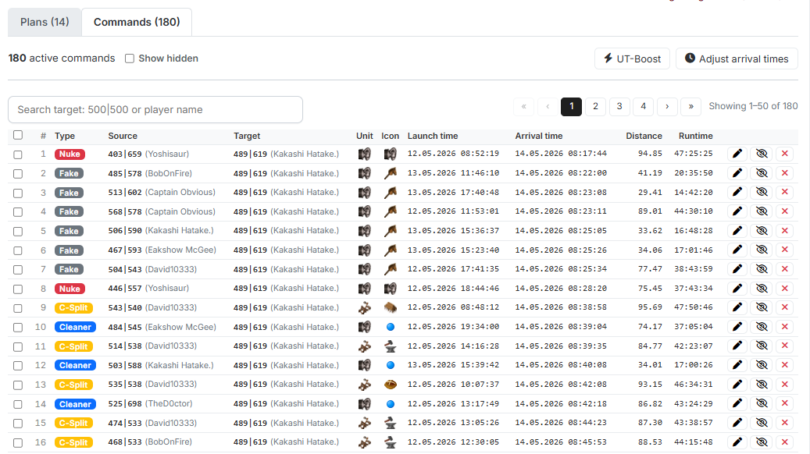{ .screenshot }

In the **"Commands"** tab you, as a leader, manage the commands
contained in the container. Individual commands can be edited, hidden
or deleted here — hidden commands can be brought back into view at
any time via the **"Show hidden"** checkbox. Bulk actions such as
adjusting arrival times and applying UT boosts to fake-UT commands
are also possible here. The individual functions are described in
the following.

#### Functions

##### Edit a single command

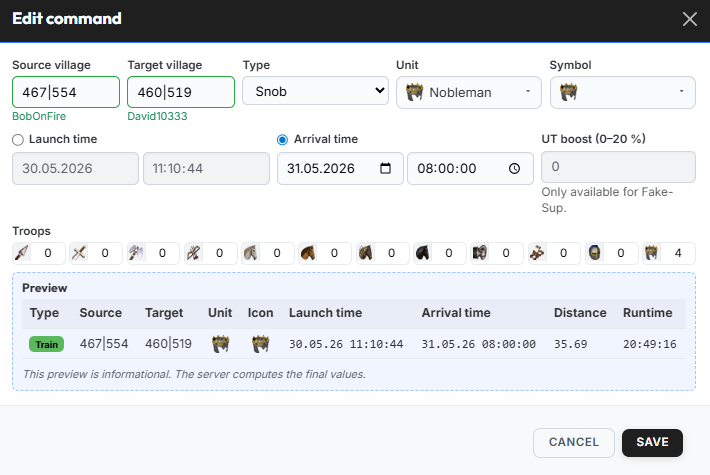{ .screenshot }

Via the edit icon of a command you open the **"Edit command"**
dialog. Here you can adjust a single command afterwards.

In the upper area of the dialog, **Source village** and **Target
village** with their coordinates are available for editing; the
player name is automatically shown below the respective field. Via
the **"Type"** field (e.g. **"Snob"**, **"Nuke"** or **"Fake"**),
**"Unit"** (fastest unit used, it determines the runtime) and
**"Symbol"** (DS-Ultimate icon of the command), you set the key data
of the command. For the times, one of the two values **Launch time**
and **Arrival time** is editable — the other is calculated
automatically. The **UT boost (0–20 %)** is optional and only
relevant for fake-UT commands. Under **"Troops"** you enter the
number of troops per unit type in the command.

The **Preview** at the bottom of the dialog provides a live preview
of the command. It is purely informational — the final values are
calculated by the server on save.

##### Adjust arrival times

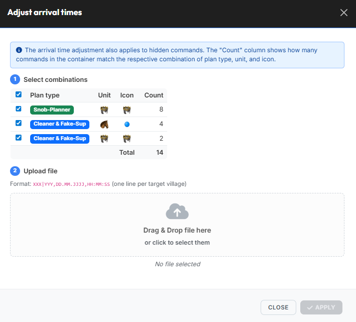{ .screenshot }

The **"Adjust arrival times"** dialog shifts the arrival times for
certain command groups. This function is often used to align snob
commands to the latest running nuke, for example.

In the first step, you selectively choose which plan-type / unit /
icon combinations should be adjusted — so you can limit the
adjustment to individual command groups and leave others untouched.
The **"Count"** column shows, per row, how many commands in the
container fall under the respective combination; the **"Total"**
column sums the currently marked selection.

In the second step you upload a text file with the new arrival times
— one line per target village in the format
`XXX|YYY,DD.MM.YYYY,HH:MM:SS`. The file can be placed via drag & drop
or selected by clicking.

!!! info "Adjustment includes hidden commands"
    The adjustment of arrival times also applies to currently hidden
    commands of the selected combination.

##### Apply UT boost

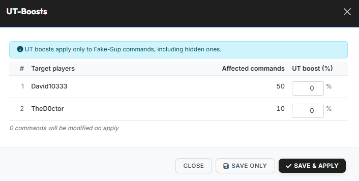{ .screenshot }

Enemy players often activate the UT boost during an offensive
action. Support commands like fake-UTs then have a shorter runtime.
The originally created attack commands do not account for this,
because at planning time it is not clear whether an enemy player
will activate the UT boost.

Once a player has activated the UT boost, you can use the
**"UT boosts"** dialog to retroactively adjust all fake-UT commands
targeting that player to the activated boost. To do so, enter the
corresponding boost percentage (0–20 %) per target player in the
table.

!!! info "Only for fake-UT commands"
    UT boosts apply exclusively to **fake-UT commands** and include
    hidden commands as well.

- **"Save only"** — stores the entered boost values without
  recalculating the affected fake-UT commands yet. The actual
  adjustment of the commands only happens on a later click on
  **"Save & apply"**.
- **"Save & apply"** — save the values and immediately apply them to
  all affected commands.

### Publishing

Via the **publishing toggle** at the top right of the header area the
leader controls whether the container is actively delivered to the
outside.

{ .screenshot }

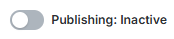{ .screenshot }

If the toggle is set to **"Active"**, the players can download their
plans themselves via the Discord bot (Planning-System) and see the
corresponding commands on their **"My Commands"** page at
tw-utils.net. If the toggle is set to **"Inactive"**, both pause:
neither the Discord download nor the display under **"My Commands"**
is then available. In this state the container is only visible
internally in the Leader-View — ideal during the preparation of an
operation.

!!! info "No effect on already distributed DSU plans"
    The publishing toggle only affects the Discord download and the
    display under **"My Commands"**. Plans already synchronized to
    DS-Ultimate remain there and are still accessible, even if the
    container is switched to **"Inactive"**.

### Other

#### Changelog

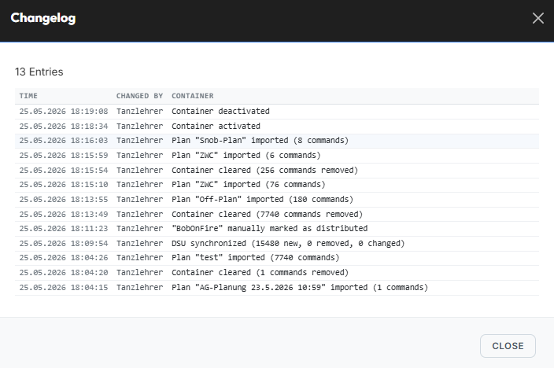{ .screenshot }

Via the **"Changelog"** button you open the full history of all
changes to the container. Per entry you see the **timestamp**,
**changed by** (leader or player) and, in the **Container** column, the
executed action.

#### Delete container

Via the **"Delete container"** button in the header area (right next
to **"Changelog"**) the entire container including all imported plans
and commands is removed. The action is **irreversible** — deleted
containers cannot be restored. Before deletion a confirmation dialog
appears to prevent accidental deletions.

!!! info "Already distributed DSU plans remain intact"
    The plans created on DS-Ultimate remain in place after the
    container is deleted — once created, a DSU plan can no longer be
    removed through the interface. tw-utils does, however,
    automatically **empty** the associated DSU plans when the
    container is deleted, removing all commands there.

    Links you already handed out therefore keep working, but show an
    empty plan afterwards. To get rid of the plan for good you have to
    delete it on DS-Ultimate directly.
