# Planung

Der Tab **„Planung"** ist der größte Bereich des Leader-Views. Er
gliedert sich in zwei Unterreiter:

- **Container** — Angriffspläne sammeln, koordinieren und an die
  Spieler verteilen.
- **Abfragen** — vorbereitende Daten sammeln (AG-Meldungen,
  Abschickzeiten, ausgeplante Herkunftsdörfer).

## Abfragen

Unter dem Reiter **„Abfragen"** findest du drei Pill-Tabs:
**AG-Meldungen**, **Abschickzeiten** und **Ausgeplante Dörfer**.

### AG-Meldungen

In diesem Bereich sammelst du Meldungen, wie viele AGs welcher Spieler
auf welche Zieldörfer fertig hat.

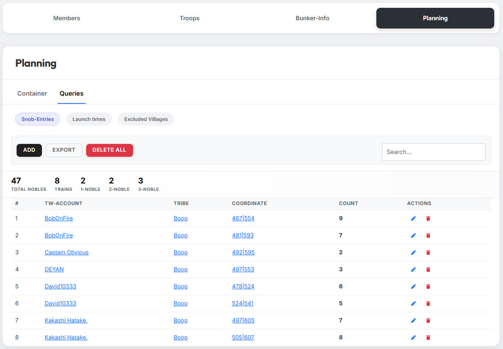{ .screenshot }

Oben siehst du eine Kennzahlen-Leiste mit:

- **Gesamt AGs**
- **Trains**
- **1er-AGs**, **2er-AGs**, **3er-AGs**

Die Tabelle darunter zeigt pro Eintrag: **DS-Account / Stamm /
Koordinate / Anzahl / Aktionen** (Bearbeiten + Löschen).

Aktionen oben: **„Hinzufügen"**, **„Export"**, **„Alles löschen"**.

#### Manuelles Hinzufügen

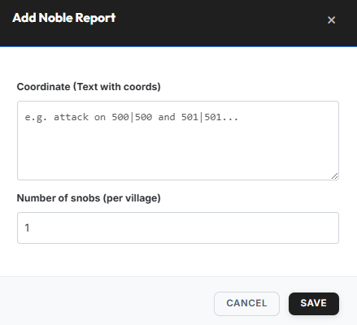{ .screenshot }

Der Dialog **„AG-Meldung hinzufügen"** enthält zwei Felder:

- **Koordinaten (Text mit Koords)** — mehrere Koordinaten möglich,
  umgebender Text wird ignoriert (z. B. `Angriff auf 500|500 und
  501|501…`).
- **Anzahl AGs (pro Dorf)** — wie viele AGs der Spieler pro Zieldorf
  fertig hat.

!!! info "AG-Meldungen werden meistens über den Discordbot gesammelt"
    In der Regel geben die Spieler ihre AG-Meldungen direkt im
    [Planning-System des Discordbots](../discord-bot/planning-system.md)
    ab. Die Einträge erscheinen dann automatisch in dieser Liste —
    manuelles Hinzufügen ist nur die Ausweich-Option.

### Abschickzeiten

Hier sammelst du die individuellen Abschickfenster der Spieler.

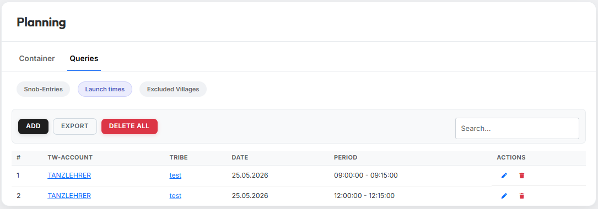{ .screenshot }

Tabellenspalten: **DS-Account / Stamm / Datum / Zeitraum (Von - Bis) /
Aktionen**.

Aktionen oben: **„Hinzufügen"**, **„Export"**, **„Alles löschen"**.

#### Manuelles Hinzufügen

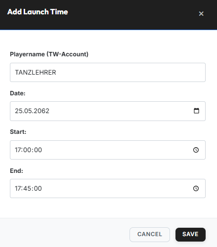{ .screenshot }

Der Dialog **„Abschickzeit hinzufügen"** enthält folgende Felder:

- **Spielername (DS-Account)** — mit Autovervollständigung über die
  verifizierten Accounts.
- **Datum**
- **Von** / **Bis**

!!! info "Hinweis"
    Auch die Abschickzeiten werden idealerweise nicht manuell gepflegt,
    sondern direkt von den Spielern über den
    [Discordbot](../discord-bot/planning-system.md) gemeldet.

### Ausgeplante Dörfer

Hier markierst du Dörfer, die in der Off-Planung **nicht als
Herkunftsdorf** verwendet werden sollen.

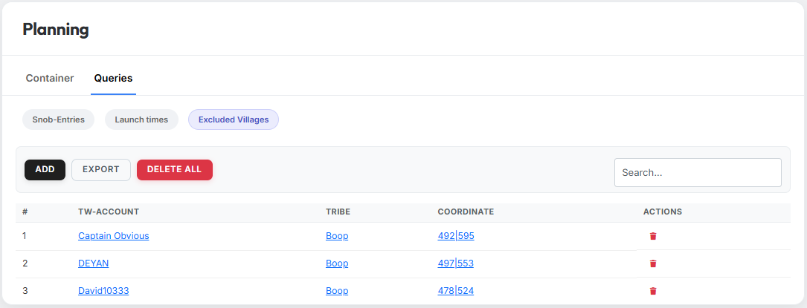{ .screenshot }

Tabellenspalten: **DS-Account / Stamm / Koordinate / Aktionen**.

#### Manuelles Hinzufügen

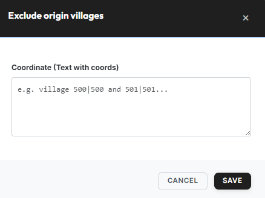{ .screenshot }

Im Dialog **„Herkunftsdorf ausplanen"** trägst du im Feld
**„Koordinaten (Text mit Koords)"** eine oder mehrere Koordinaten ein
(umgebender Text wird ignoriert).

## Container

Im Unterreiter **„Container"** verwaltest du die eigentlichen
Angriffspläne. Ein Container bündelt eine Operation — z. B. eine
Off-Welle, eine AG-Aktion oder einen Zwischencleaner — mit allen Plänen
und Befehlen, und steuert die Verteilung an die einzelnen Spieler.

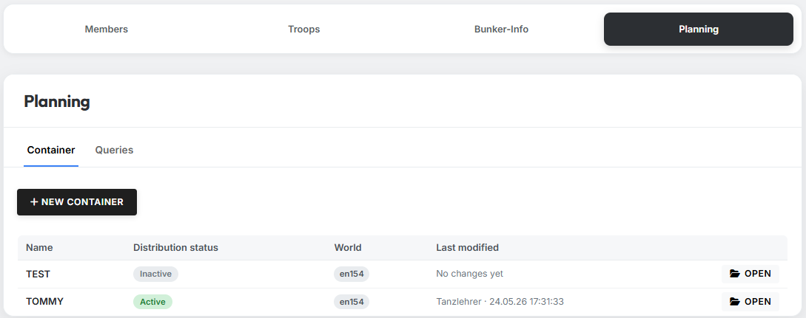{ .screenshot }

Die Übersichtstabelle zeigt: **Name / Verteilungsstatus / Welt /
Zuletzt geändert / Öffnen-Button**.

### Container anlegen

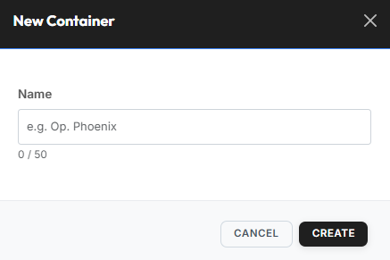{ .screenshot }

Über **„Neuer Container"** öffnet sich der Dialog **„Neuer Container"**
mit dem Feld **„Name"** (max. 50 Zeichen, z. B. `Op. Phoenix`).

### Leerer Container nach dem Öffnen

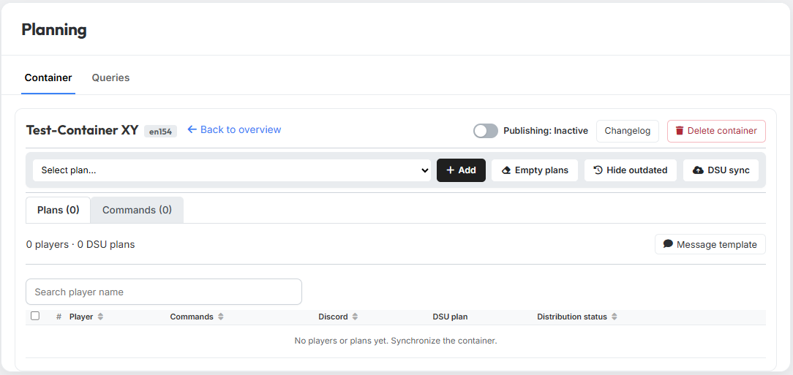{ .screenshot }

Direkt nach dem Öffnen siehst du folgende Bereiche:

- **Kopfbereich** — Container-Name + Welt-Badge, links
  **„Zurück zur Übersicht"**, rechts der Veröffentlichungs-Toggle, der
  Button **„Changelog"** und **„Container löschen"**.
- **Action-Leiste** — Dropdown **„Plan auswählen…"**, gefolgt von
  **„Hinzufügen"**, **„Pläne leeren"**, **„Veraltete ausblenden"** und
  **„DSU-Synchronisation"**.
- **Reiter** — darunter wechselst du zwischen **„Pläne"** und
  **„Befehle"**.

### Reiter „Pläne"

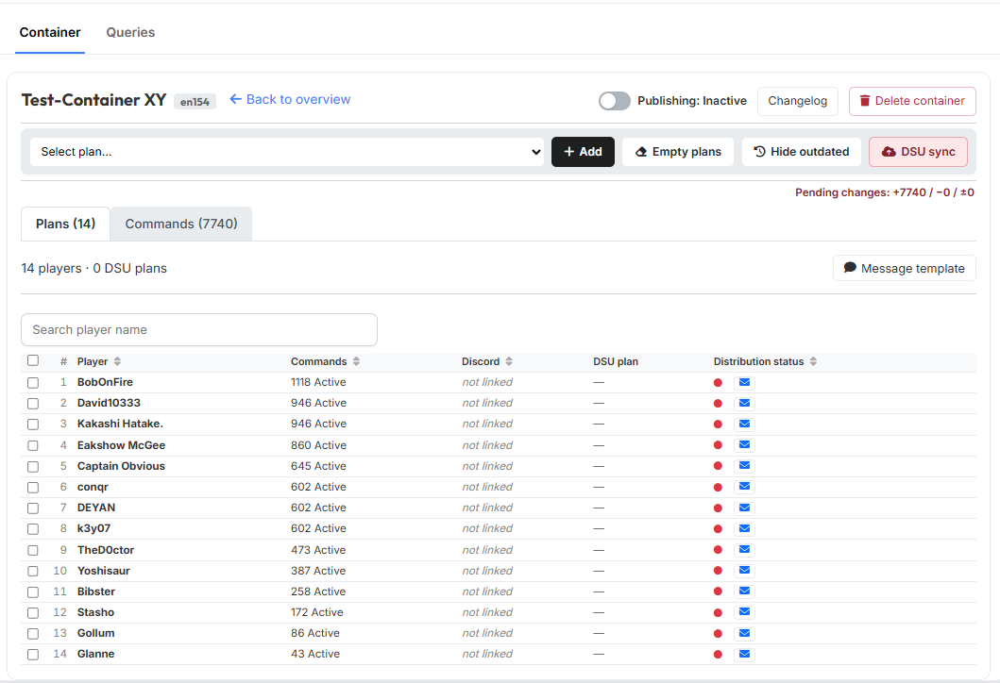{ .screenshot }

Im Reiter **„Pläne"** siehst du pro Spieler eine Zeile mit:

- **Spieler**
- **Befehle** (Anzahl, Status)
- **Discord** (verknüpfter Discord-Account oder `nicht verknüpft`)
- **DSU-Plan** (Bearbeiten · Anzeigen, sobald synchronisiert)
- **Verteilungsstatus**

#### Nachrichten-Template

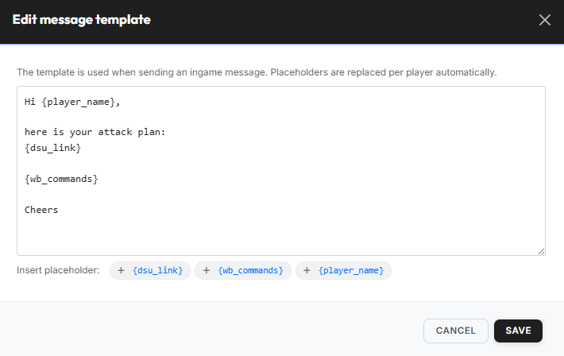{ .screenshot }

Über **„Nachrichten-Template"** öffnest du den Editor
**„Nachrichten-Template bearbeiten"**. Das Template wird beim Versenden
der Ingame-Nachricht verwendet; die Platzhalter werden automatisch pro
Spieler ersetzt:

| Platzhalter | Wird ersetzt durch |
|---|---|
| `{player_name}` | Spielername |
| `{dsu_link}` | Link zum DS-Ultimate-Plan |
| `{wb_commands}` | Alle WB-Commands des Spielers |

#### Nach DSU-Synchronisation

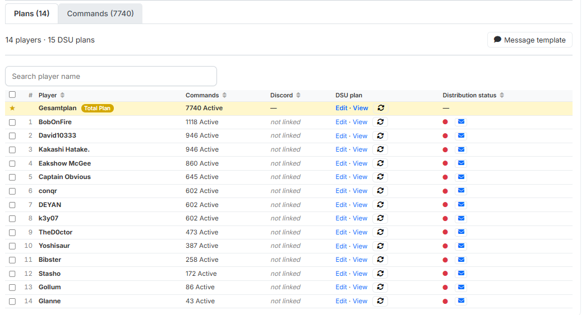{ .screenshot }

Nach Klick auf **„DSU-Synchronisation"** wird pro Spieler ein DSU-Plan
auf DS-Ultimate angelegt; in der Spalte **„DSU-Plan"** erscheinen die
Links **„Bearbeiten · Anzeigen"**.

Zusätzlich erscheint die hervorgehobene Zeile **„Gesamtplan"** mit dem
gelben **„Total Plan"**-Badge — sie enthält alle Befehle aller Spieler
in einem einzigen DSU-Plan.

Oben rechts zeigt der Hinweis **„Pending changes: +X / -Y / ±Z"** an,
wie viele Commands seit der letzten Synchronisation hinzugekommen,
entfernt oder geändert wurden.

#### Ingame-Nachricht senden

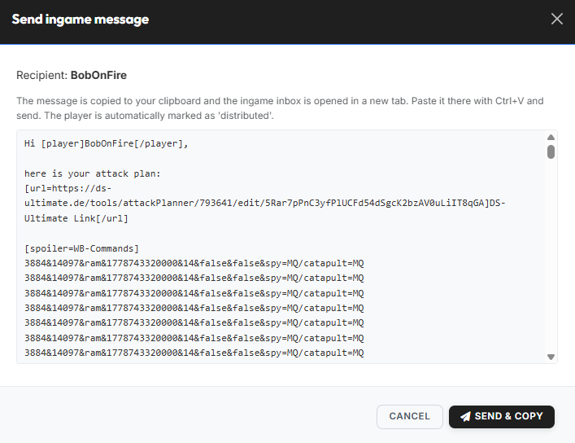{ .screenshot }

Ein Klick auf das blaue Brief-Icon in der Spalte
**„Verteilungsstatus"** öffnet den Dialog **„Ingame-Nachricht senden"**.
Der Dialog zeigt die fertige Nachricht (Template + aufgelöste
Platzhalter).

Über **„Send & Copy"** wird die Nachricht in die Zwischenablage kopiert
und gleichzeitig die Ingame-Inbox in einem neuen Tab geöffnet — dort
einfach mit `Strg+V` einfügen und versenden. Der Spieler wird
automatisch als **„verteilt"** markiert.

#### Verteilungsstatus ändern

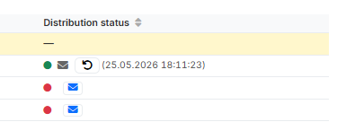{ .screenshot }

Der **Verteilungsstatus** in der jeweiligen Zeile springt nach dem
Senden auf **grün** und zeigt den Zeitstempel. Über das kleine
Rückstell-Icon (Pfeil im Kreis) lässt sich der Status manuell
zurücksetzen.

#### Action-Bar bei Auswahl

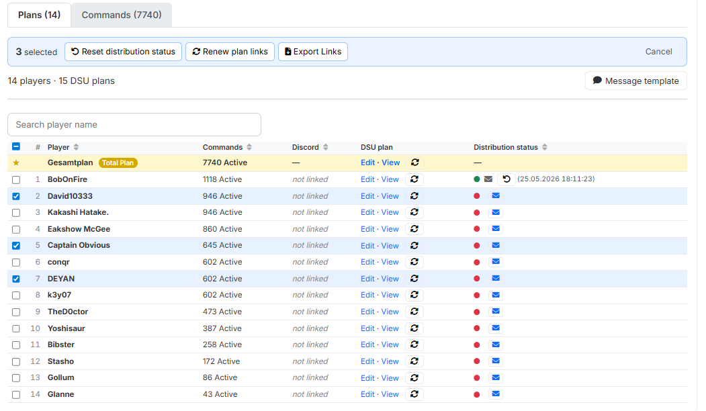{ .screenshot }

Sobald du in der Spieler-Tabelle mindestens einen Eintrag anhakst,
erscheint oben eine Action-Bar mit Bulk-Aktionen:

- **„Abhol-Status zurücksetzen"**
- **„Link erneuern"** — generiert einen neuen DSU-Link; der alte wird
  ungültig.
- **„Export Links"**
- **„Abbrechen"** — Auswahl verwerfen.

### Reiter „Befehle"

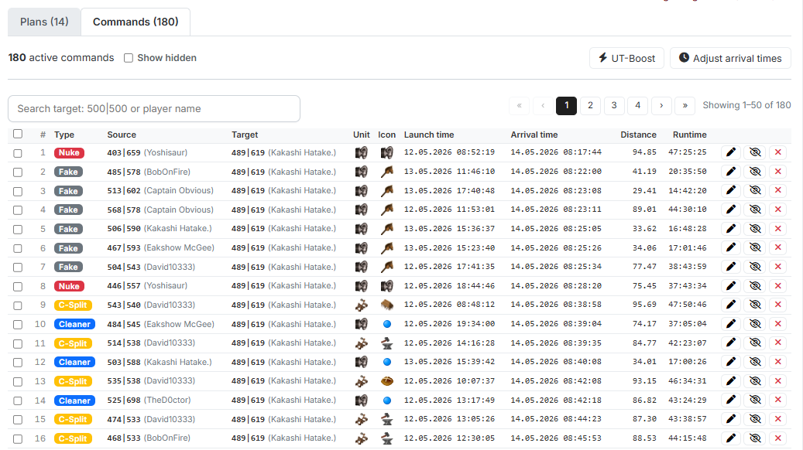{ .screenshot }

Im Reiter **„Befehle"** siehst du jeden einzelnen Angriffsbefehl des
Containers. Spalten u. a.: **Spieler / Quelle / Ziel / Einheit / Icon /
Abschickzeit / Ankunftszeit / Distanz / Laufzeit**. Über das Häkchen
**„Ausgeblendete zeigen"** lassen sich versteckte Befehle einblenden.

Rechts oben stehen die Aktionen **„UT-Boost"** und
**„Ankunftszeiten anpassen"** zur Verfügung.

#### UT-Boost-Modal

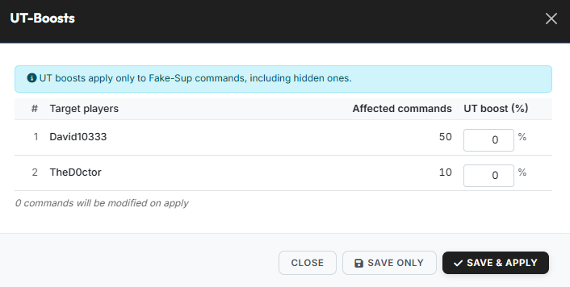{ .screenshot }

Im Dialog **„UT-Boosts"** vergibst du pro Zielspieler einen
Boost-Prozentsatz (0–20 %).

!!! info "Nur für Fake-UT-Befehle"
    UT-Boosts wirken ausschließlich auf **Fake-UT-Befehle** und
    schließen dabei auch ausgeblendete Befehle mit ein.

- **„Save only"** — Werte speichern, aber noch nicht anwenden.
- **„Save & Apply"** — Werte speichern und sofort auf alle betroffenen
  Befehle anwenden.

#### Ankunftszeiten-Modal

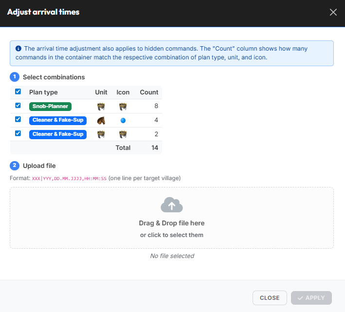{ .screenshot }

Der Dialog **„Ankunftszeiten anpassen"** läuft in zwei Schritten ab:

1. **Kombinationen auswählen** — markiere die Plantyp/Einheit/Icon-
   Kombinationen, die angepasst werden sollen. Die Spalte **„Count"**
   zeigt, wie viele Befehle im Container je Kombination passen.
2. **Datei hochladen** — Format `XXX|YYY,DD.MM.JJJJ,HH:MM:SS` (eine
   Zeile pro Zieldorf). Drag & Drop oder Klicken zum Auswählen.

Die Anpassung gilt auch für ausgeblendete Befehle.

#### Einzelnen Befehl bearbeiten

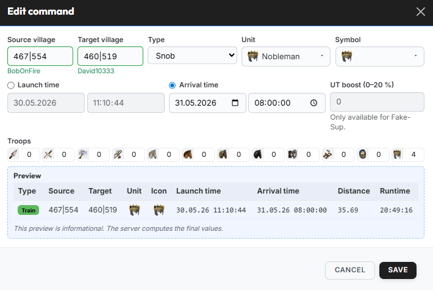{ .screenshot }

Über das Bearbeiten-Icon eines Befehls öffnest du den Dialog
**„Befehl bearbeiten"**:

- **Quelldorf** / **Zieldorf** / **Typ** / **Einheit** / **Symbol**.
- Wahl zwischen **Abschickzeit** und **Ankunftszeit** (das jeweils
  andere wird berechnet).
- Optionaler **UT-Boost (0–20 %)** — nur für Fake-UT verfügbar.
- **Truppen**-Anzahlen pro Einheitentyp.
- **Vorschau** mit Distanz und Laufzeit. Die Vorschau ist informativ;
  die finalen Werte berechnet der Server.

#### Befehls-Action-Bar

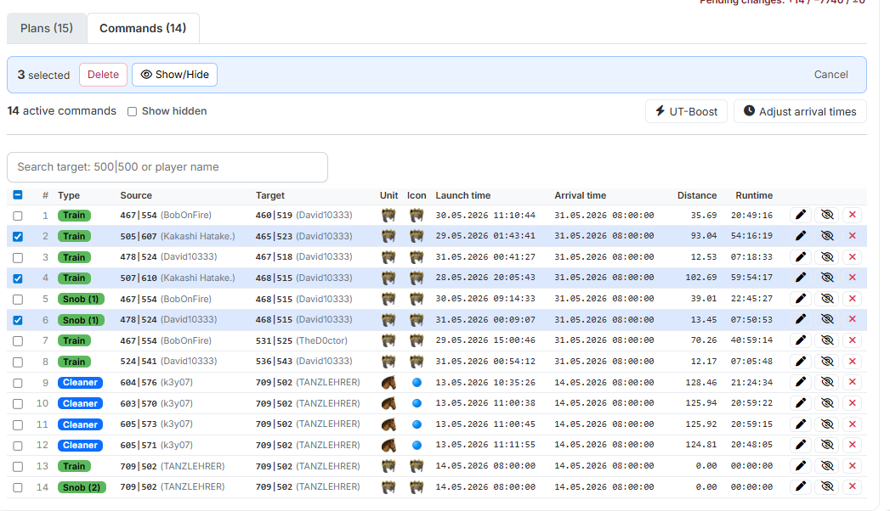{ .screenshot }

Sobald du Befehle in der Liste auswählst, erscheint eine Action-Bar mit
Bulk-Aktionen (z. B. **„UT-Boost"**, **„Ankunftszeiten anpassen"**,
Befehle ausblenden / löschen).

### Veröffentlichung

Der **Veröffentlichungs-Toggle** oben rechts steuert, ob der Container
für die Spieler bzw. den Discord-Bot aktiv ist.

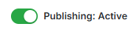{ .screenshot }

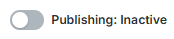{ .screenshot }

- **Veröffentlichung: Aktiv** — DSU-Links sind erreichbar, der Bot
  liefert Inhalte aus.
- **Veröffentlichung: Inaktiv** — Container ist nur intern sichtbar,
  Links/Discord-Auslieferung pausieren.

### Changelog

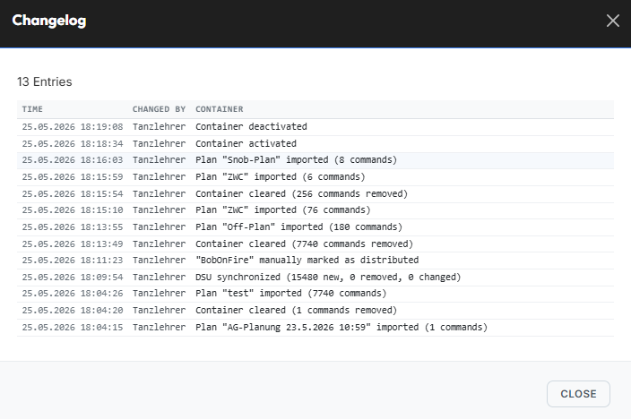{ .screenshot }

Über den Button **„Changelog"** öffnest du die Historie aller Änderungen
am Container. Pro Eintrag siehst du **Zeitpunkt**, **Geändert von** und
die ausgeführte Aktion.

Typische Einträge:

- `Container aktiviert` / `Container deaktiviert`
- `Plan "…" imported (X commands)`
- `Container cleared (X commands removed)`
- `DSU synchronized (X new, X removed, X changed)`
- `"…" manually marked as distributed`
