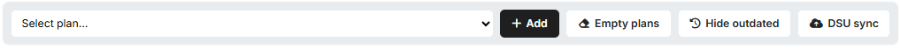
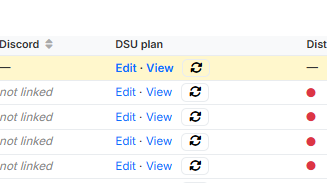
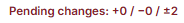
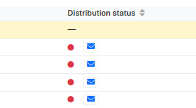
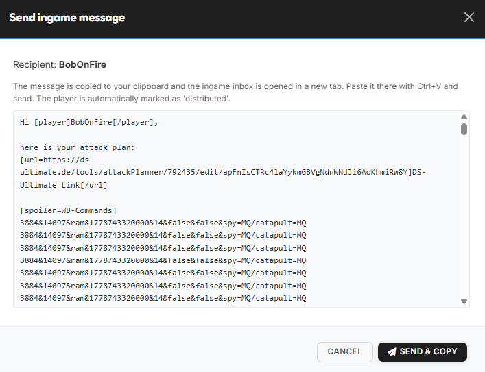
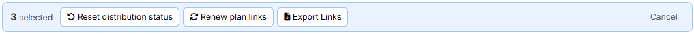

# Planung

Der Tab **„Planung"** ist der größte Bereich des Leader-Views. Er
gliedert sich in zwei Unterreiter:

- **Container** — Angriffspläne sammeln, koordinieren und an die
  Spieler verteilen.
- **Abfragen** — vorbereitende Daten sammeln (AG-Meldungen,
  Abschickzeiten, ausgeplante Dörfer).

## Abfragen

Unter dem Reiter **„Abfragen"** findest du drei Pill-Tabs:
**AG-Meldungen**, **Abschickzeiten** und **Ausgeplante Dörfer**. Sie
liefern die drei wichtigsten Inputs für die Off-Planung, welche von
den Stammesmembern bereitgestellt werden müssen.

!!! info "Daten kommen i. d. R. aus dem Discordbot"
    AG-Meldungen, Abschickzeiten und ausgeplante Herkunftsdörfer geben
    die Spieler in der Regel direkt über das
    [Planning-System des Discordbots](../discord-bot/planning-system.md)
    ab. Die Einträge erscheinen dann automatisch in diesen Listen.
    Leader können aber jederzeit auch manuell Einträge anlegen,
    bearbeiten oder löschen.

### AG-Meldungen

In diesem Bereich werden die AG-Meldungen verwaltet. Die Liste ist die
Basis für die spätere AG-Planung.

{ .screenshot }

Oben siehst du eine **Kennzahlen-Leiste**, die alle Meldungen
zusammenfasst:

- **Gesamt AGs** — Summe aller gemeldeten AGs über alle Spieler.
- **Trains** — Anzahl Herkunftsdörfer, aus denen mindestens 4 AGs
  gemeldet sind (Vollnobel-Train).
- **1er-AGs / 2er-AGs / 3er-AGs** — Anzahl Herkunftsdörfer, aus denen
  genau 1, 2 bzw. 3 AGs gemeldet sind.

Die Tabelle darunter listet jede einzelne Meldung:

| Spalte | Bedeutung |
|---|---|
| **#** | Laufende Nummer |
| **DS-Account** | Spieler, der die AGs stellt |
| **Stamm** | Stamm des Spielers |
| **Koordinate** | Herkunftsdorf der Meldung |
| **Anzahl** | Wie viele AGs der Spieler aus diesem Herkunftsdorf fertig hat |
| **Aktionen** | Eintrag bearbeiten (Stift) oder löschen (Mülltonne) |

Oberhalb der Tabelle hat man die folgenden Optionen:
**„Hinzufügen"**, **„Export"**, **„Alles löschen"**.

### Abschickzeiten

Hier verwaltest du die individuellen Abschickfenster der Spieler —
also die Zeitfenster, in denen die einzelnen Spieler tatsächlich Zeit
haben, um Befehle abzuschicken.

{ .screenshot }

Tabellenspalten:

| Spalte | Bedeutung |
|---|---|
| **#** | Laufende Nummer |
| **DS-Account** | Account, für welchen das eingetragene Zeitfenster gilt |
| **Stamm** | Stamm des Spielers |
| **Datum** | Tag, an dem der Spieler abschicken kann |
| **Zeitraum** | Von- und Bis-Uhrzeit (Tribalwars-Serverzeit) |
| **Aktionen** | Eintrag bearbeiten oder löschen |

Oberhalb der Tabelle hat man die folgenden Optionen:
**„Hinzufügen"**, **„Export"**, **„Alles löschen"**.

### Ausgeplante Dörfer

Hier markierst du Dörfer, die in der Off-Planung **nicht als
Herkunftsdorf** verwendet werden sollen — zum Beispiel weil der Spieler
das Dorf aktuell defensiv halten will oder weil die Truppen für eine
andere Aktion reserviert sind.

{ .screenshot }

Tabellenspalten:

| Spalte | Bedeutung |
|---|---|
| **#** | Laufende Nummer |
| **DS-Account** | Besitzer des ausgeplanten Dorfs |
| **Stamm** | Stamm des Besitzers |
| **Koordinate** | Das ausgeplante Dorf |
| **Aktionen** | Eintrag löschen |

### Manuelles Hinzufügen

Alle drei Listen in den **Abfragen** können nicht nur über den
Discordbot, sondern auch direkt im Leader-View manuell befüllt werden.
Über einen Klick auf den Button **„Hinzufügen"** oberhalb der
jeweiligen Tabelle öffnest du das passende Eingabe-Modal. Nach dem
Bestätigen erscheint der neue Eintrag unmittelbar in der
entsprechenden Tabelle.

Die drei Eingabe-Modals im Detail:

#### AG-Meldung hinzufügen

{ .screenshot }

Felder:

- **Koordinaten (Text mit Koords)** — eine oder mehrere
  Herkunftskoordinaten; umgebender Text wird ignoriert (z. B.
  `AGs fertig in 500|500 und 501|501…`).
- **Anzahl AGs (pro Dorf)** — wie viele AGs der Spieler pro
  Herkunftsdorf fertig hat. Der eingegebene Wert gilt für **alle** in
  Schritt 1 erkannten Koordinaten.

#### Abschickzeit hinzufügen

{ .screenshot }

Felder:

- **Spielername (DS-Account)** — mit Autovervollständigung über die
  verifizierten Accounts.
- **Datum** — Tag des Abschickfensters.
- **Von** / **Bis** — Anfang und Ende des Zeitfensters (Tribalwars-
  Serverzeit).

#### Herkunftsdorf ausplanen

{ .screenshot }

Im Feld **„Koordinaten (Text mit Koords)"** trägst du eine oder mehrere
Koordinaten ein (umgebender Text wird ignoriert).

## Container

Im Unterreiter **„Container"** verwaltest du die eigentlichen
Angriffspläne. Ein **Container** bündelt eine Operation — z. B. eine
Off-Welle, eine AG-Aktion oder einen Zwischencleaner — mit allen Plänen
und Befehlen und steuert die Verteilung an die einzelnen Spieler.

{ .screenshot }

Hier kannst du deine bestehenden Container öffnen sowie neue Container
anlegen. Mit Klick auf **„Öffnen"** wechselst du in die jeweilige
Container-Übersicht.

### Neuen Container anlegen

Über einen Klick auf den Button **„Neuer Container"** legst du einen
neuen Container an. Es öffnet sich ein Modal, in welchem du einen
**Namen** für den Container festlegen musst (max. 50 Zeichen, z. B.
`Op. Phoenix`).

{ .screenshot }

Nach dem Bestätigen wird der Container automatisch der aktuellen Welt
zugeordnet, startet im Status **„Inaktiv"** und erscheint unmittelbar
in der Container-Übersicht.

### Aufbau eines Containers

Direkt nach dem Anlegen ist ein Container noch komplett leer — es sind
weder Pläne noch Befehle hinterlegt. Das Grundgerüst mit Kopfbereich,
Action-Leiste und den beiden Reitern siehst du aber bereits:

{ .screenshot }

**Kopfbereich**

Im Kopfbereich findest du auf der linken Seite den Container-Namen
sowie das Welt-Badge der zugehörigen DS-Welt. Über den Link
**„Zurück zur Übersicht"** gelangst du zurück zur Container-Übersicht
des Stammes.

Auf der rechten Seite sitzen die container-weiten Aktionen:

- der **Veröffentlichungs-Toggle** zum Aktivieren / Deaktivieren des
  Containers (siehe [Veröffentlichung](#veroffentlichung)),
- der Button **„Changelog"** für die Änderungs-Historie (siehe
  [Sonstiges](#sonstiges)),
- der Button **„Container löschen"** zum vollständigen Entfernen des
  Containers (siehe [Sonstiges](#sonstiges)).

**Action-Leiste**

Direkt unter dem Kopfbereich liegt die Action-Leiste mit den
Werkzeugen zum Befüllen und Synchronisieren des Containers:

{ .screenshot }

Über das Dropdown **„Plan auswählen…"** wählst du einen Plan aus
deinen gespeicherten Plänen aus und fügst ihn per Klick auf
**„Hinzufügen"** dem Container hinzu. Nach dem Hinzufügen
aktualisieren sich die Reiter **„Pläne"** und **„Befehle"**
entsprechend — die importierten Spielerpläne und Befehle erscheinen
dort unmittelbar. Auf die gleiche Weise lassen sich nach und nach
weitere Pläne einfügen.

Soll der Container wieder komplett geleert werden, entfernt ein Klick
auf **„Pläne leeren"** in einem Schritt alle bisher importierten
Befehle. Der Schalter **„Abgelaufene ausblenden"** versteckt Befehle,
deren Abschickzeit bereits in der Vergangenheit liegt — sie bleiben
aber im Container erhalten und werden nur nicht mehr angezeigt.

!!! info "DSU-Pläne bleiben nach „Pläne leeren" bestehen"
    Wurde der Container zuvor bereits per **„DSU-Synchronisation"**
    nach DS-Ultimate übertragen, bleiben die dort angelegten DSU-Pläne
    (pro Spieler + Gesamtplan) auch nach **„Pläne leeren"** bestehen.
    Die Befehle innerhalb dieser DSU-Pläne werden bei **„Pläne leeren"**
    allerdings ebenfalls entfernt — übrig bleibt nur der leere
    DSU-Plan.

Ein Klick auf **„DSU-Synchronisation"** überträgt die aktuell im
Container enthaltenen Befehle nach DS-Ultimate. Dabei legt das Tool
pro Spieler einen eigenen DSU-Plan sowie einen „Gesamtplan" mit allen
Befehlen an. Details zu diesem Schritt findest du im Abschnitt
[DSU-Synchronisation](#dsu-synchronisation).

**Reiter „Pläne" und „Befehle"**

Im unteren Bereich des Containers stehen die beiden Reiter **„Pläne"**
und **„Befehle"** zur Verfügung. Die Details zu beiden Reitern findest
du in den jeweils gleichnamigen Abschnitten weiter unten.

### Reiter „Pläne"

Im Reiter **„Pläne"** verwaltest du die Angriffspläne der Spieler — pro
Spieler, für den im Container Befehle existieren, gibt es eine Zeile.

{ .screenshot }

Auf einen Blick erkennst du, ob der Spieler-Account mit einem
Discord-Account verknüpft ist; daran siehst du sofort, ob der Spieler
den Plan eigenständig über den tw-utils-Discordbot herunterladen kann
oder ob du ihn per Ingame-Nachricht zukommen lassen musst. Außerdem
siehst du den **DSU-Plan**-Link des jeweiligen Spielers — dieser
erscheint allerdings erst, nachdem eine
[DSU-Synchronisation](#dsu-synchronisation) durchgeführt wurde. Der
**Verteilungsstatus** schließlich wird grün, sobald der Plan per
Ingame-Nachricht versendet wurde **oder** sobald ein verknüpfter
Discord-User den Plan über den Discordbot heruntergeladen hat.

Darüber hinaus stehen dir als Stammesführung mehrere Funktionen zur
Verfügung, die in den folgenden Unterabschnitten beschrieben sind.

#### Funktionen

##### DSU-Synchronisation

{ .screenshot }

Nach Klick auf **„DSU-Synchronisation"** legt das Tool für jeden
Spieler einen DSU-Plan auf DS-Ultimate an; in der Spalte **„DSU-Plan"**
erscheinen die Links **„Bearbeiten · Anzeigen"**.

{ .screenshot }

Zusätzlich erscheint ganz oben die hervorgehobene Zeile **„Gesamtplan"**
mit dem gelben **„Total Plan"**-Badge — sie enthält alle Befehle aller
Spieler in einem einzigen DSU-Plan.

{ .screenshot }

Oben rechts zeigt der Hinweis **„Pending changes: +X / -Y / ±Z"** an,
wie viele Commands seit der letzten Synchronisation **hinzugekommen
(+)**, **entfernt (−)** oder **geändert (±)** wurden. Solange der
Zähler nicht 0/0/0 steht, sind die DSU-Pläne nicht auf dem aktuellen
Stand.

!!! info "Was wird synchronisiert?"
    In die DSU-Pläne werden ausschließlich Befehle übertragen, die im
    Container enthalten **und** nicht ausgeblendet sind. Ausgeblendete
    Befehle (per **„Abgelaufene ausblenden"** oder manuell) bleiben im
    Container, fließen aber nicht in die DSU-Synchronisation ein.

##### Planverteilung

Die fertigen Pläne lassen sich auf **drei Wegen** an die Spieler
verteilen:

1. **Über den Discordbot** — Spieler mit abgeschlossener
   Account-Verifizierung können den Plan eigenständig über den
   Stammes-Discordserver herunterladen.
2. **Per Ingame-Nachricht** — der Leader versendet den Plan einzeln per
   Ingame-Nachricht, optional mit dem von tw-utils bereitgestellten
   Nachrichten-Template.
3. **Sonstige Verteilung über Export** — die DSU-Links lassen sich als
   TXT-Datei exportieren und außerhalb des Spiels weiterverwenden
   (z. B. Forum-Posting, Discord-DM, etc.).

**Verteilung über den Discordbot**

Spieler, die ihre Account-Verifizierung mit ihrem DS-Account
abgeschlossen haben, können den Angriffsplan eigenständig über das
[Planning-System des tw-utils-Discordbots](../discord-bot/planning-system.md)
herunterladen. Ein aktives Versenden durch den Leader ist hier nicht
nötig. Welche Spieler über den Bot verifiziert sind, erkennst du an
der Spalte **Discord** in der Übersicht.

**Verteilung per Ingame-Nachricht**

Sollen Spieler den Plan per Ingame-Nachricht erhalten, kommt das
**Nachrichten-Template** ins Spiel — die Text-Vorlage, die beim
Versenden für jeden Spieler individuell befüllt wird.

{ .screenshot }

Über den Button **„Nachrichten-Template"** öffnest du den Editor
**„Nachrichten-Template bearbeiten"**. Die Platzhalter werden
automatisch pro Spieler ersetzt:

| Platzhalter | Wird ersetzt durch |
|---|---|
| `{player_name}` | Name des Spielers, an den die Nachricht geht |
| `{dsu_link}` | Individueller Link zum DS-Ultimate-Plan dieses Spielers |
| `{wb_commands}` | Alle WB-Commands des Spielers im Spoiler-Block. |

Wenn das Nachrichten-Template erstellt und gespeichert wurde, kannst
du per Klick auf das blaue **Brief-Icon** in der Spalte
**„Verteilungsstatus"** die Verteilung starten:

{ .screenshot }

Es öffnet sich der Dialog **„Ingame-Nachricht senden"**, der die
fertige Nachricht für den jeweiligen Empfänger zeigt (Template mit
aufgelösten Platzhaltern, inkl. WB-Commands-Spoiler).

{ .screenshot }

Über **„Send & Copy"** wird die Nachricht in die Zwischenablage
kopiert und gleichzeitig die Ingame-Nachricht in einem neuen Tab
geöffnet — dort einfach mit `Strg+V` einfügen und versenden. Der
Spieler wird automatisch als **„verteilt"** markiert.

**Sonstige Verteilung über Export der DSU-Links**

Soll die Verteilung außerhalb von Discord und Ingame stattfinden —
z. B. zentral im Stammesforum — kannst du die DSU-Links der
ausgewählten Spieler über die Bulk-Aktion **„Export Links"** als
TXT-Datei herunterladen.

{ .screenshot }

Markiere dazu in der Spieler-Tabelle die gewünschten Spieler; in der
oben erscheinenden Action-Bar wählst du dann **„Export Links"**. Die
TXT-Datei enthält pro markiertem Spieler einen DSU-Link und kann
beliebig weiterverwendet werden.

##### Status- & Link-Management (Bulk-Aktionen)

Damit ein Spieler den Plan erneut zugeschickt bekommen kann oder
mehrere Spieler gleichzeitig nachverwaltet werden können, gibt es zwei
Werkzeuge: das **Rückstell-Icon** in jeder einzelnen Zeile und die
**Action-Bar mit Bulk-Aktionen** über die Spalten-Auswahl.

**Verteilungsstatus einzeln zurücksetzen**

{ .screenshot }

Der **Verteilungsstatus** in jeder Zeile springt nach dem Senden auf
**grün** und zeigt den Zeitstempel der Verteilung. Über das kleine
**Rückstell-Icon** (Pfeil im Kreis) lässt sich der Status manuell
zurücksetzen — z. B. wenn ein Spieler den Plan erneut zugeschickt
bekommen soll.

**Bulk-Aktionen für mehrere Spieler**

Sobald du in der Spieler-Tabelle mindestens einen Eintrag anhakst,
erscheint oben eine Action-Bar mit Bulk-Aktionen. Über
**„Abhol-Status zurücksetzen"** setzt du den Verteilungsstatus aller
ausgewählten Spieler auf 🔴 zurück — nützlich, wenn die Pläne erneut
verteilt werden sollen. Mit **„Link erneuern"** wird für die
ausgewählten Spieler ein neuer DSU-Link generiert; der alte Link wird
dabei sofort ungültig, sodass die betroffenen Spieler den neuen Link
aktiv abholen müssen. Die Bulk-Aktion **„Export Links"** ist im
Abschnitt [Planverteilung](#planverteilung) beschrieben. Über
**„Abbrechen"** verwirfst du die aktuelle Auswahl.

### Reiter „Befehle"

{ .screenshot }

Im Reiter **„Befehle"** verwaltest du als Leader die im Container
enthaltenen Befehle. Einzelne Befehle können hier bearbeitet,
ausgeblendet oder gelöscht werden — ausgeblendete Befehle lassen
sich über das Häkchen **„Ausgeblendete zeigen"** jederzeit wieder
einblenden. Auch Bulk-Aktionen wie das Anpassen von Ankunftszeiten
sowie das Anwenden von UT-Boosts auf Fake-UT-Befehle sind hier
möglich. Die einzelnen Funktionen sind im Folgenden beschrieben.

#### Funktionen

##### Einzelnen Befehl bearbeiten

{ .screenshot }

Über das Bearbeiten-Icon eines Befehls öffnest du den Dialog
**„Befehl bearbeiten"**. Hier kannst du einen einzelnen Befehl
nachträglich justieren.

Im oberen Bereich des Dialogs stehen **Quelldorf** und **Zieldorf**
mit ihren Koordinaten zur Bearbeitung bereit; der Spielername wird
automatisch unter dem jeweiligen Feld angezeigt. Über die Felder
**„Typ"** (z. B. **„Snob"**, **„Off"** oder **„Fake"**),
**„Einheit"** (schnellste verwendete Einheit, sie bestimmt die
Laufzeit) und **„Symbol"** (DS-Ultimate-Icon des Befehls) legst du
die Eckdaten des Befehls fest. Bei den Zeiten ist jeweils einer der
beiden Werte **Abschickzeit** und **Ankunftszeit** einstellbar — der
jeweils andere wird automatisch berechnet. Der **UT-Boost (0–20 %)**
ist optional und ausschließlich für Fake-UT-Befehle relevant. Unter
**„Truppen"** trägst du die Anzahl Truppen pro Einheitentyp im
Befehl ein.

Die **Vorschau** am unteren Rand des Dialogs liefert eine
Live-Vorschau des Befehls. Sie ist rein informativ — die finalen
Werte berechnet der Server beim Speichern.

##### Ankunftszeiten anpassen

{ .screenshot }

Der Dialog **„Ankunftszeiten anpassen"** verschiebt die Ankunftszeiten
für bestimmte Befehlsgruppen. Häufig wird diese Funktion eingesetzt,
um z. B. AG-Befehle zeitlich an die zuletzt laufende Off anzupassen.

Im ersten Schritt wählst du gezielt aus, welche
Plantyp/Einheit/Icon-Kombinationen angepasst werden sollen — so
kannst du die Anpassung auf einzelne Befehlsgruppen einschränken und
andere unberührt lassen. Die Spalte **„Count"** zeigt dir je Zeile,
wie viele Befehle im Container unter die jeweilige Kombination
fallen; die Spalte **„Total"** summiert die aktuell markierte
Auswahl.

Im zweiten Schritt lädst du eine Textdatei mit den neuen
Ankunftszeiten hoch — eine Zeile pro Zieldorf im Format
`XXX|YYY,DD.MM.JJJJ,HH:MM:SS`. Die Datei kannst du per Drag & Drop
ablegen oder per Klick auswählen.

!!! info "Anpassung schließt ausgeblendete Befehle ein"
    Die Anpassung der Ankunftszeiten gilt auch für aktuell
    ausgeblendete Befehle der gewählten Kombination.

##### UT-Boost anwenden

{ .screenshot }

Häufig aktivieren feindliche Spieler während einer offensiven Aktion
den UT-Boost. Unterstützungs-Befehle wie z. B. Fake-UT haben dadurch
eine geringere Laufzeit. In den ursprünglich erstellten
Angriffsbefehlen ist das nicht berücksichtigt, weil zum
Planungszeitpunkt nicht feststeht, ob ein gegnerischer Spieler den
UT-Boost aktivieren wird.

Sobald ein Spieler den UT-Boost aktiviert hat, kannst du über den
Dialog **„UT-Boosts"** alle auf diesen Spieler laufenden
Fake-UT-Befehle nachträglich an den aktivierten Boost anpassen. Dazu
trägst du in der Tabelle pro Zielspieler den entsprechenden
Boost-Prozentsatz (0–20 %) ein.

!!! info "Nur für Fake-UT-Befehle"
    UT-Boosts wirken ausschließlich auf **Fake-UT-Befehle** und
    schließen dabei auch ausgeblendete Befehle mit ein.

- **„Save only"** — speichert die eingegebenen Boost-Werte, ohne die
  betroffenen Fake-UT-Befehle bereits umzurechnen. Die tatsächliche
  Anpassung der Befehle erfolgt erst beim späteren Klick auf
  **„Save & Apply"**.
- **„Save & Apply"** — Werte speichern und sofort auf alle betroffenen
  Befehle anwenden.

### Veröffentlichung

Über den **Veröffentlichungs-Toggle** oben rechts im Kopfbereich
steuert der Leader, ob der Container nach außen aktiv ausgeliefert
wird.

{ .screenshot }

{ .screenshot }

Steht der Toggle auf **„Aktiv"**, können die Spieler ihre Pläne
eigenständig über den Discordbot (Planning-System) herunterladen und
sehen die zugehörigen Befehle auf ihrer **„Meine Befehle"**-Seite bei
tw-utils.net. Steht der Toggle auf **„Inaktiv"**, pausiert beides:
weder der Discord-Download noch die Anzeige unter **„Meine Befehle"**
ist dann verfügbar. Der Container bleibt in diesem Zustand nur intern
im Leader-View sichtbar — ideal während der Vorbereitung einer
Operation.

!!! info "Keine Auswirkung auf bereits verteilte DSU-Pläne"
    Der Veröffentlichungs-Toggle beeinflusst ausschließlich den
    Discord-Download und die Anzeige unter **„Meine Befehle"**.
    Bereits an DS-Ultimate synchronisierte Pläne bleiben dort
    erhalten und sind weiterhin abrufbar, auch wenn der Container auf
    **„Inaktiv"** geschaltet wird.

### Sonstiges

#### Changelog

{ .screenshot }

Über den Button **„Changelog"** öffnest du die vollständige Historie
aller Änderungen am Container. Pro Eintrag siehst du **Zeitpunkt**,
**Geändert von** (Leader bzw. Spieler) und die ausgeführte
**Container-Aktion**.

#### Container löschen

Über den Button **„Container löschen"** im Kopfbereich (rechts neben
**„Changelog"**) wird der gesamte Container inklusive aller
importierten Pläne und Befehle entfernt. Die Aktion ist
**irreversibel** — gelöschte Container können nicht wiederhergestellt
werden. Vor dem Löschen erscheint ein Bestätigungsdialog, um
versehentliche Löschungen zu vermeiden.

!!! info "Bereits verteilte DSU-Pläne bleiben erhalten"
    Das Löschen des Containers hat keine Auswirkung auf bereits an
    DS-Ultimate synchronisierte Pläne — diese bleiben in DS-Ultimate
    bestehen. Sollen die DSU-Pläne vor dem Löschen ebenfalls geleert
    werden, empfiehlt sich folgender Ablauf: zunächst über
    **„Pläne leeren"** alle Befehle aus dem Container entfernen,
    anschließend über **„DSU-Synchronisation"** den geleerten Zustand
    nach DS-Ultimate übertragen — und erst danach den Container
    löschen.
