# Stammes-Umfragen

Der Tab **„Planung"** gliedert sich in zwei Unterreiter:

- **Container** — Angriffspläne sammeln, koordinieren und an die
  Spieler verteilen (siehe [Planung (Container)](planung.md)).
- **Stammes-Umfragen** — vorbereitende Daten bei den Mitgliedern
  abfragen (AG-Meldungen, Abschickzeiten, ausgeplante Dörfer). Dieser
  Unterreiter ist beim Öffnen des Tabs vorausgewählt.

Diese Seite beschreibt den Unterreiter **„Stammes-Umfragen"**.

!!! info "Nur für TWU-Planner und TWU-Leader"
    Der Tab **„Planung"** ist ausschließlich für User mit der Rolle
    **TWU-Planner** oder **TWU-Leader** sichtbar. Umfragen anlegen,
    bearbeiten, beenden und löschen darf ebenfalls nur, wer eine
    dieser beiden Rollen hat.

## Was ist eine Stammes-Umfrage?

Eine **Stammes-Umfrage** ist eine Melde-Runde: Du legst fest, **was**
du wissen willst und **bis wann**, verteilst den Link an den Stamm und
siehst anschließend in einer Tabelle, wer geliefert hat und wer nicht.

Abgefragt werden können drei Datentypen — einzeln oder in beliebiger
Kombination:

- **AG-Meldungen** — welcher Spieler hat aus welchem Dorf wie viele
  AGs fertig?
- **Abschickzeiten** — wann hat ein Spieler tatsächlich Zeit,
  Befehle abzuschicken?
- **Ausgeplante Dörfer** — welche Herkunftsdörfer sollen **nicht**
  verplant werden?

Diese drei Listen sind die wichtigsten Vorarbeiten für die Off- und
AG-Planung. Es dürfen beliebig viele Umfragen gleichzeitig laufen —
etwa eine je Operation oder je Cluster.

## Übersicht

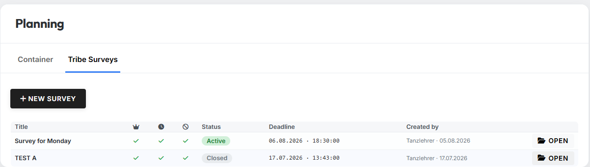{ .screenshot }

Die Übersicht listet alle Umfragen des Servers:

| Spalte | Bedeutung |
|---|---|
| **Titel** | Name der Umfrage |
| 👑 | Umfrage fragt **AG-Meldungen** ab |
| 🕐 | Umfrage fragt **Abschickzeiten** ab |
| 🚫 | Umfrage fragt **Ausgeplante Dörfer** ab |
| **Status** | **Aktiv** oder **Beendet** |
| **Frist** | Datum und Uhrzeit des Meldeschlusses (Weltzeit) |
| **Erstellt von** | Leader und Datum der Erstellung |
| | Button **„Öffnen"** zur Detailansicht |

Die drei Icon-Spalten zeigen ein grünes Häkchen, wenn der Datentyp
abgefragt wird, und andernfalls ein graues ✗.

## Neue Umfrage anlegen

Über den Button **„Neue Umfrage"** öffnet sich der Anlege-Dialog:

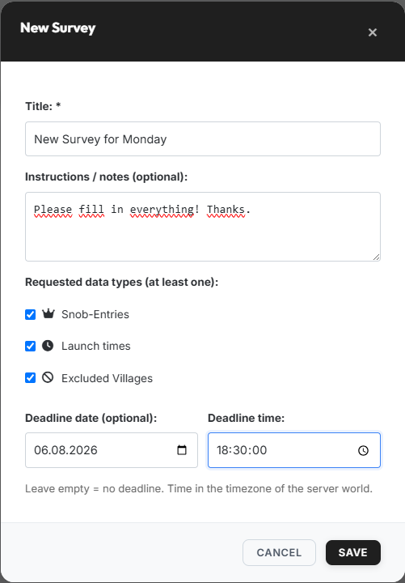{ .screenshot }

Felder im Dialog:

- **Titel** (Pflichtfeld, max. 120 Zeichen) — z. B. `AG-Runde Cluster A`.
- **Anweisungen / Hinweise (optional)** (max. 2000 Zeichen) — freier
  Text, den die Mitglieder später oben auf der Melde-Seite sehen.
- **Abgefragte Datentypen** — mindestens einer der drei muss angehakt
  sein.
- **Frist-Datum (optional)** und **Frist-Uhrzeit** — der Meldeschluss.
  Bleibt das Datum leer, hat die Umfrage keine Frist. Wird nur ein
  Datum ohne Uhrzeit gesetzt, endet die Umfrage um `23:59:59`. Die
  Frist muss in der Zukunft liegen.

!!! info "Zeitangaben in Weltzeit"
    Die Frist wird in der Zeitzone der Server-Welt eingegeben und
    angezeigt — nicht in der Zeitzone deines Rechners.

Nach dem Speichern verschickt der tw-utils-Discordbot **einmalig** eine
Ankündigung per Direktnachricht an alle verknüpften Mitglieder des
Servers. Wer die Benachrichtigung **Stammes-Umfragen** in seinem Profil
abgeschaltet hat, bekommt keine DM — siehe
[Benachrichtigungen](../benachrichtigungen.md).

## Detailansicht einer Umfrage

Ein Klick auf **„Öffnen"** wechselt in die Detailansicht:

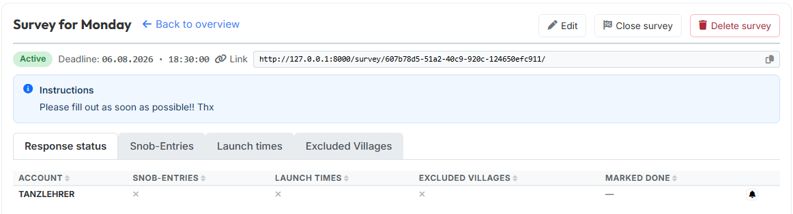{ .screenshot }

Im Kopfbereich stehen links der Titel und der Link
**„zurück zur Übersicht"**, rechts die Aktionen der Umfrage. Darunter
folgen Status, Frist und — besonders wichtig — der **Teilen-Link** mit
Kopier-Knopf. Genau diesen Link gibst du an den Stamm weiter. Sind
Anweisungen hinterlegt, erscheinen sie im blauen Kasten darunter.

Die drei Aktionen im Kopfbereich:

- **Bearbeiten** — ändert **Titel** und **Anweisungen**. Die
  abgefragten Datentypen und die Frist stehen nach dem Anlegen fest
  und lassen sich nicht mehr ändern.
- **Umfrage beenden** — setzt den Status auf **Beendet**. Mitglieder
  können danach nichts mehr melden; die bereits gemeldeten Daten
  bleiben vollständig erhalten und weiterhin importierbar. Eine
  beendete Umfrage lässt sich **nicht** wieder öffnen.
- **Umfrage löschen** — entfernt die Umfrage **samt allen zugehörigen
  Meldungen**. Der Bestätigungsdialog nennt vorher, wie viele
  AG-Meldungen, Abschickzeiten und ausgeplanten Dörfer verloren gehen.
  Die Aktion ist nicht rückgängig zu machen.

!!! info "Die Frist beendet die Umfrage automatisch"
    Läuft die Frist ab, gilt die Umfrage als beendet — auch ohne
    Klick auf **„Umfrage beenden"**. Meldungen sind ab diesem
    Zeitpunkt nicht mehr möglich.

Darunter sitzen die Reiter der Umfrage. **„Antwort-Status"** ist immer
vorhanden; die drei Datenreiter erscheinen nur für die Datentypen, die
in dieser Umfrage auch abgefragt werden.

## Reiter „Antwort-Status"

Der Antwort-Status ist die Kontrollansicht: eine Zeile je verknüpftem
DS-Account des Servers.

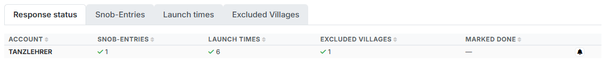{ .screenshot }

| Spalte | Bedeutung |
|---|---|
| **Account** | Der DS-Account; im Tooltip stehen die verknüpften Discord-Nutzer |
| **AG-Meldungen** | Häkchen mit Anzahl der Meldungen, sonst ✗ |
| **Abschickzeiten** | Häkchen mit Anzahl der Einträge, sonst ✗ |
| **Ausgeplante Dörfer** | Häkchen mit Anzahl der Einträge, sonst ✗ |
| **Fertig-Klick** | Wer wann auf „Fertig" geklickt hat, sonst `—` |
| | Glocken-Knopf für eine Erinnerung |

Es werden nur die Spalten der tatsächlich abgefragten Datentypen
gezeigt. Alle Spalten lassen sich per Klick auf die Überschrift
sortieren.

Der **Fertig-Klick** ist eine bewusste Rückmeldung des Spielers („ich
bin durch") und unabhängig davon, wie viele Zeilen er gemeldet hat —
gerade wenn jemand *nichts* zu melden hat, ist das die einzige
verlässliche Information.

### Erinnerung senden

Über den **Glocken-Knopf** am Zeilenende schickt der Discordbot eine
Erinnerungs-DM an alle Discord-Nutzer, die mit diesem Account
verknüpft sind. Nach dem Versand wird der Knopf grau und zeigt im
Tooltip den Zeitpunkt.

!!! info "Eine Erinnerung pro Umfrage und Account"
    Je Umfrage und Account ist genau **eine** Erinnerung möglich — der
    Knopf ist kein Dauerfeuer. Er erscheint nur, solange die Umfrage
    aktiv ist. Empfängt keiner der verknüpften Discord-Nutzer
    Umfrage-DMs, wird die Erinnerung nicht verbraucht, sondern mit
    einem Hinweis abgelehnt.

## Reiter „AG-Meldungen"

In diesem Bereich werden die AG-Meldungen dieser Umfrage verwaltet.
Die Liste ist die Basis für die spätere AG-Planung.

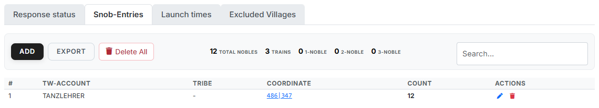{ .screenshot }

In der Werkzeugleiste über der Tabelle stehen links die Buttons
**„Hinzufügen"**, **„Export"** und **„Alles löschen"**, rechts das
Suchfeld — und dazwischen die **Kennzahlen** aller Meldungen dieser
Umfrage:

- **Gesamt AGs** — Summe aller gemeldeten AGs über alle Spieler.
- **Trains** — Anzahl der vollen Trains (je 4 AGs). Gezählt wird pro
  Herkunftsdorf, wie viele volle Vierer darin stecken.
- **1er-AGs / 2er-AGs / 3er-AGs** — der **Rest**, der nach den vollen
  Trains je Dorf übrig bleibt.

!!! info "Beispiel"
    Ein Dorf mit 8 gemeldeten AGs zählt als **2 Trains** und
    hinterlässt keinen Rest. Ein Dorf mit 6 AGs zählt als **1 Train**
    plus eine **2er-AG**.

Die Tabelle darunter listet jede einzelne Meldung:

| Spalte | Bedeutung |
|---|---|
| **#** | Laufende Nummer |
| **DS-Account** | Spieler, der die AGs stellt |
| **Stamm** | Stamm des Spielers |
| **Koordinate** | Herkunftsdorf der Meldung |
| **Anzahl** | Wie viele AGs der Spieler aus diesem Herkunftsdorf fertig hat |
| **Aktionen** | Eintrag bearbeiten (Stift) oder löschen (Mülltonne) |

## Reiter „Abschickzeiten"

Hier verwaltest du die individuellen Abschickfenster der Spieler —
also die Zeitfenster, in denen die einzelnen Spieler tatsächlich Zeit
haben, um Befehle abzuschicken.

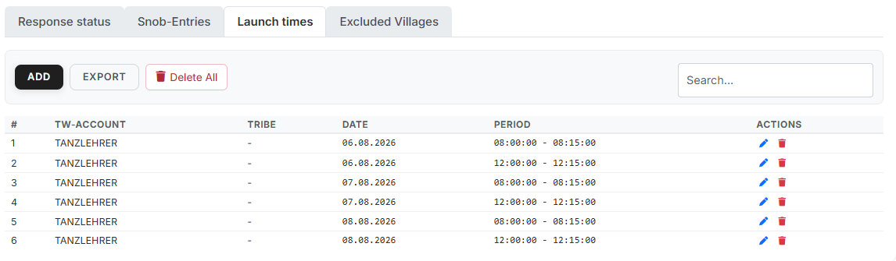{ .screenshot }

Tabellenspalten:

| Spalte | Bedeutung |
|---|---|
| **#** | Laufende Nummer |
| **DS-Account** | Account, für welchen das eingetragene Zeitfenster gilt |
| **Stamm** | Stamm des Spielers |
| **Datum** | Tag, an dem der Spieler abschicken kann |
| **Zeitraum** | Von- und Bis-Uhrzeit (Tribalwars-Serverzeit) |
| **Aktionen** | Eintrag bearbeiten oder löschen |

Über der Tabelle liegen wieder die Buttons **„Hinzufügen"**,
**„Export"** und **„Alles löschen"** sowie das Suchfeld.

## Reiter „Ausgeplante Dörfer"

Hier markierst du Dörfer, die in der Off-Planung **nicht als
Herkunftsdorf** verwendet werden sollen — zum Beispiel weil der Spieler
das Dorf aktuell defensiv halten will oder weil die Truppen für eine
andere Aktion reserviert sind.

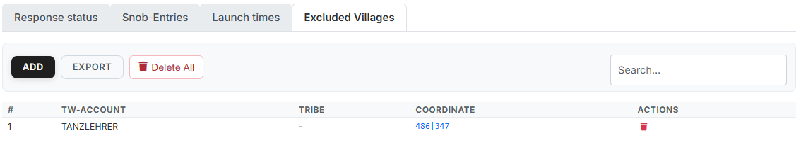{ .screenshot }

Tabellenspalten:

| Spalte | Bedeutung |
|---|---|
| **#** | Laufende Nummer |
| **DS-Account** | Besitzer des ausgeplanten Dorfs |
| **Stamm** | Stamm des Besitzers |
| **Koordinate** | Das ausgeplante Dorf |
| **Aktionen** | Eintrag löschen |

Auch hier stehen über der Tabelle **„Hinzufügen"**, **„Export"** und
**„Alles löschen"** sowie das Suchfeld.

## Einträge manuell anlegen

Alle drei Listen können nicht nur von den Mitgliedern befüllt werden,
sondern auch direkt im Leader-View. Über einen Klick auf den Button
**„Hinzufügen"** oberhalb der jeweiligen Tabelle öffnest du das
passende Eingabe-Modal. Nach dem Bestätigen erscheint der neue Eintrag
unmittelbar in der entsprechenden Tabelle.

!!! info "Alles gehört zu dieser einen Umfrage"
    Hinzufügen, Bearbeiten, Export und **„Alles löschen"** wirken
    ausschließlich innerhalb der gerade geöffneten Umfrage. Andere
    Umfragen bleiben unberührt.

Die drei Eingabe-Modals im Detail:

### AG-Meldung hinzufügen

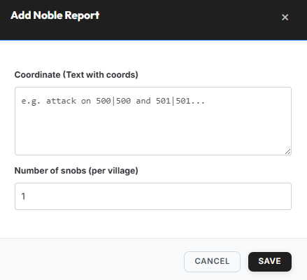{ .screenshot }

Felder:

- **Koordinaten (Text mit Koords)** — eine oder mehrere
  Herkunftskoordinaten; umgebender Text wird ignoriert (z. B.
  `AGs fertig in 500|500 und 501|501…`).
- **Anzahl AGs (pro Dorf)** — wie viele AGs der Spieler pro
  Herkunftsdorf fertig hat. Der eingegebene Wert gilt für **alle** in
  Schritt 1 erkannten Koordinaten.

### Abschickzeit hinzufügen

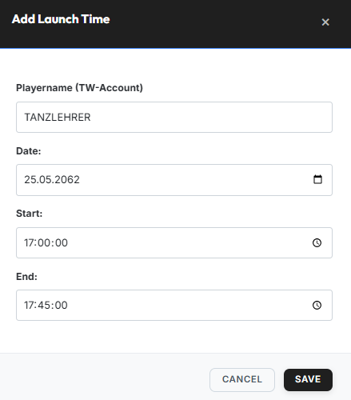{ .screenshot }

Felder:

- **Spielername (DS-Account)** — mit Autovervollständigung über die
  verifizierten Accounts.
- **Datum** — Tag des Abschickfensters.
- **Von** / **Bis** — Anfang und Ende des Zeitfensters (Tribalwars-
  Serverzeit).

### Herkunftsdorf ausplanen

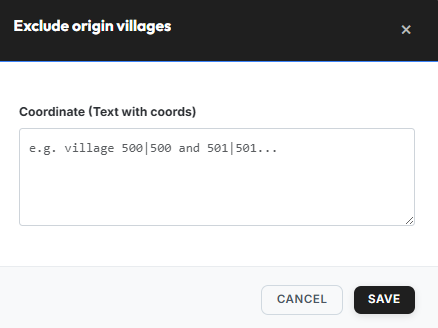{ .screenshot }

Im Feld **„Koordinaten (Text mit Koords)"** trägst du eine oder mehrere
Koordinaten ein (umgebender Text wird ignoriert).

## Was die Mitglieder sehen

Die Mitglieder melden ihre Daten auf einer eigenen Seite, die über den
**Teilen-Link** der Umfrage erreichbar ist. Dieser Abschnitt zeigt
diese Seite aus Sicht eines Stammesmitglieds — praktisch, wenn du als
Leader Rückfragen beantworten musst.

### So kommen die Mitglieder hin

Zwei Wege führen zur Melde-Seite:

1. **Über den Link** — du verteilst ihn per Discord, Ingame-Nachricht
   oder Forum. Die Seite verlangt einen Discord-Login und einen auf
   diesem Server verknüpften DS-Account.
2. **Über „Meine Accounts"** — auf tw-utils.net zeigt die Account-Karte
   der passenden Welt einen Abschnitt **„Stammes-Umfragen"**.

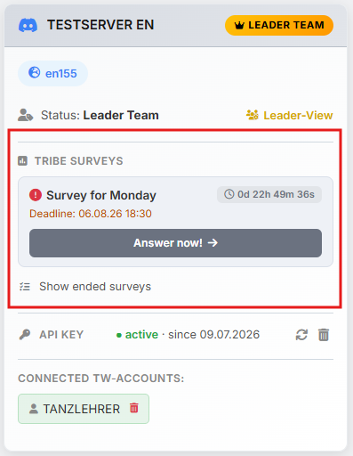{ .screenshot }

Dort steht jede laufende Umfrage mit Titel, Frist und einem
mitlaufenden **Countdown**; der Knopf **„Jetzt beantworten!"** führt
direkt auf die Melde-Seite. Über **„Beendete Umfragen anzeigen"**
darunter sieht ein Mitglied außerdem, was es in früheren Runden
gemeldet hat.

Auf der Melde-Seite selbst gibt es je abgefragtem Datentyp einen
Bereich. Links neben jedem Formular steht der gelbe Kasten
**„Gemeldet"** mit allem, was für diesen Account schon eingetragen
ist — über das ✗ hinter einer Zeile nimmt der Spieler einen Eintrag
wieder zurück.

!!! info "Immer nur für eigene Accounts"
    Ein Mitglied kann ausschließlich für **eigene**, verknüpfte
    Accounts melden. Der Server ordnet jede Koordinate automatisch dem
    richtigen Account zu; Koordinaten fremder Dörfer, Barbarendörfer
    und nicht existierende Koordinaten weist die Seite einzeln mit
    Begründung ab.

### AGs melden

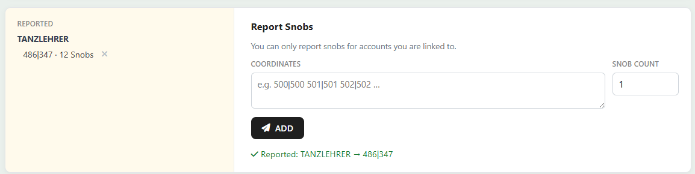{ .screenshot }

Ins Feld **„Koordinaten"** kommen ein oder mehrere Herkunftsdörfer,
unter **„Anzahl AGs"** die Zahl der fertigen AGs — der Wert gilt für
alle eingegebenen Koordinaten. **„Hinzufügen"** speichert die Meldung.

### Abschickzeiten eintragen

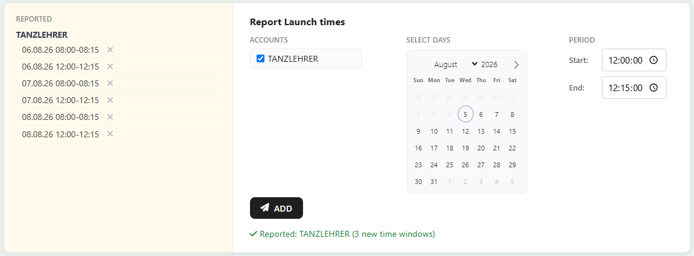{ .screenshot }

Hier hakt der Spieler unter **„Accounts"** an, für welche seiner
Accounts das Zeitfenster gilt, wählt im Kalender **„Tage auswählen"**
beliebig viele Tage aus und setzt unter **„Zeitraum"** die Uhrzeiten
**„Von"** und **„Bis"**. Ein Klick auf **„Hinzufügen"** legt daraus
alle Kombinationen an — also Tage × Accounts Einträge auf einmal.

### Herkunftsdörfer ausplanen

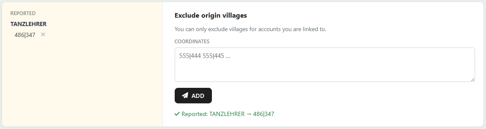{ .screenshot }

Ins Feld **„Koordinaten"** kommen die Dörfer, aus denen der Spieler
**nicht** verplant werden möchte — auch hier sind mehrere Koordinaten
auf einmal möglich.

### Fertig melden

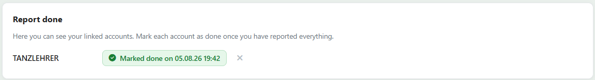{ .screenshot }

Ganz unten steht je verknüpftem Account ein **„Fertig"**-Knopf. Nach
dem Klick zeigt die Zeile grün **„Fertig gemeldet am …"**; über das ✗
lässt sich die Rückmeldung wieder zurücknehmen.

Genau dieser Klick landet bei dir im Reiter
[Antwort-Status](#reiter-antwort-status) in der Spalte
**„Fertig-Klick"**.

!!! info "Meldungen gehen auch über den Discordbot"
    AG-Meldungen, Abschickzeiten und ausgeplante Herkunftsdörfer
    können die Spieler weiterhin direkt über das
    [Planning-System des Discordbots](../discord-bot/planning-system.md)
    abgeben. Der Bot fragt dabei zuerst, für **welche** Umfrage die
    Meldung gilt; gibt es nur eine aktive Umfrage, entfällt die
    Abfrage.

## Weiterverarbeitung in den Planungstools

Die gesammelten Daten werden in den Planungstools per Dropdown
übernommen — dort wählst du die Umfrage aus und bestätigst mit dem
Plus-Knopf:

- **AG-Meldungen** → AG-Planungstool, Spalte **„Aus Stammes-Umfrage"**
  (siehe [Schritt 1: AG-Meldungen](../ag-planner/schritt1-ag-meldungen.md)).
- **Abschickzeiten** → Off-Planungstool, Schritt 2 (siehe
  [Schritt 2: Abschickzeiten](../off-planner/schritt2-abschickzeiten.md)).
- **Ausgeplante Dörfer** → Off-Planungstool, Schritt 1 (siehe
  [Schritt 1: Truppen](../off-planner/schritt1-truppen.md)).

!!! info "Auch beendete Umfragen bleiben importierbar"
    Der Import nach Fristende ist der Normalfall: Erst melden die
    Mitglieder, dann wird geplant. In den Dropdowns tauchen deshalb
    beendete Umfragen genauso auf wie laufende. Bei den
    Abschickzeiten werden allerdings nur Zeitfenster übernommen, die
    noch in der Zukunft liegen.
