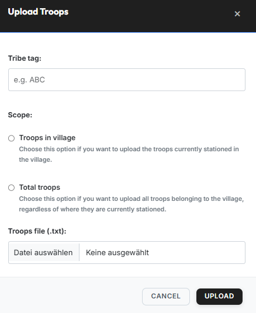

# Troops

{ .screenshot }

The **"Troops"** tab manages the troop-data uploads per tribe. The
data uploaded here is the basis for many other features — both in the
Leader-View (e.g. Bunker-Info) and in the modules of the tw-utils
Discord bot.

!!! info "Re-use by the Discord bot"
    The uploaded **"Troops in village"** data is automatically synced
    with the tw-utils Discord bot and re-used there in the
    **Bunker-Information-System** and **Nuke/Deff/Snob-Search-System**
    modules.

## Table columns

| Column | Meaning |
|---|---|
| **#** | Running number |
| **Tribe** | Tribe the data belongs to |
| **Scope** | "Troops in village" or "Total troops" |
| **Villages** | Number of villages in the dataset |
| **Uploaded at** | Timestamp of the last upload |
| **Uploaded by** | Discord user who triggered the upload |
| **Actions** | Delete entry (trash icon) |

## The two scopes

When uploading you choose which view of the troops the file contains.
Both views can be maintained in parallel.

- **Troops in village** — only the troops currently actually standing
  in the village (i.e. no troops in transit).
- **Total troops** — all existing troops of a village (in village +
  in transit). Pure inventory/analysis view.

## Uploading troops

The button **"Upload Troops"** (top right) opens the upload dialog:

{ .screenshot }

Dialog fields:

- **Tribe tag** — tag of the tribe the data belongs to (e.g. `ABC`).
- **Scope** — choose either **"Troops in village"** or
  **"Total troops"** (see [The two scopes](#the-two-scopes)).
- **Troops file (.txt)** — the TXT file produced by the
  [quickbar script](https://forum.tribalwars.net/index.php?threads/download-tribe-info.285469/).

### Expected file format

The TXT file must contain a header line with the column names as its
first line, followed by one line per village:

```
Coords,Player,spear,sword,axe,archer,spy,light,marcher,heavy,ram,catapult,knight,snob
483|520,Testuser A,2421,6099,100,5963,50,50,3632,200,5,279,0,8
543|538,Testuser A,100,100,6027,100,6,3014,100,100,159,5,0,0
467|559,Testuser A,3779,4836,100,4803,40,50,6309,1584,5,80,0,0
465|523,Testuser B,4298,5495,100,6752,23,50,5761,1131,5,35,0,0
468|515,Testuser B,721,4160,100,2280,61,50,5935,832,5,308,0,4
```
