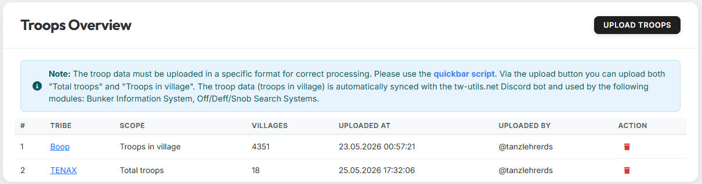

# Truppen

Der Tab **„Truppen"** verwaltet die Truppendaten-Uploads pro Stamm. Die
hier hochgeladenen Daten sind die Grundlage für viele andere Funktionen
— sowohl im Leader-View (z. B. Bunker-Info) als auch in den Modulen des
tw-utils-Discordbots.

{ .screenshot }

!!! info "Hinweis"
    Die Truppendaten müssen für eine korrekte Verarbeitung in einem
    speziellen Format hochgeladen werden. Nutze hierzu bitte das
    [Schnellleistenscript](https://forum.tribalwars.net/index.php?threads/download-tribe-info.285469/).
    Über den Upload-Button kannst du **„Truppen Insgesamt"** und
    **„Truppen im Dorf"** hochladen. Die Truppendaten (Truppen im
    Dorf) werden **automatisch mit dem tw-utils.net Discordbot
    synchronisiert** und im Rahmen der folgenden Module genutzt:
    **Bunker-Information-System**, **Off/Deff/Snob-Search-Systems**.

## Spalten der Tabelle

| Spalte | Bedeutung |
|---|---|
| **#** | Laufende Nummer |
| **Stamm** | Stamm, zu dem die Daten gehören |
| **Scope** | „Truppen im Dorf" oder „Truppen Insgesamt" |
| **Dörfer** | Anzahl der Dörfer im Datensatz |
| **Hochgeladen am** | Zeitstempel des letzten Uploads |
| **Hochgeladen von** | Discord-User, der den Upload ausgelöst hat |
| **Aktion** | Eintrag löschen (Mülltonnen-Icon) |

## Die beiden Scopes

Beim Hochladen wählst du, welche Sicht der Truppen die Datei enthält.
Beide Sichten lassen sich parallel pflegen.

- **Truppen im Dorf** — nur die Truppen, die aktuell tatsächlich im
  Dorf stehen (also keine unterwegs befindlichen oder gestützten
  Truppen). Diese Sicht ist die Daten-Grundlage für das
  **Bunker-Information-System** und die
  **Off/Deff/Snob-Search-Systems** des Discordbots und wird automatisch
  mit dem Bot synchronisiert.
- **Truppen Insgesamt** — alle vorhandenen Truppen eines Dorfes (im
  Dorf + unterwegs + gestützt). Sie dient als reine
  Bestands-/Auswertungs-Sicht.

!!! info "Automatische Synchronisation mit dem Discordbot"
    Sobald du neue **„Truppen im Dorf"**-Daten hochlädst, stehen sie
    dem Discordbot ohne weiteren Schritt zur Verfügung. Bunker-Status,
    Off-/Deff-/Snob-Suchen und das Planning-System greifen jeweils auf
    den jüngsten Upload zu.

## Truppen hochladen

Über den Button **„Upload Troops"** (oben rechts) öffnest du den
Upload-Dialog. Es wird dieselbe TXT-Datei erwartet, die auch im
Off-Planungstool verwendet wird — Format und Erzeugung sind in
[Tab 1: Daten & Vorbereitung](../off-planner/tab1-daten.md) beschrieben.

## Verknüpfung mit dem Discordbot

Die hochgeladenen „Truppen im Dorf" werden direkt von folgenden Modulen
verwendet:

- [Bunker-Information-System](../discord-bot/bunker-info.md) — prüft
  den Soll-/Ist-Stand der Bunker.
- [Off/Deff/Snob-Search-System](../discord-bot/search-system.md) —
  ermittelt Quelldörfer mit ausreichend Truppen für Off-, Deff- bzw.
  AG-Anfragen.
