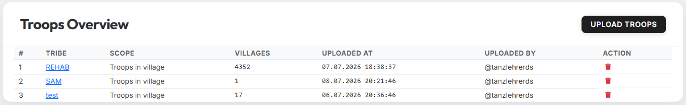
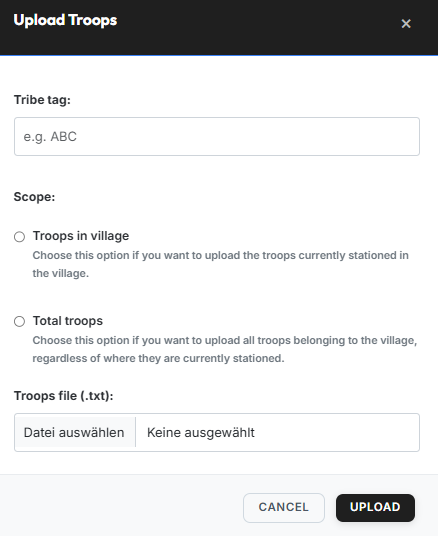

# Truppen

{ .screenshot }

Der Tab **„Truppen"** verwaltet die Truppendaten-Uploads pro Stamm. Die
hier hochgeladenen Daten sind die Grundlage für viele andere Funktionen
— sowohl im Leader-View (z. B. Bunker-Info) als auch in den Modulen des
tw-utils-Discordbots.

!!! info "Weiterverwendung durch den Discordbot"
    Die hochgeladenen **„Truppen im Dorf"** werden automatisch mit dem
    tw-utils-Discordbot synchronisiert und dort in den Modulen
    **Bunker-Information-System** und **Off/Deff/Snob-Search-Systems**
    weiterverwendet.

!!! info "Wer sieht diesen Tab?"
    Der Tab **„Truppen"** ist für alle vier Rollen sichtbar —
    TWU-Troops, TWU-Bunker, TWU-Planner und TWU-Leader. Details unter
    [Berechtigung](uebersicht.md#welche-rolle-sieht-welchen-tab).

## Spalten der Tabelle

| Spalte | Bedeutung |
|---|---|
| **#** | Laufende Nummer |
| **Stamm** | Stamm, zu dem die Daten gehören |
| **Scope** | „Truppen im Dorf" oder „Truppen Insgesamt" |
| **Dörfer** | Anzahl der Dörfer im Datensatz |
| **Hochgeladen am** | Zeitstempel des letzten Uploads |
| **Hochgeladen von** | Discord-User, der den Upload ausgelöst hat |
| **Aktion** | Eintrag löschen (Mülltonnen-Icon) |

!!! info "Die Zahl unter **Dörfer** kann von selbst kleiner werden"
    Einmal pro Stunde entfernt tw-utils aus den hochgeladenen Truppen
    die Dörfer, die inzwischen erobert wurden oder Barbarendörfer
    geworden sind; die Zahl unter **Dörfer** sinkt entsprechend, der
    Zeitstempel unter **Hochgeladen am** bleibt stehen. Der Eintrag als
    Ganzes verschwindet weiterhin nur, wenn ihn jemand löscht oder er
    fünf Tage alt geworden ist.

## Die beiden Scopes

Beim Hochladen wählst du, welche Sicht der Truppen die Datei enthält.
Beide Sichten lassen sich parallel pflegen.

- **Truppen im Dorf** — nur die Truppen, die aktuell tatsächlich im
  Dorf stehen (also keine unterwegs befindlichen Truppen).
- **Truppen Insgesamt** — alle vorhandenen Truppen eines Dorfes (im
  Dorf + unterwegs). Reine Bestands-/Auswertungs-Sicht.

## Truppen hochladen

Über den Button **„Truppen hochladen"** (oben rechts) öffnet sich der
Upload-Dialog:

{ .screenshot }

Felder im Dialog:

- **Stammeskürzel** — Tag des Stammes, zu dem die Daten gehören
  (z. B. `ABC`). Das Feld schlägt beim Tippen passende Stämme der
  aktuellen Welt vor; ein Kürzel, das es auf der Welt nicht gibt, wird
  beim Hochladen abgelehnt.
- **Scope** — wähle entweder **„Truppen im Dorf"** oder
  **„Truppen Insgesamt"** (siehe [Die beiden Scopes](#die-beiden-scopes)).
  Nennt die gewählte Datei selbst genau eine Erfassungsart, springt die
  Auswahl automatisch darauf. Entscheidend bleibt trotzdem, was hier
  steht: Enthält die Datei die gewählte Erfassungsart nicht, lehnt der
  Upload mit einer Meldung ab, die nennt, was stattdessen drinsteht.
- **Truppen-Datei (.txt, .csv, .json)** — die Datei aus einem der beiden
  unterstützten Auslese-Scripte (siehe
  [Erwartetes Datei-Format](#erwartetes-datei-format)).

Ein Upload **ersetzt** immer den kompletten bisherigen Datensatz
dieser Kombination aus Stamm und Scope — es wird also nichts
zusammengeführt. Ein Upload ohne verwertbare Zeilen lässt die
vorhandenen Daten unangetastet, statt sie zu leeren.

Stehen in der Datei Einheiten, die es auf der Welt gar nicht gibt (etwa
der Export einer Bogenschützen-Welt für einen Stamm auf einer Welt ohne
Bogenschützen), wird der Upload mit einer Meldung abgelehnt, statt die
Daten halb zu importieren. Die Erfolgsmeldung nennt zusätzlich
übersprungene Zeilen und Spieler, bei denen in keinem Dorf eine Einheit
steht — häufigste Ursache dafür ist eine fehlende Truppenfreigabe im
Stamm.

### Erwartetes Datei-Format

Es werden zwei Auslese-Scripte unterstützt. **Du wählst nirgends aus,
welches Format du hochlädst** — erkannt wird es am Inhalt der Datei.
Erlaubt sind die Dateiendungen `.txt`, `.csv` und `.json`.

Die Datei muss Truppenspalten enthalten — ein reiner Gebäude-Export wird
abgelehnt.

#### „Download Tribe Info"

Das [Schnellleisten-Script](https://forum.tribalwars.net/index.php?threads/download-tribe-info.285469/)
lädt die Datei direkt herunter. Sie muss als erste Zeile eine
Header-Zeile mit den Spaltennamen enthalten, gefolgt von einer Zeile pro
Dorf:

```
Coords,Player,spear,sword,axe,archer,spy,light,marcher,heavy,ram,catapult,knight,snob
483|520,Testuser A,2421,6099,100,5963,50,50,3632,200,5,279,0,8
543|538,Testuser A,100,100,6027,100,6,3014,100,100,159,5,0,0
467|559,Testuser A,3779,4836,100,4803,40,50,6309,1584,5,80,0,0
465|523,Testuser B,4298,5495,100,6752,23,50,5761,1131,5,35,0,0
468|515,Testuser B,721,4160,100,2280,61,50,5935,832,5,308,0,4
```

Dieses Format sagt nicht, welche Erfassungsart darin steckt — hier
entscheidet allein deine Auswahl im Feld **Scope**.

#### „NeilsTribeInfo"

Wo es die Ingame-**Skriptbibliothek** gibt — auf den .net-Welten
etwa —, musst du dafür nichts installieren: Dort steht es als
**„NeilB Tribe Info"**, und ein Klick auf **„Activate"** legt es in
deine Schnellleiste. Im Bild steht stattdessen **„Deactivate"**,
weil das Script dort schon aktiv ist.

{ .screenshot }

!!! info "Dieses Script lädt keine Datei herunter"
    Statt eines Downloads hat es die Knöpfe **„Copy CSV"** und
    **„Copy JSON"** — das Ergebnis landet in der **Zwischenablage**.
    Füge es also erst in einen Editor (z. B. Notepad) ein und speichere
    es als Datei, bevor du es hier hochlädst.

Die Datei beginnt mit einer `exported_at`-Zeile, darunter folgt die
quotierte Spaltenzeile und je Dorf eine Zeile:

```
exported_at,1789240946
"player_name","player_id","village","coords","points","spear","sword","axe",…
"Testuser A","9859907","Testdorf (603|576) K56","603|576","5491","2222","11","12",…
```

Dieses Format nennt die Erfassungsart selbst: die Script-Seite
**„Truppen"** ergibt **Truppen Insgesamt**, die Seite
**„Verteidigung"** ergibt **Truppen im Dorf**. Unterwegs befindliche
Truppen werden dabei bewusst nicht übernommen.
