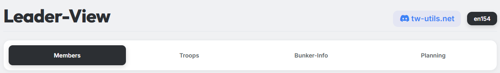
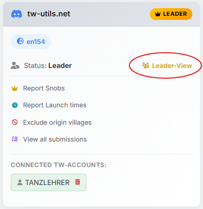

# Permission

{ .screenshot }

The **Leader-View** is the tribe-leader area on tw-utils.net. It
bundles all the tools you need as a leader to steer your tribe — from
member management and troop data to bunker administration and attack
planning.

The Leader-View is split into four tabs:

- **Members**
- **Troops**
- **Bunker-Info**
- **Planning**

## Access requirements

For a user to see and use the Leader-View, **both** of the following
conditions must be met:

### 1. Linking the Discord account to a Tribalwars account

The user must be linked on the **tribe Discord server** with at least
one of their Tribalwars accounts. The linking is done via the
tw-utils Discord bot:

1. On the tribe Discord server, switch to the channel
   **`#⚫-bot-config`**.
2. Click the **"Account Verification"** button and follow the
   instructions shown there — the bot guides you through linking the
   Discord account and the Tribalwars account.

The full step-by-step instructions with all details can be found
under [Account Verification](../discord-bot/verifizierung.md).

### 2. Granting the "Leader" role

The user must hold the **"Leader"** role. This role is granted
exclusively via the tw-utils Discord bot and can only be done by
**admins of the tribe Discord server**:

1. On the tribe Discord server, switch to the channel
   **`#⚫-bot-config`**.
2. Click the **"Manage Access to Leader-View"** button.
3. In the ephemeral embed that appears, click **"Grant Access"**.
4. Select the role — currently only **"Leader"** is available.
5. Select the Discord user who should receive Leader access.

Via **"Terminate Access"** you can revoke a user's access. With
**"List authorized Users"** all currently authorized Leaders of the
tribe Discord server are listed.

!!! info "Bot setup as prerequisite"
    For the channel `#⚫-bot-config` and its buttons to even exist,
    the tw-utils Discord bot must first be set up on the tribe Discord
    server. A step-by-step guide for this can be found under
    [Quick-Setup-Guide](../discord-bot/quick-setup.md).

---

Once both requirements are met, the entry **"Leader-View"** as well
as the yellow **"Leader"** badge appear in the profile popup of the
respective world:

{ .screenshot }
