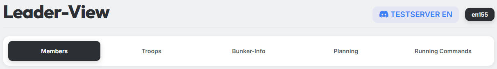
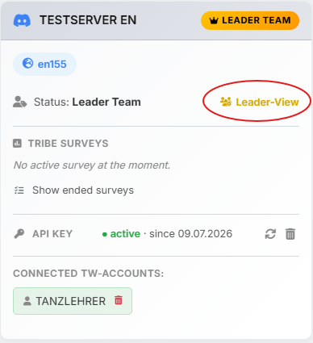

# Berechtigung

{ .screenshot }

Der **Leader-View** ist der Stammesführer-Bereich auf tw-utils.net. Er
bündelt alle Werkzeuge, die du als Leader für die Steuerung deines
Stammes brauchst — von der Mitgliederverwaltung über die Truppendaten
bis hin zur Bunker-Verwaltung, der Angriffsplanung und den laufenden
Befehlen des Stammes.

Der Leader-View ist in fünf Tabs gegliedert:

- **Mitglieder**
- **Truppen**
- **Bunker-Info**
- **Planung** (Stammes-Umfragen und Container)
- **Laufende Befehle**

Welche dieser Tabs du siehst, hängt von deiner Rolle ab — siehe
[Welche Rolle sieht welchen Tab?](#welche-rolle-sieht-welchen-tab).

## Voraussetzungen für den Zugriff

Damit ein User den Leader-View sehen und nutzen kann, müssen **beide**
folgenden Bedingungen erfüllt sein:

### 1. Verknüpfung des Discord-Accounts mit einem Tribalwars-Account

Der User muss auf dem **Stammes-Discordserver** mit mindestens einem
seiner Tribalwars-Accounts verknüpft sein. Die Verknüpfung erfolgt über
den tw-utils-Discordbot:

1. Im Stammes-Discordserver in den Channel **`#⚫-bot-config`**
   wechseln.
2. Auf den Button **`Account-Verification`** klicken und den dort
   angezeigten Anweisungen folgen — der Bot führt durch die
   Verknüpfung von Discord-Account und Tribalwars-Account.

Die vollständige Schritt-für-Schritt-Anleitung mit allen Details findet
sich unter [Account-Verifizierung](../discord-bot/verifizierung.md).

### 2. Mindestens eine tw-utils-Rolle

Der User muss mindestens eine der vier tw-utils-Rollen besitzen:
**TWU-Troops**, **TWU-Bunker**, **TWU-Planner** oder **TWU-Leader**.
Ein Mitglied ohne Rolle kann den Leader-View nicht öffnen.

Für die Vergabe dieser Rollen gibt es zwei Wege.

#### Der Normalfall: Vergabe im Leader-View

Sobald es auf dem Server **einen** TWU-Leader gibt, werden alle
weiteren Rechte direkt auf tw-utils.net vergeben: im Tab
**„Mitglieder"** über den Button **„Verwalten"** in der jeweiligen
Zeile. Dort lassen sich die vier Standard-Rollen sowie die
API-Zusatzrollen setzen und wieder entziehen.

Die Details dazu — inklusive der Beschreibung jeder einzelnen Rolle —
stehen unter [Mitglieder](mitglieder.md#rechte-verwalten).

#### Der erste Leader: Vergabe über den Discordbot

Auf einem frisch eingerichteten Server gibt es noch keinen TWU-Leader,
der Rollen verteilen könnte. Der **erste** Leader wird deshalb über den
tw-utils-Discordbot ernannt. Das kann nur ein **Discord-Administrator**
des Stammesservers:

1. Im Stammes-Discordserver in den Channel **`#⚫-bot-config`**
   wechseln.
2. Auf den Button **„Manage Access to Leader-View"** klicken.
3. Im daraufhin angezeigten (ephemeren) Embed auf **„Grant Access"**
   klicken.
4. Die Rolle auswählen — über den Bot steht ausschließlich
   **„Leader"** (= TWU-Leader) zur Verfügung.
5. Den Discord-User auswählen, der Leader-Zugriff erhalten soll.

Über **„Terminate Access"** lässt sich einem User der Zugriff wieder
entziehen; dabei werden **alle** seine tw-utils-Rollen entfernt. Mit
**„List authorized Users"** werden alle aktuell berechtigten User des
Stammes-Discordservers aufgelistet.

!!! info "Bot-Setup als Voraussetzung"
    Damit der Channel `#⚫-bot-config` und seine Buttons überhaupt
    vorhanden sind, muss der tw-utils-Discordbot zunächst auf dem
    Stammes-Discordserver eingerichtet sein. Eine
    Schritt-für-Schritt-Anleitung dazu findest du unter
    [Quick-Setup-Guide](../discord-bot/quick-setup.md).

## Welche Rolle sieht welchen Tab?

Die vier Standard-Rollen bauen aufeinander auf: TWU-Bunker und
TWU-Planner enthalten jeweils alles, was TWU-Troops darf, und
TWU-Leader enthält alles zusammen.

| Tab | TWU-Troops | TWU-Bunker | TWU-Planner | TWU-Leader |
|---|:---:|:---:|:---:|:---:|
| **Mitglieder** | – | – | – | ✓ |
| **Truppen** | ✓ | ✓ | ✓ | ✓ |
| **Bunker-Info** | – | ✓ | – | ✓ |
| **Planung** | – | – | ✓ | ✓ |
| **Laufende Befehle** | – | – | ✓ | ✓ |

Nicht sichtbare Tabs erscheinen gar nicht erst in der Tab-Leiste — wer
etwa nur TWU-Bunker ist, sieht ausschließlich **Truppen** und
**Bunker-Info**.

!!! info "Die Rollen liegen nicht auf Discord"
    Die tw-utils-Rollen sind **keine** Discord-Rollen. Sie werden vom
    Bot in seiner eigenen Datenbank geführt und wirken auf
    tw-utils.net wie im Discordbot gleichermaßen. Auf dem
    Discord-Server selbst muss dafür nichts angelegt werden. Mehr dazu
    im [Berechtigungskonzept](../discord-bot/berechtigungskonzept.md).

---

Sobald beide Voraussetzungen erfüllt sind, erscheint in der
Account-Karte der jeweiligen Welt der Eintrag **„Leader-View"** sowie
das gelbe **„Leader-Team"**-Badge:

{ .screenshot }
