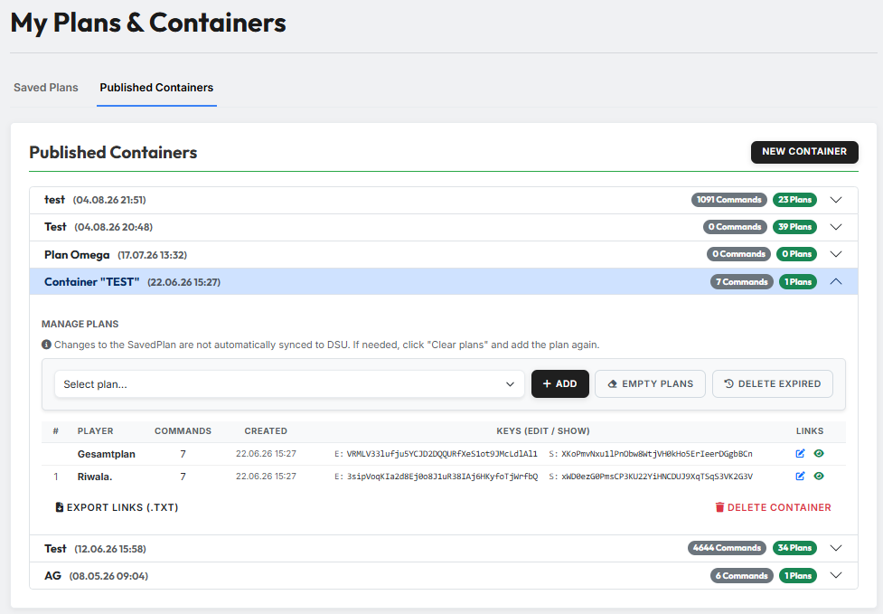

# Published Containers

A **container** is a collection of published plans on **DS-Ultimate**. When
publishing, tw-utils splits a saved plan up by player and creates a separate DSU
plan for each of them — so everybody only gets to see their own commands.

{ .screenshot }

The tab lists all containers of the current world. Per row you find the name,
the creation date and two badges: how many **commands** and how many **plans**
the container contains. A click on the arrow unfolds it.

!!! info "There is more for the whole tribe"
    This page manages **your** containers. In the Leader-View, tribe leadership
    has a considerably more extensive view under
    [Planning (Container)](../leader-view/planung.md) with command editing, plan
    distribution and status tracking.

## 1. Creating a container

**"New Container"** opens a small dialog in which you enter a name for the
container. The container is empty afterwards — filling it is the next step.

## 2. Publishing a plan

Inside the unfolded container, under **"Manage plans"**, sits the dropdown
**"Select plan…"** with your saved plans. Select one, click **"Add"** — that is
the publishing step. tw-utils then creates the DSU plans; with large plans this
takes a moment.

You can put several plans into the same container one after another. Commands of
the same player end up in the same DSU plan.

!!! warning "Changes do not carry over automatically"
    If you edit a saved plan afterwards, the already published DSU plan does
    **not** change. The page says so itself. The way back: **"Empty plans"** and
    add the plan again.

## 3. The container's plan list

The table shows the **player** per row, the number of their **commands**, the
creation date, the two **keys** (edit and show) and the **links** to the DSU
plan on the right.

At the very top, without a sequential number, sits the **Gesamtplan**: an
additional DSU plan containing **all** commands of all players. It is meant for
tribe leadership, who want to see the whole attack at a glance.

Below the table sits **"Export links (.txt)"** — it downloads all DSU links as a
text file, so you can hand them out on Discord, for example.

## 4. Cleaning up

Next to **"Add"** there are two buttons:

- **"Empty plans"** — deletes **all commands** from the container's DSU plans.
  The plans themselves and their links remain; whoever already has the link
  keeps it.
- **"Delete expired"** — removes only the commands whose arrival lies in the
  past. Active commands are kept.

At the bottom right, **"Delete container"** deletes the container in tw-utils.
The plans on DS-Ultimate remain — only the link to them here disappears.

All four actions ask for confirmation first.
