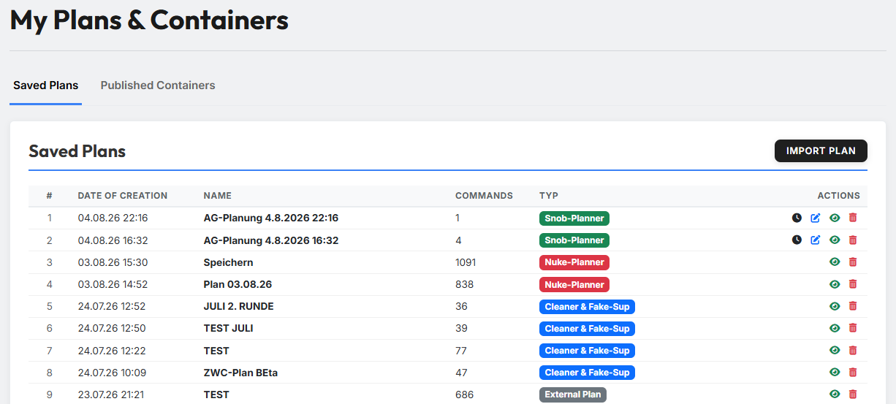
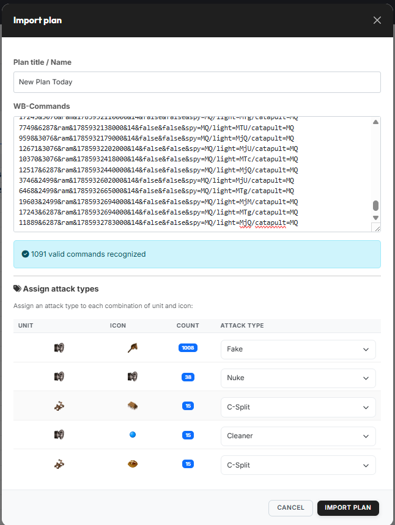
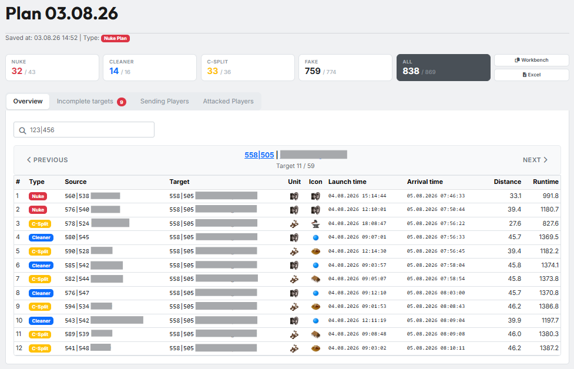

# Gespeicherte Pläne

Alles, was du im [Off-Planungstool](../off-planner/schritt1-truppen.md), im
[AG-Planungstool](../ag-planner/die-zwei-wege.md) oder im
[Zwischencleaner](../cleaner-fake-ut/schritt1-truppen.md) speicherst, landet
unter **„Meine Pläne & Container"**. Die Seite hat zwei Reiter: **Gespeicherte
Pläne** — darum geht es hier — und **Veröffentlichte Container**, beschrieben
unter [Veröffentlichte Container](container.md).

{ .screenshot }

## 1. Die Planliste

Je Zeile siehst du Erstellungsdatum, Name, die Anzahl der enthaltenen Befehle
und den Plantyp als farbiges Kennzeichen:

| Kennzeichen | Herkunft |
|---|---|
| **AG-Planung** | AG-Planungstool |
| **Planungstool** | Off-Planungstool |
| **ZWC & Fake-UT** | Zwischencleaner & Fake-UT |
| **Externer Plan** | über „Plan importieren" eingelesen (siehe Abschnitt 2) |

Die Liste zeigt immer nur Pläne der **aktuell gewählten Welt**. Ist keine Welt
gewählt, steht dort ein entsprechender Hinweis.

Rechts stehen die Aktionen der Zeile:

- **Auge** — den Plan ansehen (siehe Abschnitt 3).
- **Mülleimer** — den Plan löschen. Das lässt sich nicht rückgängig machen.
- **Uhr** und **Stift** — nur bei **AG-Plänen**. Die Uhr öffnet die Seite zum
  nachträglichen Anpassen der Abschickzeiten, der Stift lädt den Plan zurück
  ins AG-Planungstool.

!!! info "Andere Plantypen lassen sich nicht nachbearbeiten"
    Off- und ZWC-Pläne öffnest du zum Ansehen, nicht zum Ändern. Wenn sich etwas
    ändern soll, rechnest du im jeweiligen Werkzeug neu und speicherst erneut.

## 2. Plan importieren

{ .screenshot }

Über **„Plan importieren"** bringst du Befehle in tw-utils, die **außerhalb**
der Planungswerkzeuge entstanden sind — etwa aus einem fremden Plan oder direkt
aus der Workbench.

1. **Bezeichnung / Name des Plans** eintragen.
2. Die **WB-Befehle** einfügen. Darunter meldet das Tool sofort zurück, wie
   viele gültige Befehle es erkannt hat; unbrauchbare Zeilen werden stillschweigend
   übergangen.
3. Unter **„Angriffstypen zuordnen"** ordnest du jeder Kombination aus
   **Einheit** und **Icon** einen Angriffstyp zu (Off, Fake, C-Split, Cleaner
   und so weiter). Die Spalte **Anzahl** zeigt, wie viele Befehle jeweils
   dahinterstecken.
4. **„Plan importieren"** legt den Plan als **Externen Plan** an.

!!! info "Wozu die Zuordnung gut ist"
    Aus den WB-Befehlen allein ist nicht ersichtlich, ob eine Zeile eine Off,
    ein Fake oder ein Cleaner sein soll. Erst die Zuordnung macht daraus einen
    Plan, den die Auswertung im Plan-Viewer und der Leaderview richtig lesen
    können.

## 3. Der Plan-Viewer

{ .screenshot }

Das Auge öffnet den Plan in einer eigenen Ansicht. Oben stehen Name,
Speicherzeitpunkt und Typ, darunter die **Kennzahlen-Karten** — je Befehlsart
das Verhältnis von tatsächlich geplanten zu vorgesehenen Befehlen (etwa
*„Off 32 / 43"*), ganz rechts die Gesamtzahl. Daneben liegen die Knöpfe
**„Workbench"** und **„Excel"**.

Darunter gliedert sich die Ansicht in vier Reiter:

- **Übersicht** — die Befehle Ziel für Ziel, mit Blätterleiste und Suchfeld.
- **Unvollständige Ziele** — Ziele, die weniger Befehle bekommen haben als
  vorgesehen. Die Zahl im Reiter zeigt, wie viele es sind.
- **Abschickende Spieler** — wer wie viele Befehle stellt.
- **Angegriffene Spieler** — wen der Plan trifft.

!!! info "AG-Pläne sehen anders aus"
    Für AG-Pläne zeigt der Viewer die Ziel-Ansicht des AG-Planungstools mit der
    Train-Tabelle statt dieser vier Reiter.

---

Weiter geht es mit [Veröffentlichte Container](container.md).
