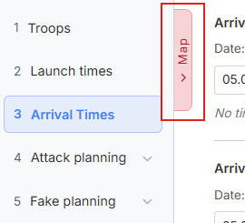
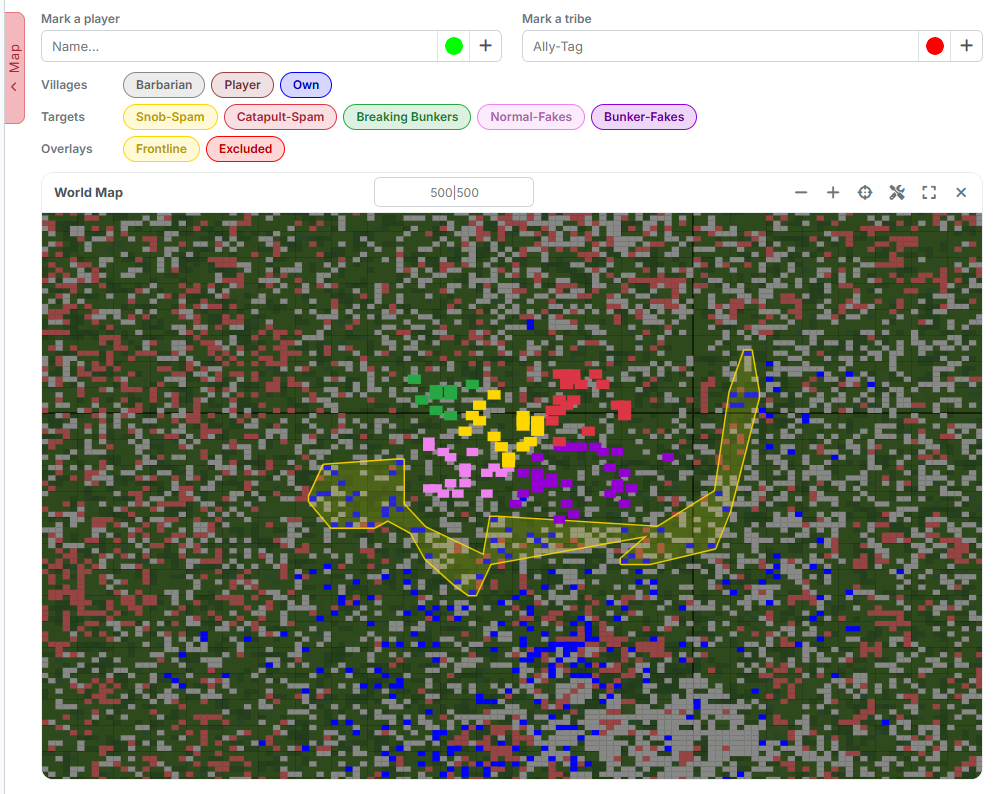
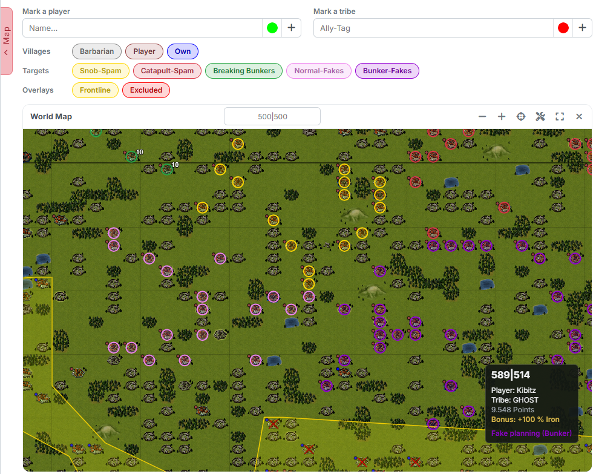
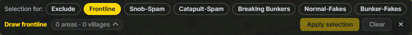
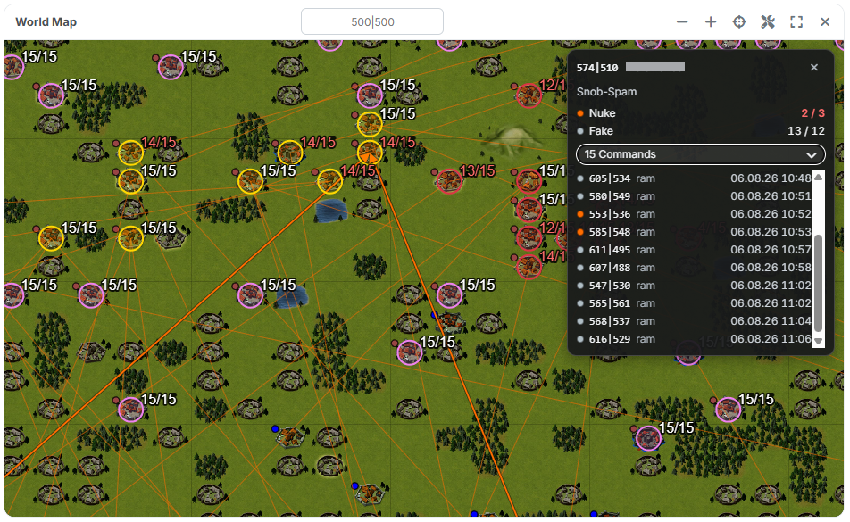

# The Overall Map

The overall map is not a step of its own but a **drawer** that is available in
every step. On it you see your whole plan at once and can additionally select
villages directly.

## 1. Opening and closing

{ .screenshot }

On the left edge of the content area sits the **"Map"** tab. One click (or
Enter or Space) opens the drawer, a second one closes it again. At the top
right of the map card there is an additional **close** symbol.

The map also opens by itself as soon as you click **"Select on the map"**
anywhere in the tool — in [step 1](schritt1-truppen.md) for excluding and for
the frontline, in [step 4](schritt4-angriffsplanung.md) and
[step 5](schritt5-fakeplanung.md) for the targets.

!!! info "Changing the step closes the map"
    When you change the step, the drawer closes. That is on purpose: this way
    the selection you just made stays clearly assigned to one step.

## 2. What the map shows

{ .screenshot }

In the zoomed-out view you see the world as a grid of dots with the continent
borders. Every village is one pixel; the colour tells you who owns it. On top
of that lie the target rings of your plan and the areas of the frontline and
the excluded villages.

{ .screenshot }

If you zoom in far enough, the map switches to the **in-game look** with
terrain, forests, lakes and mountains — exactly like the map in the game. When
you move the mouse over a village, a small box appears with coordinate, player,
tribe, points, the bonus of the village and the category it is planned in.

## 3. Operating the map

In the header of the map card the title **"World Map"** sits on the left, a
field for **searching a coordinate** (`500|500`) in the middle and a row of
symbols on the right:

- **"Zoom out"** / **"Zoom in"** — zoom level. The same is achieved with the
  mouse wheel, on a phone with two fingers.
- **"Show all"** — zooms out far enough for everything planned to fit into the
  picture.
- **"Select villages on the map"** — starts the selection tool, see
  [section 5](#5-selecting-by-click-and-lasso). It starts the selection action
  used last, no matter which step you are currently in. The symbol is only
  missing while no selection is possible at all — that is, before the world
  data is loaded.
- **"Fullscreen"** — puts the map across the whole screen. In fullscreen one
  more symbol joins in: **"Show/hide controls"**, with which you fold away the
  chips and marking fields to gain more map area.
- **"Close"** — closes the drawer.

Dragging with the mouse button held down moves the visible section.

## 4. Layers and markings

Above the map sit the **layer chips**, grouped into rows. One click switches
the respective layer on or off:

- **"Villages"** — `Barbarian`, `Player`, `Own`.
- **"Targets"** — `Snob-Spam`, `Catapult-Spam`, `Breaking Bunkers`,
  `Normal-Fakes`, `Bunker-Fakes`, each in the colour of its category.
- **"Commands"** — `Nuke`, `Cleaner`, `C-Split`, `Fake`, `Snob`. This row only
  appears once a result exists.
- **"Overlays"** — `Frontline`, `Watchtowers`, `Excluded`.

Below the chips a **watchtower legend** additionally appears as soon as
watchtowers are drawn — it assigns their level to the circles.

!!! info "Three chips hide themselves"
    Most chips are always there, even when their layer is currently empty.
    Three behave differently:

    - **"Watchtowers"** only appears once watchtowers are entered **and** the
      algorithm [Watchtower optimized](schritt7-berechnung.md#2-algorithm) is
      selected.
    - **"Excluded"** depends on the switch *"Optional: exclude origin villages
      manually?"* from
      [step 1](schritt1-truppen.md#2-excluding-origin-villages).
    - The whole row **"Commands"** only appears after a calculation, and there
      only those command types that actually occur in the result.

Above that you can highlight individual people:

- **"Mark a player"** — type a name, choose a colour, plus button. The field
  suggests names from the world data.
- **"Mark a tribe"** — the same with a tribe tag.

Several markings at once are possible; they appear as a list below and can be
removed individually.

## 5. Selecting by click and lasso

{ .screenshot }

As soon as you click **"Select on the map"** — or use the tool symbol in the
header — the map switches into selection mode and the selection bar appears at
the bottom.

**This is how you select:**

- A **short click** on a village adds it to the selection; a second click takes
  it out again.
- **Dragging** with the left mouse button held down pulls a **lasso**:
  everything inside the freehand outline joins the selection. This is how you
  mark whole regions in one go.
- Panning works with the **right mouse button** in selection mode, so that
  dragging and drawing do not get in each other's way.

**The selection bar** shows all available actions next to each other on the
left under **"Selection for:"**: `Exclude`, `Frontline`, `Snob-Spam`,
`Catapult-Spam`, `Breaking Bunkers`, `Normal-Fakes`, `Bunker-Fakes`. You can
switch between them right there, without leaving the map — so you can mark fake
targets first and bunkers right afterwards, without closing the map in between.
The sidebar jumps to the matching step automatically while the map stays open.
Only `Exclude` and `Frontline` leave the step untouched.

Next to it stands the number of selected villages; a click on it unfolds the
list of coordinates. When drawing the frontline, the bar counts both — for
example *"3 areas · 128 villages"* — because areas are created there rather
than individual villages.

On the right are **"Apply selection"** (writes the selection into the list of
the respective step), **"Clear"** and an × to **end the selection**.

Two actions bring their own controls into the bar:

- **Breaking Bunkers** shows the field **"Nukes per target:"**. It applies to
  all targets of this selection — and is only read when you apply it, so you
  can still change the number until then.
- **Normal-Fakes** and **Bunker-Fakes** mirror the
  [target filter](schritt5-fakeplanung.md#12-target-filter) into the bar. If
  you change the tribes or the minimum points there, it immediately affects
  what the map marks.

!!! info "Village info"
    On a computer the info box of a village appears as soon as you hover over
    it with the mouse — in selection mode as well. A click hides it again. On a
    phone you tap the village. The box shows coordinate, player, tribe, points,
    the bonus of the village and — if available — a table **"Imported troops"**
    from your troop import. Own and excluded villages are explicitly labelled
    there.

## 6. Command lines after the calculation

{ .screenshot }

As soon as a result exists, the map additionally draws the finished plan: for
every command a line with an arrowhead runs from the origin to the target
village, coloured by command type (`Nuke`, `Cleaner`, `C-Split`, `Fake`,
`Snob`). Via the chip row **"Commands"** you hide individual types when it gets
too busy.

At every target ring the **actual/target** figures are shown as well — that is,
how many commands actually arrive there and how many were planned.

A **click on a target** opens an info box with coordinate, player, category,
the actual/target figures per command type and an expandable list of all
commands on that target. At the same time the map highlights the lines of this
target and fades out all others.

!!! info "With very large plans"
    From about 4000 lines in the picture it becomes unreadable. The tool then
    only draws the commands of the selected target and points that out with the
    message *"Too many commands in view — only the selected target is drawn."*
    Zooming out and clicking a target helps.
