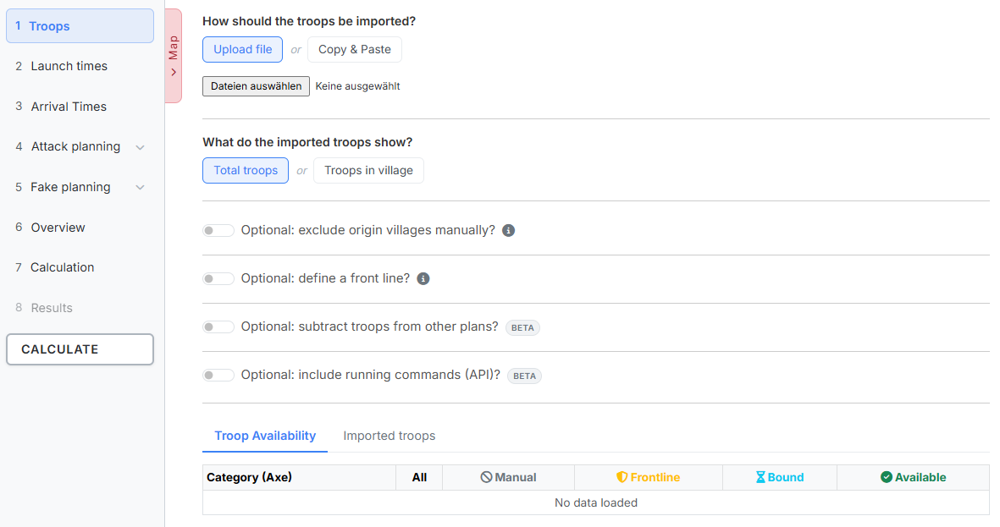
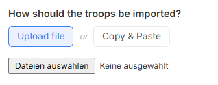
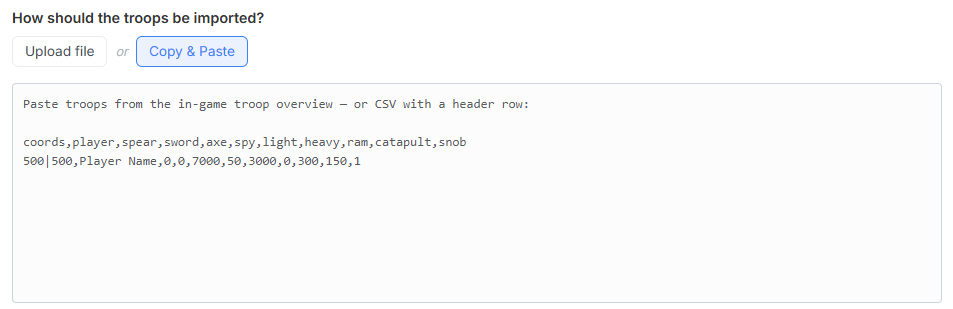
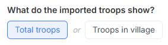
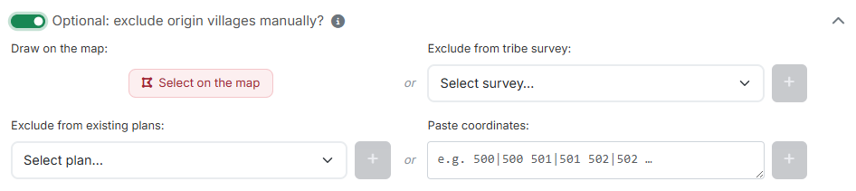
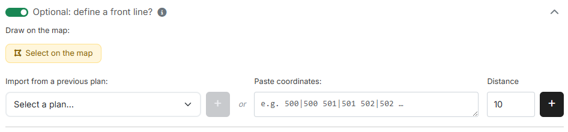
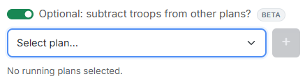
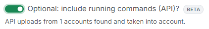
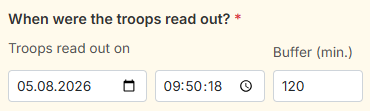
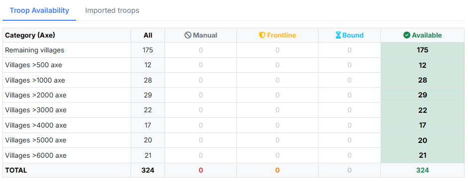

# Schritt 1: Truppen

In Schritt 1 legst du fest, **aus welchen Dörfern** geplant werden darf. Du
lädst die Truppen hoch, nimmst bei Bedarf einzelne Herkunftsdörfer aus der
Planung heraus und siehst am Ende, wie viele Offs tatsächlich zur Verfügung
stehen.

{ .screenshot }

Links steht die **Schrittleiste**. Du kannst jederzeit zwischen den Schritten
hin- und herspringen — eine feste Reihenfolge erzwingt das Tool nicht. Die
Schritte **4. Angriffsplanung** und **5. Fakeplanung** klappen ihre
Unterschritte auf, sobald du sie anwählst; hinter jedem Unterschritt steht die
Anzahl der dort eingetragenen Ziele. Ganz unten sitzt der Knopf
**„Berechnen"**, der von überall aus erreichbar ist. Schritt **8. Ergebnis**
bleibt gesperrt, bis eine Berechnung durchgelaufen ist.

Am linken Rand des Inhaltsbereichs findest du außerdem die Lasche
**„Karte"**. Sie öffnet die Gesamtkarte, die in jedem Schritt zur Verfügung
steht — siehe [Die Gesamtkarte](gesamtkarte.md).

## 1. Truppen importieren

Unter **„Wie sollen die Truppen importiert werden?"** wählst du zwischen zwei
gleichwertigen Wegen.

### Datei hochladen

{ .screenshot }

Über **„Datei hochladen"** lädst du eine oder mehrere TXT-Dateien ein. Diese
Dateien erzeugst du am bequemsten über das
[Schnellleisten-Script „Download Tribe Info"](https://forum.tribalwars.net/index.php?threads/download-tribe-info.285469/).

Erwartetes Format:

```
Coords,Player,spear,sword,axe,archer,spy,light,marcher,heavy,ram,catapult,knight,snob
483|520,Testuser A,2421,6099,100,5963,50,50,3632,200,5,279,0,8
543|538,Testuser A,100,100,6027,100,6,3014,100,100,159,5,0,0
467|559,Testuser A,3779,4836,100,4803,40,50,6309,1584,5,80,0,0
465|523,Testuser B,4298,5495,100,6752,23,50,5761,1131,5,35,0,0
468|515,Testuser B,721,4160,100,2280,61,50,5935,832,5,308,0,4
```

Entscheidend ist die **Kopfzeile**: Sie muss das Wort `Coords` enthalten, und
die Spalten danach müssen die Einheiten in der Reihenfolge benennen, in der
sie in den Zeilen stehen. Welche Einheiten vorkommen, hängt von der Welt ab —
auf Welten ohne Bogenschützen fallen `archer` und `marcher` einfach weg. Die
erste Spalte ist immer die Koordinate, die zweite immer der Spielername.

### Copy & Paste

{ .screenshot }

Über **„Copy & Paste"** fügst du die Truppen direkt aus der
Ingame-Truppenübersicht ein (Strg+A, Strg+C). Der Import startet automatisch
beim Einfügen. Alternativ nimmt das Feld dieselben CSV-Daten wie der
Datei-Upload entgegen — inklusive Kopfzeile.

### Was zeigen die importierten Truppen?

{ .screenshot }

Diese Auswahl ist für **beide** Importwege Pflicht:

- **„Truppen Insgesamt"** — alle Truppen des Dorfes, also auch die gerade
  unterwegs befindlichen.
- **„Truppen im Dorf"** — nur die aktuell im Dorf stehenden Truppen.

Beim Einfügen aus der Ingame-Übersicht sucht das Tool genau die Zeilen, die
mit dem gewählten Schlüsselwort beginnen. Passt die Auswahl nicht zu deinen
Daten, meldet es das ausdrücklich, statt stillschweigend nichts zu finden.

!!! info "Konsekutive Planung braucht „Truppen Insgesamt""
    Die beiden Abschnitte
    [Truppen aus anderen Plänen abziehen](#4-truppen-aus-anderen-planen-abziehen)
    und
    [Laufende Befehle (API) einbeziehen](#5-laufende-befehle-api-einbeziehen)
    rechnen mit Truppen, die gerade unterwegs sind. Im Modus **„Truppen im
    Dorf"** blendet das Tool diese Bereiche deshalb aus.

## 2. Herkunftsdörfer ausplanen

{ .screenshot }

Der Schalter **„Optional: Herkunftsdörfer manuell ausplanen?"** klappt einen
Bereich mit vier gleichwertigen Wegen auf. Was du hier ausplanst, ist
vollständig aus der Planung heraus:

!!! info "Ausgeplant heißt wirklich ausgeplant"
    Aus Dörfern, die hier ausgeplant werden, wird kein einziger Befehl
    verplant — weder Offs noch Zwischencleaner, K-Splits oder Fakes.

**„Direkt einzeichnen"** — der Knopf **„Auf der Karte auswählen"** öffnet die
Gesamtkarte im Auswahlmodus. Dort klickst du einzelne Dörfer an oder ziehst
mit gedrückter Maustaste ein Lasso um einen ganzen Bereich. Wie das genau
funktioniert, steht unter
[Die Gesamtkarte · Auswahl per Klick und Lasso](gesamtkarte.md#5-auswahl-per-klick-und-lasso).

**„Aus Stammes-Umfrage ausplanen"** — hat dein Stamm Dörfer über eine
Stammes-Umfrage gemeldet, welche nicht mitverplant werden sollen, wählst du die
Umfrage im Dropdown aus und bestätigst die Auswahl mit dem Plus-Knopf. Der
Bereich erscheint nur, wenn du auf einem Discord-Server dieser Welt die
Planungsrechte hast und dort mindestens eine Umfrage vorliegt.

**„Aus vorhandenen Plänen ausplanen"** — schließt alle Herkunftsdörfer einer
bereits gespeicherten Planung in einem Zug aus. Nach der Auswahl im Dropdown
erscheint unter **„Befehlstypen wählen:"** die Liste der im Plan enthaltenen
Befehlstypen. Hinter jedem Typ steht, wie viele Herkunftsdörfer er enthält und
wie viele davon ausplanbar sind. Erst wenn mindestens ein Typ angehakt ist,
lässt sich der Plus-Knopf drücken.

!!! info "Was „ausplanbar" bedeutet"
    Ausplanbar sind nur Herkunftsdörfer, die im Plan enthalten sind, in deinen
    hochgeladenen Truppen vorkommen **und** noch nicht ausgeplant wurden. Lade
    deshalb zuerst die Truppen hoch — sonst steht beim Zähler ein „—" statt
    einer Zahl.

**„Koordinaten einfügen"** — für einzelne Dörfer. Umgebender Text stört nicht,
das Tool zieht sich die Koordinaten selbst heraus.

Am unteren Ende des Bereichs findest du eine Tabelle **„Ausgeplante
Herkunftsdörfer"**. Über das Suchfeld filterst du nach Spieler oder Koordinate,
mit **„Alle löschen"** leerst du die Liste wieder.

## 3. Frontlinie definieren

{ .screenshot }

Der Schalter **„Optional: Frontlinie definieren?"** legt fest, welche Dörfer
als Frontdörfer gelten. Sie bleiben dadurch mobil und können kurzfristig auf
Angriffe reagieren.

!!! info "Frontdörfer dürfen weiterhin faken"
    Aus Dörfern der Frontlinie werden keine Offs, Zwischencleaner und K-Splits
    verplant. Fakes dürfen von dort weiterhin starten.

Auch hier gibt es drei Wege:

- **„Direkt einzeichnen"** — **„Auf der Karte auswählen"** öffnet die Karte im
  Zeichenmodus. Anders als beim Ausplanen entstehen hier **Gebiete**: Du
  ziehst mit der Maus einen geschlossenen Umriss, und die darin liegenden
  **Herkunftsdörfer aus deinem Truppen-Import** gehören zur Frontlinie.
  Mehrere Gebiete sind möglich. Gebiete, in denen kein einziges
  Herkunftsdorf liegt, werden beim Übernehmen verworfen — und ohne
  hochgeladene Truppen lässt sich der Zeichenmodus gar nicht erst starten.
- **„Aus vorheriger Planung importieren"** — übernimmt die gespeicherte
  Frontlinie einer früheren Off-Planung dieser Welt und führt sie mit dem
  bereits Vorhandenen zusammen. Zur Auswahl stehen nur Planungen der aktuell
  gewählten Welt; enthält eine Planung keine Frontlinie, sagt das Tool das.
- **„Koordinaten einfügen"** + **„Abstand"** — der klassische Weg. Der Abstand
  in Feldern erzeugt einen Ring um jede eingetragene Koordinate; alles darin
  zählt zur Frontlinie. Standard ist `10`.

Die Liste darunter zeigt zuerst die gezeichneten **Gebiete in Frontlinie**
(jeweils mit der Anzahl der enthaltenen Dörfer und einem ×) und darunter die
einzelnen **Dörfer in Frontlinie**. Auf der Gesamtkarte lässt sich die
Frontlinie über das Chip **„Frontlinie"** jederzeit einblenden.

## 4. Truppen aus anderen Plänen abziehen

{ .screenshot }

Der Schalter **„Optional: Truppen aus anderen Plänen abziehen?"** ist der Kern
der **konsekutiven Planung**: Wenn bereits eine Aktion läuft, stehen die dort
verplanten Truppen für die neue Planung nicht mehr zur Verfügung — sie sind
aber trotzdem noch in deinen hochgeladenen Truppendaten enthalten, weil du sie
vor dem Abschicken ausgelesen hast.

Wähle im Dropdown die laufenden Pläne aus und füge sie mit dem Plus-Knopf
hinzu; die ausgewählten Pläne erscheinen als Chips darunter. Das Tool rechnet
dann aus, welche Einheiten in welchem Dorf gebunden sind, und zieht sie ab.

Welche Truppen dadurch wegfallen, siehst du in der Spalte **„Gebunden"** der
[Truppenverfügbarkeit](#7-truppenverfugbarkeit) — von dort kommst du auch an
die Einzelheiten.

## 5. Laufende Befehle (API) einbeziehen

{ .screenshot }

Der Schalter **„Optional: Laufende Befehle (API) einbeziehen?"** geht einen
Schritt weiter als der vorige: Statt aus gespeicherten Planungen zu rechnen,
nutzt er die **tatsächlich laufenden Befehle**, die deine Mitspieler über die
tw-utils-API hochgeladen haben — etwa mit einem eigenen Userscript (siehe
[Laufende Befehle](../leader-view/laufende-befehle.md)). Das ist genauer, weil
es auch Befehle erfasst, die gar nicht aus einer Planung stammen.

Unter dem Schalter steht eine Zeile wie *„API-Uploads von 12 Accounts gefunden
und berücksichtigt."* — oder *„Keine Uploads für diese Welt vorhanden."*, wenn
noch niemand hochgeladen hat.

Der Bereich erscheint nur, wenn du auf einem Discord-Server dieser Welt das
Recht hast, laufende Befehle zu lesen.

## 6. Wann wurden die Truppen ausgelesen?

{ .screenshot }

Sobald einer der beiden Schalter aus Abschnitt 4 oder 5 aktiv ist, erscheint
dieser gemeinsame Streifen. Er ist ein **Pflichtfeld**, denn ohne ihn kann das
Tool nicht entscheiden, welche Befehle zum Zeitpunkt deines Truppen-Auslesens
schon unterwegs waren und welche noch nicht.

- **„Truppen ausgelesen am"** — Datum und Uhrzeit, zu der du die
  Truppenübersicht kopiert bzw. die Datei erzeugt hast.
- **„Puffer (Min.)"** — ein Sicherheitsfenster um diesen Zeitpunkt herum,
  Standard `120`. Es fängt ab, dass zwischen Auslesen und Planung noch etwas
  passiert ist.

## 7. Truppenverfügbarkeit

{ .screenshot }

Ganz unten siehst du auf einen Blick, was von deinen Truppen übrig bleibt. Die
Tabelle ist nach **„Kategorie (Axt)"** gruppiert — also nach der Zahl der
Axtkämpfer je Dorf (`Dörfer >500 Axt`, `>1000 Axt` … sowie `Restliche
Dörfer`). Die Spalten:

- **„Gesamt"** — alle importierten Dörfer dieser Kategorie.
- **„Manuell"** — durch Ausplanen ausgeschlossen (Abschnitt 2).
- **„Front"** — durch die Frontlinie blockiert (Abschnitt 3).
- **„Gebunden"** — durch laufende Aktionen gebunden (Abschnitte 4 und 5).
- **„Verfügbar"** — was nach allen Abzügen für die Planung bleibt.

Die Fußzeile **SUMME** fasst alle Kategorien zusammen.

Ist eine Zahl in der Spalte **„Gebunden"** unterstrichen, kannst du sie
anklicken: Es öffnet sich das Fenster **„Gebundene Dörfer (laufende
Aktionen)"** mit den Spalten **Dorf**, **Gebundene Einheiten**, **Grund** und
**Frei ab**. Jede Zeile ist eine einzelne Bindung — ein Dorf kann mehrere
haben, die zu unterschiedlichen Zeiten wieder frei werden.

Über den zweiten Reiter **„Eingelesene Truppen"** siehst du die Rohdaten Dorf
für Dorf, mit Suchfeld nach Spieler oder Koordinate.

---

Weiter geht es mit [Schritt 2: Abschickzeiten](schritt2-abschickzeiten.md).
