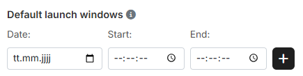
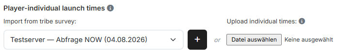

# Step 2: Launch times

In step 2 you define the **launch times**. The tool plans every command so that
its launch time falls into one of these valid windows.

## 1. Default launch windows

{ .screenshot }

Enter **"Date:"**, **"Start:"** and **"End:"** and apply the window with the
plus button. The windows you created collect on the right; each one can be
removed individually. You can create as many windows in a row as you like.

As soon as you fill in **"Start:"** and leave the field, the tool sets
**"End:"** to 15 minutes later. This overwrites a value already entered there —
so always fill in **"End:"** **after** **"Start:"**.

!!! info "Who the default windows apply to"
    The default windows apply to all players for whom no individual times are
    entered.

If two default windows overlap, the tool rejects the second one instead of
quietly merging them.

## 2. Individual times

{ .screenshot }

Individual times apply **per player** and replace the default windows for that
player. There are two ways to get them into the tool.

!!! info "Individual times take precedence"
    Wherever individual times are entered, they completely replace the default
    launch windows for that player. Default and individual windows therefore do
    not mix.

### Importing from a tribe survey

If your fellow players have reported their launch times via a **tribe survey**,
you select the survey in the dropdown and apply it with the plus button. The
tool assigns the reported windows to the respective players.

The section only appears if at least one survey exists for the currently
selected world and you hold planning rights on a Discord server for this world.

### Uploading individual times

Alternatively you upload a `.txt` or `.csv` file. One line per time window, the
values separated by commas:

```
Player,Date from,Time from,Date to,Time to
```

For example:

```
Testuser A,10.05.2026,10:00:00,10.05.2026,10:07:00
Testuser A,10.05.2026,12:00:00,10.05.2026,12:15:00
Testuser B,10.05.2026,11:30:00,10.05.2026,12:00:00
Testuser B,10.05.2026,17:15:00,10.05.2026,18:15:00
Testuser C,10.05.2026,21:00:00,10.05.2026,21:15:00
```

The date is written as `DD.MM.YYYY`, the time as `HH:MM:SS`. Several lines per
player are allowed. The header row in the example above is only there for
explanation — the file contains data rows exclusively.

!!! info "Delete all individual times"
    As soon as at least one player has individual times, the button **"Delete
    all individual times"** appears. It removes them in one go, no matter
    whether they came from a survey or an upload. The default windows remain
    untouched.

## 3. Launch times per player

Below the separator you permanently find the overview **"Launch times per
player"** with three columns:

- **"Player"** — every player for whom troops were imported.
- **"Source"** — whether `Default` or `Individual` applies to them.
- **"Active time windows"** — the windows that are used to plan for them.

This is how you see before the calculation whether every player really has a
time window. Use the search field to filter for individual players.

The table stays empty as long as no troops are imported — it is derived from
the player list of the troop import and then points you to
[step 1](schritt1-truppen.md).

---

Next up: [Step 3: Arrival Times](schritt3-ankunftszeiten.md).
