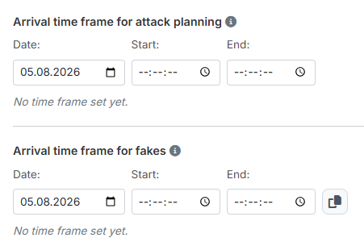

# Schritt 3: Ankunftszeiten

In Schritt 3 legst du fest, **wann die Befehle einschlagen sollen**. Der
Schritt trägt zwei getrennte Zeiträume: einen für die Angriffsplanung
([Schritt 4](schritt4-angriffsplanung.md)) und einen für die eigenständige
Fakeplanung ([Schritt 5](schritt5-fakeplanung.md)).

{ .screenshot }

## 1. Ankunftszeitraum für Angriffsplanung

Trage **„Datum:"**, **„Von:"** und **„Bis:"** ein. Sobald alle drei Felder
gefüllt sind, fasst die Zeile darunter den Zeitraum zusammen — etwa
*„Ankunft zwischen 24.12.2026 20:00:00 und 23:00:00"*. Solange etwas fehlt,
steht dort *„Noch kein Zeitraum festgelegt."*

Füllst du **„Von:"** aus, trägt das Tool in **„Bis:"** automatisch eine Stunde
später ein — auch dann, wenn dort schon etwas stand. Trage **„Bis:"** also
immer **nach** **„Von:"** ein. Das gilt für beide Zeiträume dieses Schritts.

!!! info "Über Mitternacht hinaus"
    Liegt **„Bis:"** vor **„Von:"**, versteht das Tool das als Zeitraum über
    Mitternacht hinweg und rechnet mit dem Folgetag. Genau **gleiche** Zeiten
    gelten dagegen nicht als Rollover, sondern als leerer Zeitraum — den weist
    die Prüfung vor der Berechnung zurück.

!!! info "Der Zeitraum gilt für die 1. Off"
    Der Korridor bestimmt, in welchen Zeitrahmen die **1. geplante Off**
    eintreffen muss. Weitere Offs und Fakes können leicht außerhalb des
    festgelegten Korridors eintreffen, je nachdem welche Einstellungen zum
    Fake-Zeitraum sowie zum Min-/Max-Abstand getroffen wurden.

    Plane außerdem genügend Abstand zum **Nachtbonus** ein — wann er gilt, ist
    von Welt zu Welt verschieden.

Die genannten Folgeeinstellungen findest du je Zielkategorie in
[Schritt 4](schritt4-angriffsplanung.md): die
[Abstände der Offs](schritt4-angriffsplanung.md#25-abstande-der-offs) und den
[Fake-Zeitraum](schritt4-angriffsplanung.md#26-weitere-detail-einstellungen).

## 2. Ankunftszeitraum für Fakes

Der zweite Zeitraum gilt ausschließlich für die **reinen Fakeziele** aus
Schritt 5 — also für Ziele, die keine scharfen Befehle bekommen. Begleitfakes
zu echten Zielen richten sich dagegen nach den echten Befehlen ihres Ziels und
nicht nach diesem Zeitraum.

Die Bedienung ist identisch. Zusätzlich steht rechts neben den Feldern ein
Kopier-Knopf mit dem Tooltip **„Aus Angriffen kopieren"**: Ein Klick übernimmt
Datum und Uhrzeiten aus dem oberen Zeitraum, sodass du sie nicht ein zweites
Mal eintragen musst.

!!! info "Der Zeitraum gilt für den 1. Fake"
    Der Korridor bestimmt, in welchen Zeitrahmen der **1. geplante Fake**
    eintreffen muss. Weitere Fakes können leicht außerhalb des festgelegten
    Korridors eintreffen, je nachdem welche Einstellungen zum Fake-Zeitraum
    getroffen wurden.

    Plane auch hier genügend Abstand zum Nachtbonus ein.

!!! info "Beide Zeiträume sind Pflicht — aber nur, wenn sie gebraucht werden"
    Vor der Berechnung prüft das Tool, ob die benötigten Zeiträume vollständig
    sind. Planst du keine eigenständigen Fakes, bleibt der zweite Zeitraum
    ohne Folgen. Fehlt ein benötigter Zeitraum, listet das Prüffeld in
    [Schritt 7](schritt7-berechnung.md#3-prufung-vor-der-berechnung) das auf,
    statt die Berechnung zu starten.

---

Weiter geht es mit [Schritt 4: Angriffsplanung](schritt4-angriffsplanung.md).
