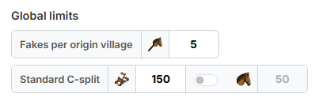
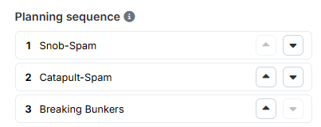
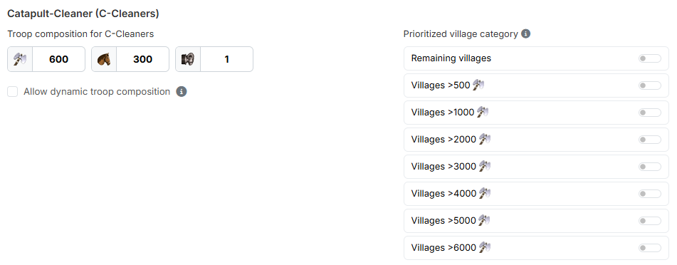
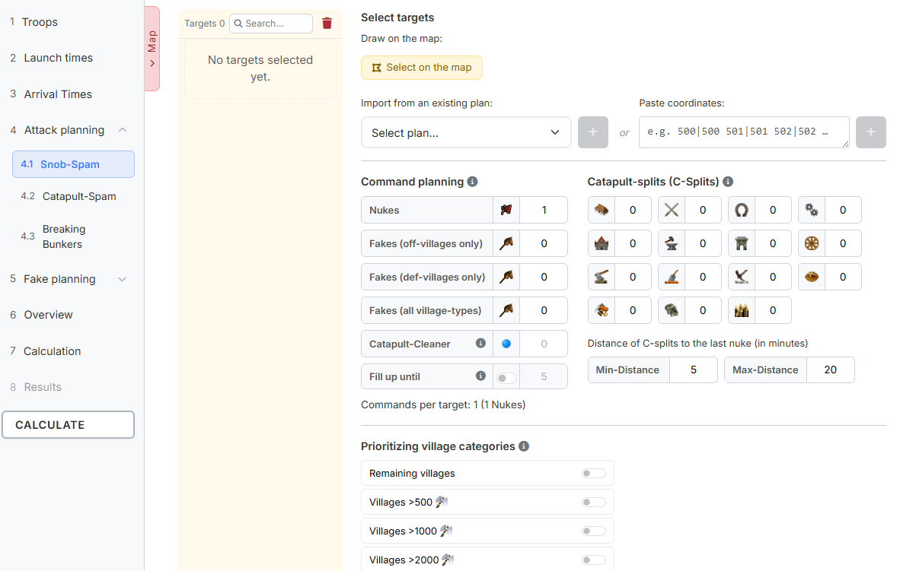
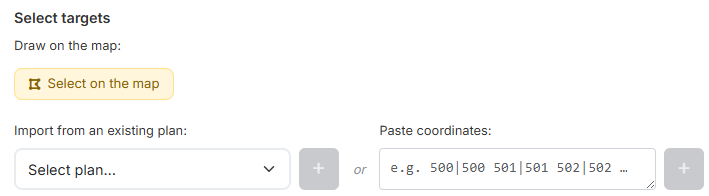
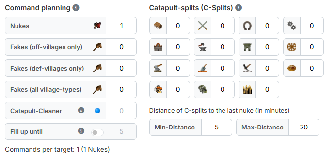
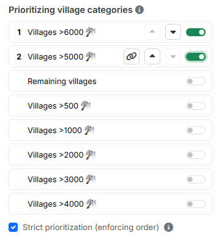
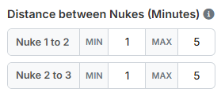
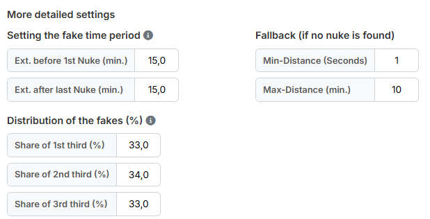

# Schritt 4: Angriffsplanung

In Schritt 4 verplanst du alle **scharf angelaufenen Ziele** — also Ziele, die
echte Offs bekommen. Begleitfakes zu diesen Zielen werden ebenfalls hier
definiert. Die Planung **reiner Fakeziele** läuft getrennt davon in
[Schritt 5: Fakeplanung](schritt5-fakeplanung.md).

Der Schritt selbst trägt die **globalen Einstellungen**, die für alle
Kategorien gemeinsam gelten. Darunter klappen in der Schrittleiste die drei
Zielkategorien als Unterschritte auf:

- **4.1 AG-Spam**
- **4.2 Kattern**
- **4.3 Bunker brechen**

!!! info "Die Kategorienamen sind nur ein Vorschlag"
    **AG-Spam** und **Kattern** sind in ihren Einstellungen identisch
    aufgebaut, **Bunker brechen** bietet eine bewusst reduzierte Auswahl. Du
    musst die Namen also nicht wörtlich nehmen — die beiden ersten Kategorien
    lassen sich z. B. genauso gut für zwei unterschiedliche Katter-Aktionen
    nutzen.

## 1. Globale Einstellungen

### 1.1 Globale Grenzwerte

{ .screenshot }

- **„Fakes pro Herkunftsdorf"** — wie viele Fakes insgesamt aus einem
  einzelnen Dorf verplant werden dürfen. Standard `5`.
- **„Standard Kattasplit"** — die Anzahl Katapulte in einem einzelnen
  Katta-Split. Standard `150`.
- Im selben Feld sitzt rechts ein Schalter **„Lkav im K-Split mitschicken
  (min. 50)"**. Ist er an, bekommt jeder Split zusätzlich die daneben
  eingetragene Anzahl **Leichter Kavallerie** als Begleittruppen.

!!! info "Mindestmenge bei der Lkav-Eskorte"
    Ein Split bekommt entweder **mindestens 50** Leichte Kavallerie **oder gar
    keine** — niemals nur eine wirkungslose Handvoll. Hat ein Herkunftsdorf
    weniger als 50 übrig, läuft der Split ohne Begleittruppen; er wird also
    nicht abgesagt. Liegt der Bestand zwischen 50 und der eingetragenen
    Wunschmenge, wird so viel verplant, wie das Dorf hergibt.

!!! info "Fake-Limit & Puffer"
    Wie viele Truppen ein **Fake** mindestens enthalten muss, ergibt sich
    nicht aus diesen Grenzwerten, sondern aus dem **Fake-Limit der Welt**
    (z. B. 1 % oder 2 % der Dorfpunkte). Das Tool berechnet die Fake-Truppen
    automatisch passend dazu und plant zusätzlich einen **Puffer von 500
    Dorfpunkten** ein: So enthält der Fake auch dann noch genügend Truppen,
    wenn das Herkunftsdorf zwischen Planung und Abschicken um bis zu 500
    Punkte wächst. Herkunftsdörfer, die diesen Puffer nicht aus den
    vorhandenen Truppen decken können, werden für Fakes übersprungen.

### 1.2 Planungsreihenfolge

{ .screenshot }

Über die Pfeile **„Nach oben"** / **„Nach unten"** bringst du die drei
Kategorien in die gewünschte Reihenfolge.

!!! info "Bei knappen Truppen entscheidet die Reihenfolge"
    Die oberste Kategorie wird zuerst verplant. Sind die Off-Ressourcen knapp,
    bekommt die unterste Kategorie sehr wahrscheinlich nicht mehr alles, was
    sie bräuchte. Stelle die wichtigste Kategorie deshalb nach oben.

### 1.3 Katta-Zwischencleaner

{ .screenshot }

Zwischencleaner laufen zwischen zwei Katta-Splits und räumen die
Verteidigung frei. Hier legst du einmal fest, wie sie aussehen und woher sie
kommen; **wie viele** je Ziel fliegen, entscheidest du in der jeweiligen
Kategorie.

Unter **„Truppenzusammensetzung"** trägst du die Soll-Truppen ein: **Axt**
(Standard `600`), **Lkav** (`300`) und **Rammen** (`1`).

!!! info "Dynamische Truppenzusammensetzung"
    Ist **„Dynamische Truppenzusammensetzung erlauben"** aktiviert, werden
    auch Zwischencleaner verplant, die nicht exakt der eingetragenen
    Truppenzusammensetzung entsprechen (z. B. wenn dem Dorf Axtkämpfer
    fehlen). Das Tool füllt dann selbstständig mit Axt oder Lkav auf, bis die
    resultierende Angriffsstärke erreicht ist.

Rechts daneben bestimmt **„Priorisierte Dorfkategorie"**, aus welchen
Dorfkategorien Katta-Zwischencleaner verplant werden dürfen. Schalte die
gewünschten Kategorien ein — aktive Zeilen rücken nach oben.

!!! info "Ohne Kategorie kein Zwischencleaner"
    Wird mindestens ein Zwischencleaner geplant, muss hier auch mindestens
    eine Dorfkategorie eingeschaltet sein. Sonst bricht die Prüfung vor der
    Berechnung ab.

## 2. Schritt 4.1: AG-Spam

{ .screenshot }

Links steht die **Zielliste** der Kategorie mit der Anzahl der Ziele, einem
Suchfeld und einem Papierkorb (**„Alle löschen"**). Die Ziele sind nach
Spieler gruppiert, sodass du sofort siehst, wie viele Dörfer eines Gegners du
angelaufen hast. Rechts daneben stehen alle Einstellungen dieser Kategorie.

### 2.1 Ziele auswählen

{ .screenshot }

Es gibt drei Wege, Ziele in die Kategorie zu bekommen:

- **„Direkt einzeichnen"** — der Knopf **„Auf der Karte auswählen"** öffnet die
  Gesamtkarte im Auswahlmodus. Dort klickst du Dörfer einzeln an oder ziehst
  ein Lasso um einen Bereich, siehe
  [Die Gesamtkarte](gesamtkarte.md#5-auswahl-per-klick-und-lasso).
- **„Aus vorhandenem Plan importieren"** — übernimmt die Ziele einer
  gespeicherten Planung. Nach der Auswahl im Dropdown erscheinen die
  enthaltenen Befehlstypen als Häkchen, jeweils mit einem Zähler wie
  *„48 Zieldörfer · davon 31 planbar"*.
- **„Koordinaten einfügen"** — für einzelne Ziele. Umgebender Text stört
  nicht.

!!! info "Was „planbar" bedeutet"
    Planbar sind Ziele des Plans, die auf dieser Welt existieren, keine
    Barbarendörfer sind **und** noch nicht als Ziel eingetragen sind.

!!! info "Kein Ziel wird doppelt verplant"
    Das Tool sorgt dafür, dass ein Dorf nie in zwei Kategorien gleichzeitig
    steht. Koordinaten, die bereits in einer anderen Angriffs-Kategorie
    liegen, werden beim Hinzufügen herausgefiltert. Ein Dorf, das bisher als
    reines Fakeziel eingetragen war, wandert dagegen hierher — die scharfe
    Planung hat Vorrang, und das Tool sagt dir das mit einer Meldung.

    Barbarendörfer sind als Ziel nicht zugelassen.

### 2.2 Befehlsplanung

{ .screenshot }

Hier legst du fest, **wie viele Befehle jedes Ziel dieser Kategorie
bekommt**:

- **„Anzahl Offs"** — scharfe Off-Angriffe je Ziel.
- **„Fakes (aus Offdörfern)"** — Begleitfakes, die nur aus Off-Dörfern
  starten.
- **„Fakes (aus Deffdörfern)"** — Begleitfakes, die nur aus Deff-Dörfern
  starten.
- **„Fakes (Dorftyp egal)"** — Begleitfakes aus beliebigen Dörfern.
- **„Zwischencleaner"** — Anzahl Katta-Zwischencleaner je Ziel. Die Truppen
  dafür kommen aus [Abschnitt 1.3](#13-katta-zwischencleaner).
- **„Auffüllen bis"** — Schalter plus Zahl.

Unter den Feldern läuft eine Zeile mit, die alles zusammenzählt, etwa
*„Befehle je Ziel: 9 (2 Offs · 5 Kattas · 1 K-ZWC · 1 Fakes)"*.

!!! info "Zwischencleaner brauchen mindestens zwei Kattasplits"
    Zwischencleaner laufen zwischen zwei Kattasplits — deshalb lassen sie
    sich erst eintragen, sobald mindestens zwei Kattasplits geplant sind. Wie
    viele möglich sind, richtet sich nach der Zahl der Kattasplits: Es passt
    immer einer weniger hinein, als Kattasplits eingetragen sind. Trägst du
    mehr ein, senkt das Tool den Wert automatisch auf die höchstzulässige
    Anzahl.

!!! info "Was „Auffüllen bis" bewirkt"
    Konnte ein Befehl nicht verplant werden — etwa eine Off, ein Kattasplit
    oder ein Zwischencleaner —, füllt das Tool mit Fakes auf, bis die hier
    eingetragene Anzahl Befehle erreicht ist. So läuft auf jedes Ziel immer
    dieselbe Anzahl Befehle, und der Gegner kann aus der Anzahl der Incs nicht
    ablesen, wo es ernst wird.

### 2.3 Kattasplits (Gebäude)

Rechts neben der Befehlsplanung steht je Gebäude ein Feld. Die Zahl gibt an,
wie viele **einzelne Splits** auf jedes Ziel dieser Kategorie verplant werden
sollen — trägst du beim Hauptgebäude eine `3` ein, versucht das Tool, drei
Splits auf das Hauptgebäude zu setzen. Jeder Split bekommt die unter
[Standard Kattasplit](#11-globale-grenzwerte) hinterlegte Anzahl Katapulte.

Darunter legst du mit **„Abstand Kattasplits zur letzten Off (in Minuten)"**
fest, wie weit die Splits zeitlich hinter der letzten Off eintreffen sollen —
über **„Min-Abstand"** (Standard `5`) und **„Max-Abstand"** (Standard `20`).

### 2.4 Priorisierung Dorfkategorien

{ .screenshot }

Hier bestimmst du, **aus welchen Dörfern die Offs für diese Kategorie kommen
dürfen**. Schalte die gewünschten Dorfkategorien (`Dörfer >500 Axt`,
`>1000 Axt` … sowie `Restliche Dörfer`) ein.

Die Checkbox **„Strikte Priorisierung (Reihenfolge erzwingen)"** darunter
entscheidet, wie das Tool die Auswahl liest:

- **Aus** — alle eingeschalteten Kategorien bilden **einen gemeinsamen Pool**.
  Die Reihenfolge spielt dann keine Rolle.
- **Ein** — die Kategorien werden **strikt nacheinander** abgearbeitet: Eine
  niedriger priorisierte Kategorie wird erst angefasst, wenn in der höheren
  keine valide Option mehr gefunden wird.

Erst wenn die strikte Priorisierung eingeschaltet ist, erscheinen an den
aktiven Zeilen die **Rangziffer**, die Pfeile **„Nach oben"** / **„Nach
unten"** und ein **Kettensymbol**. Mit der Kette legst du zwei Kategorien auf
denselben Rang (**„Gleichrangig mit der Zeile darüber"**); ein zweiter Klick
trennt sie wieder.

### 2.5 Abstände der Offs

{ .screenshot }

Sobald mindestens **zwei** Offs je Ziel geplant sind, erscheint für jedes
aufeinanderfolgende Off-Paar ein eigenes Feld: `Off 1 zu 2`, `Off 2 zu 3` und
so weiter, jeweils mit **„Min"** und **„Max"** in Minuten (Standard `1` und
`5`). Steht die Anzahl Offs auf 1, bleibt der ganze Bereich ausgeblendet.

!!! info "So liest das Tool die Abstände"
    Je Off-Paar legst du fest, wie weit die nächste Off zeitlich hinter der
    vorherigen ankommen darf: frühestens nach dem Min-Abstand, spätestens nach
    dem Max-Abstand. In diesem Fenster sucht das Tool dann ein passendes
    Herkunftsdorf.

**Beispiel — Verspätungen beim Abschicken einplanen:** Du planst eine
Katta-Aktion mit 2 Offs und 5 K-Splits je Ziel, der Abstand der K-Splits zur
letzten Off steht auf 3 Minuten. Ist der Abstand zwischen 1. und 2. Off sehr
klein, können die Offs bei verspätetem Abschicken **hinter** den K-Splits
eintreffen. Setzt du **Off 1 zu 2** stattdessen auf 10 Minuten, kommt die
1. Off selbst bei 5 Minuten Verspätung beider Offs noch sicher vor den
K-Splits an.

### 2.6 Weitere Detail-Einstellungen

{ .screenshot }

Dieser Bereich ist zugeklappt und enthält die Feinsteuerung der Begleitfakes.
Stimmen die Anteile nicht, erscheint an der Überschrift ein Warnzeichen — auch
im zugeklappten Zustand.

**„Festlegung Fake-Zeitraum"** — **„Erw. vor 1. Off (Min.)"** und **„Erw. nach
letzter Off (Min.)"**, beide standardmäßig `15,0`.

!!! info "Wie der Fake-Zeitraum entsteht"
    Der Fake-Zeitraum entsteht je Ziel aus dessen echten Befehlen: Er beginnt
    bei der frühesten Ankunft (Off, Kattasplit oder Zwischencleaner) abzüglich
    der Erweiterung davor und endet bei der spätesten Ankunft zuzüglich der
    Erweiterung danach. Hat ein Ziel keine echten Befehle und ist das
    Auffüllen mit Fakes an, gilt stattdessen der Ankunftszeitraum aus
    [Schritt 3](schritt3-ankunftszeiten.md).

**„Verteilung der Fakes (%)"** — **„Anteil 1. Drittel (%)"**, **„Anteil
2. Drittel (%)"** und **„Anteil 3. Drittel (%)"**, standardmäßig 33/34/33. Der
Fake-Zeitraum wird in drei gleich lange Abschnitte geteilt; die drei Werte
legen fest, welcher Anteil der Fakes in welchem Abschnitt ankommt. Damit
steuerst du, ob die Begleitfakes eher **vor** den scharfen Offs eintreffen,
sich **mit ihnen vermischen** oder erst **danach** folgen. Eine Zeile darunter
rechnet mit und meldet, wenn die Summe nicht 100 % ergibt.

**„Fallback (wenn keine Off gefunden)"** — **„Min-Abstand (Sek)"** (Standard
`1`) und **„Max-Abstand (Min)"** (Standard `10`). Findet das Tool im regulären
Abstandsfenster kein passendes Herkunftsdorf, versucht es die Off noch einmal
in diesem deutlich weiteren Fenster hinter der vorherigen Off unterzubringen.

## 3. Schritt 4.2: Kattern

Die Kategorie **Kattern** ist **strukturell identisch** zu
[4.1 AG-Spam](#2-schritt-41-ag-spam) aufgebaut — dieselbe Zielliste, dieselbe
Zielauswahl, dieselbe Befehlsplanung, dieselben Kattasplits, dieselbe
Priorisierung, dieselben Detail-Einstellungen. Zwei Dinge sind anders: die
Farbe des Zeichnen-Knopfes auf der Karte (rot statt gelb) — und das Feld
**„Anzahl Offs"** darf hier auf `0` stehen. Damit lässt sich eine reine
Katta-Aktion planen, bei der ein Ziel nur Kattasplits bekommt und keine Off.
Beim AG-Spam ist mindestens `1` Off Pflicht.

Alle übrigen Erklärungen aus Abschnitt 2 gelten unverändert.

## 4. Schritt 4.3: Bunker brechen

Bei **Bunker brechen** trägt **jedes Ziel seine eigene Anzahl Offs**. Deshalb
sieht die Kategorie an mehreren Stellen anders aus.

**Ziele auswählen** — es gibt nur zwei Wege: **„Direkt einzeichnen"** über die
Karte und **„Koordinaten einfügen"**. Einen Import aus einem gespeicherten Plan
gibt es hier nicht. Dafür steht rechts daneben das Feld **„Anzahl Offs"**
(Standard `10`).

!!! info "Die Off-Zahl lässt sich je Ziel ändern"
    Der Wert im Feld gilt für alle Ziele, die du mit dem Plus-Knopf daneben
    hinzufügst. In der Zielliste links lässt sich die Zahl danach für jedes
    Ziel einzeln ändern. Dasselbe gilt für die Auswahl auf der Karte: Dort
    steht die Zahl in der Auswahlleiste und wird erst beim Übernehmen gelesen.

    Ein Ziel mit `0` Offs wird **nicht** stillschweigend korrigiert — die
    Prüfung vor der Berechnung meldet es.

**Was hier fehlt** — es gibt keine Befehlsplanung mit Fake-Feldern, keine
Kattasplits und keine Zwischencleaner. Bunker bekommen Offs, und wenn sich
nicht alle verplanen lassen, wird mit Fakes aufgefüllt.

**„Abstände der Offs (Min.)"** — anders als bei AG-Spam und Kattern gibt es
hier nur **ein einziges Feldpaar** aus **„Min-Abstand"** (Standard `1`) und
**„Max-Abstand"** (Standard `5`). Es gilt für alle Abstände eines Ziels, weil
hier jedes Ziel seine eigene Anzahl Offs trägt.

**„Auffüllen mit Fakes"** — mit **„Auffüllen bis"** (Schalter plus Zahl,
Standard `15`) legst du fest, auf wie viele Befehle je Ziel mit Fakes
aufgefüllt wird.

**Priorisierung Dorfkategorien** und **Weitere Detail-Einstellungen** sind
identisch zu [4.1](#24-priorisierung-dorfkategorien) bzw.
[4.1](#26-weitere-detail-einstellungen).

---

Weiter geht es mit [Schritt 5: Fakeplanung](schritt5-fakeplanung.md).
