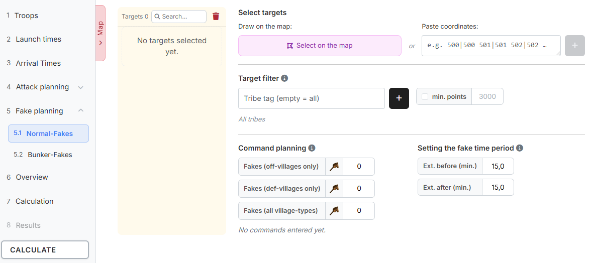
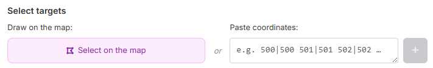
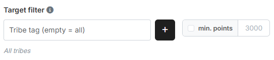
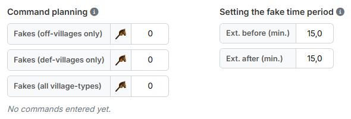

# Step 5: Fake planning

In step 5 you plan **pure fake targets** — villages that receive fakes only and
are not hit for real. Accompanying fakes for real targets belong to their
target instead and are defined in
[step 4](schritt4-angriffsplanung.md).

There are two groups:

- **5.1 Normal-Fakes**
- **5.2 Bunker-Fakes**

!!! info "Both groups are built the same way"
    **Normal-Fakes** and **Bunker-Fakes** differ in nothing but their name and
    their colour on the map. The split is only a suggestion — you can just as
    well use the two groups for two arbitrary parallel fake operations, for
    example to be able to tell them apart in the results later.

## 1. Step 5.1: Normal-Fakes

{ .screenshot }

On the left sits the **target list** of the group with a count, a search field
and a bin (**"Delete all"**), on the right the settings.

### 1.1 Selecting targets

{ .screenshot }

Two ways are available:

- **"Draw on the map:"** — **"Select on the map"** opens the overall map in
  selection mode, see
  [The Overall Map](gesamtkarte.md#5-selecting-by-click-and-lasso). For fake
  planning this is the most convenient way, because it lets you mark whole
  regions in one go.
- **"Paste coordinates:"** — for individual targets.

There is no import from a saved plan here.

!!! info "Real targets take precedence"
    Villages that already sit in a category of the
    [attack planning](schritt4-angriffsplanung.md) are filtered out when adding
    — the tool reports them as *"Targets ignored (already planned elsewhere)"*.
    Conversely, a fake target automatically moves into the attack planning if
    you enter it there.

### 1.2 Target filter

{ .screenshot }

The target filter narrows down which villages qualify as a fake target at all:

- **"Tribe tag (empty = all)"** — type a tag and add it with the plus button.
  Several tribes are possible; they appear as chips below. If the field stays
  empty, *"All tribes"* applies.
- **"min. points"** — checkbox plus number (default `3000`). Only villages from
  this point count upwards qualify.

!!! info "The target filter applies everywhere"
    The filter determines which villages qualify as a fake target at all. It
    applies to **both** fake groups and to the selection on the map: there only
    what matches it gets marked. So you can drag generously across the map with
    the filter set, without accidentally catching tiny villages or the wrong
    tribe.

    If you change the filter while the map is open, that takes effect on the
    marking immediately.

### 1.3 Command planning

{ .screenshot }

How many fakes every target of this group receives, broken down by the kind of
origin village:

- **"Fakes (off-villages only)"** — from off-villages only.
- **"Fakes (def-villages only)"** — from def-villages only.
- **"Fakes (all village-types)"** — from any village.

Below that the sum runs along: *"Fakes per target: 3"*, or *"No commands
entered yet."* as long as all fields are at `0`.

### 1.4 Setting the fake time period

To the right of it are **"Ext. before (min.)"** and **"Ext. after (min.)"**,
both `15.0` by default. They define how far apart the fakes of a target may
lie in time.

!!! info "The first fake spans the time period"
    For the **first** fake of a target the
    [arrival time frame for fakes](schritt3-ankunftszeiten.md#2-arrival-time-frame-for-fakes)
    from step 3 applies, extended by the two values. As soon as that fake is
    set, its arrival time becomes the **anchor**: every further fake on the
    same target must arrive between "Ext. before" ahead of and "Ext. after"
    behind that anchor. Large values therefore scatter the fakes of a target
    further apart, small ones pull them together.

    Unlike in the
    [attack planning](schritt4-angriffsplanung.md#26-more-detailed-settings),
    where the fake time period is derived from the real commands of the target,
    there are no real commands here — hence the detour via step 3 and the first
    fake.

## 2. Step 5.2: Bunker-Fakes

The group **Bunker-Fakes** is built identically. It has its own target list,
its own command planning and its own fake time period — only the target filter
from [section 1.2](#12-target-filter) is shared by both groups.

On the overall map the targets of both groups appear in different shades of
violet and can be shown and hidden individually via the chips **"Normal-Fakes"**
and **"Bunker-Fakes"**.

In the results, the commands of both groups are counted together as **"Fakes
(Fake planning)"** and are thus distinguished from the accompanying fakes of
the attack planning.

---

Next up: [Step 6: Overview](schritt6-uebersicht.md).
