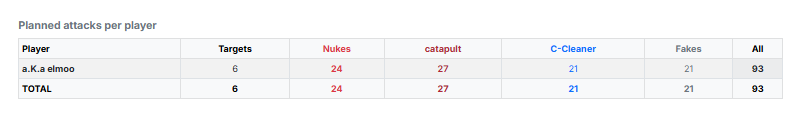

# Step 6: Overview

Step 6 is the **check before the calculation** and shows clearly how the
planned attacks are spread across the opposing players.

{ .screenshot }

The table **"Planned attacks per player"** has the following columns:

- **"Player"** — the attacked player.
- **"Targets"** — how many of their villages are entered as a target.
- **"Nukes"** — real nukes, from all three attack categories together. If you
  enter a number of nukes with **Catapult-Spam**, it counts in here.
- **"C-Splits"** — number of C-splits.
- **"C-Cleaner"** — catapult-cleaners.
- **"Fakes"** — fakes, accompanying fakes and pure fakes together.
- **"All"** — all commands of this player.

The footer row sums everything up. Use the search field **"Search player..."**
to filter for individual names.

!!! info "Target figures, not actual figures"
    The table extrapolates from your settings what **should** be planned.
    Whether enough troops are available for it is decided in
    [step 7](schritt7-berechnung.md). The comparison of target and actual
    figures follows in [step 8](schritt8-ergebnis.md).

---

Next up: [Step 7: Calculation](schritt7-berechnung.md).
