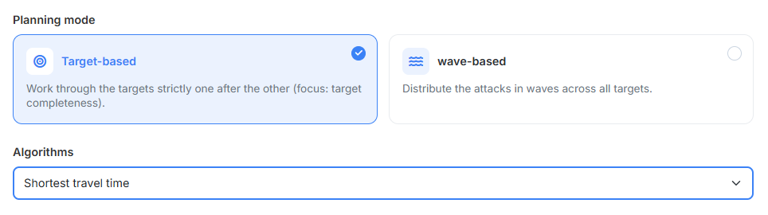
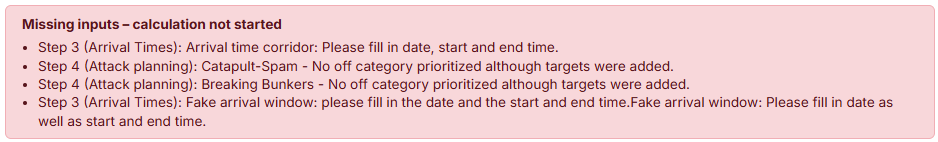
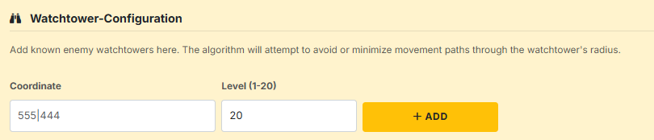

# Schritt 7: Berechnung

In Schritt 7 legst du fest, **nach welcher Strategie** das Tool aus deinen
Eingaben einen konkreten Befehlsplan baut — und startest die Berechnung.

## 1. Planungsmodus

{ .screenshot }

Zwei Auswahlkarten stehen zur Wahl:

- **„Ziel-basiert"** — *„Arbeitet die Ziele strikt nacheinander ab (Fokus:
  Ziel-Vollständigkeit)."* Das Tool plant ein Ziel komplett durch; erst wenn es
  seine Offs, Zwischencleaner, K-Splits und Fakes hat, geht es zum nächsten
  weiter. Sinnvoll, wenn die Vollständigkeit jedes einzelnen Ziels wichtiger
  ist als eine gleichmäßige Verteilung.
- **„Wellen-basiert"** — *„Verteilt die Angriffe in Wellen auf alle Ziele."*
  Zuerst bekommt jedes Ziel eine Off, dann jedes Ziel die zweite, und so
  weiter. Sinnvoll, wenn alle Ziele auf einem ähnlichen Versorgungsniveau
  landen sollen — auch wenn am Ende nicht jedes Ziel vollständig ist.

## 2. Algorithmus

Das Dropdown darunter bestimmt, **wie das Tool aus den möglichen
Herkunftsdörfern auswählt**. Welche Einträge zur Verfügung stehen, hängt vom
Planungsmodus und von der Welt ab:

- **„Wachturm-optimiert"** — versucht, Laufwege durch bekannte Wachturm-Radien
  zu vermeiden oder zu minimieren. Nur auf Welten mit aktivem Wachturm.
  Blendet zusätzlich den Bereich aus [Abschnitt 4](#4-wachturm-konfiguration)
  ein.
- **„Moral-optimiert"** — bevorzugt Herkunftsdörfer mit hoher Moral.
- **„Kürzeste Laufzeit"** — wählt je Ziel das Dorf mit der kürzesten Reisezeit.
- **„Längste Laufzeit"** — wählt je Ziel das Dorf mit der längsten Reisezeit.
- **„Zufällig"** — wählt zufällig aus. Nützlich, wenn der Plan möglichst
  unspezifisch wirken soll.
- **„Knappheit-optimiert (Verteilung)"** — **nur im Modus Wellen-basiert.**
  Verplant zuerst die Herkunftsdörfer, die laufzeittechnisch die wenigsten
  Ziele erreichen können.

!!! warning "Der Algorithmus arbeitet nur innerhalb des erlaubten Pools"
    Welche Herkunftsdörfer der Algorithmus überhaupt zur Auswahl hat, hängt
    von den Einstellungen der jeweiligen Kategorie ab — insbesondere von der
    [Priorisierung der Dorfkategorien](schritt4-angriffsplanung.md#24-priorisierung-dorfkategorien)
    und der dort gesetzten Option **„Strikte Priorisierung (Reihenfolge
    erzwingen)"**. Ein optimaler Algorithmus liefert immer nur das beste
    Ergebnis **innerhalb des erlaubten Pools** — nicht zwingend das global
    beste.

    **Beispiel:** Du wählst **Moral-optimiert** und hast die strikte
    Priorisierung aktiviert, mit *>2000 Axt* als höchster Kategorie. Für ein
    Ziel findet das Tool dort nur eine Option mit 80 % Moral — die wird
    verplant. Dass es in der niedriger priorisierten Kategorie *>1000 Axt* ein
    Dorf mit 100 % Moral gegeben hätte, bleibt unentdeckt: Die strikte
    Priorisierung weist den Algorithmus an, niedrigere Kategorien erst
    anzufassen, wenn in der höheren gar keine valide Option mehr da ist.

    Möchtest du dem Algorithmus mehr Spielraum geben, schalte die strikte
    Priorisierung aus — alle eingeschalteten Kategorien bilden dann einen
    gemeinsamen Pool.

## 3. Prüfung vor der Berechnung

{ .screenshot }

Gestartet wird die Berechnung nicht auf dieser Seite, sondern über den Knopf
**„Berechnen"** ganz unten in der Schrittleiste. Er ist aus jedem Schritt
erreichbar.

Vor dem eigentlichen Rechnen prüft das Tool deine Eingaben. Fehlt etwas,
springt es zurück auf Schritt 7 und zeigt dort das Feld **„Fehlende Eingaben –
Berechnung nicht gestartet"** mit einer Liste. Jede Zeile nennt den Schritt,
in dem etwas fehlt, zum Beispiel:

- *„Schritt 2 (Abschickzeiten): Kein Abschickzeitfenster definiert."*
- *„Schritt 3 (Ankunftszeiten): Ankunftszeiten-Korridor: Bitte Datum, Von- und
  Bis-Uhrzeit ausfüllen."*
- *„Schritt 4 (Angriffsplanung): AG-Spam - Keine Off-Kategorie priorisiert,
  obwohl Ziele eingetragen wurden."*
- *„Schritt 4–5 (Ziele & Fakes): Es sind keine Angriffsziele und keine
  Fake-Ziele vorhanden. Es gibt nichts zu planen."*

Betrifft eine Meldung eine bestimmte Kategorie, steht deren Name mit im Text —
so siehst du sofort, welcher Unterschritt gemeint ist.

!!! info "Die Berechnung läuft im Hintergrund"
    Größere Pläne dauern einige Sekunden bis Minuten. Unter dem Knopf läuft
    solange eine Statuszeile mit — *„Warte auf Worker…"*, dann *„Berechne…"*
    samt verstrichener Zeit. Die Seite währenddessen nicht schließen; beim
    Verlassen fragt der Browser nach.

    Ist die Berechnung durch, wird Schritt **8. Ergebnis** freigeschaltet und
    das Tool springt dorthin.

## 4. Wachturm-Konfiguration

{ .screenshot }

Sobald der Algorithmus **„Wachturm-optimiert"** gewählt ist, erscheint dieser
zusätzliche Bereich.

!!! info "Wozu die Wachtürme dienen"
    Füge hier bekannte gegnerische Wachtürme hinzu. Der Algorithmus wird
    versuchen, Laufwege durch deren Radius zu vermeiden oder zu minimieren.

Je Wachturm trägst du ein:

- **„Koordinate"** — Position im Format `XXX|YYY`.
- **„Stufe (1-20)"** — die Ausbaustufe; sie bestimmt den Wirkungsradius
  (Stufe 20 entspricht etwa 15 Feldern).

Mit dem Plus-Knopf wandert der Turm in die Liste darunter, die Koordinate,
Spieler und Stufe zeigt. Solange nichts eingetragen ist, steht dort *„Keine
Wachtürme."*

Die Wirkungskreise lassen sich auf der [Gesamtkarte](gesamtkarte.md) über das
Chip **„Wachtürme"** einblenden — so siehst du auf einen Blick, wie viel deiner
Angriffsfläche tatsächlich abgedeckt ist.

---

Weiter geht es mit [Schritt 8: Ergebnis](schritt8-ergebnis.md).
