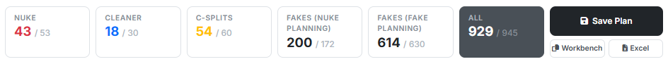
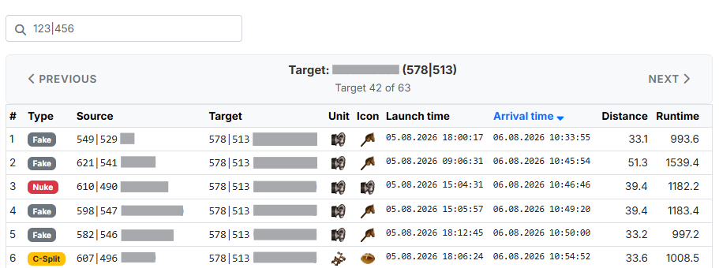
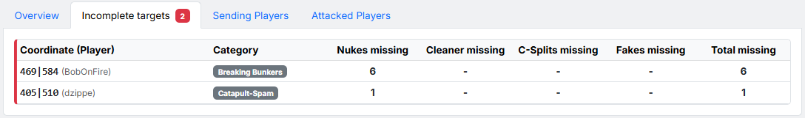
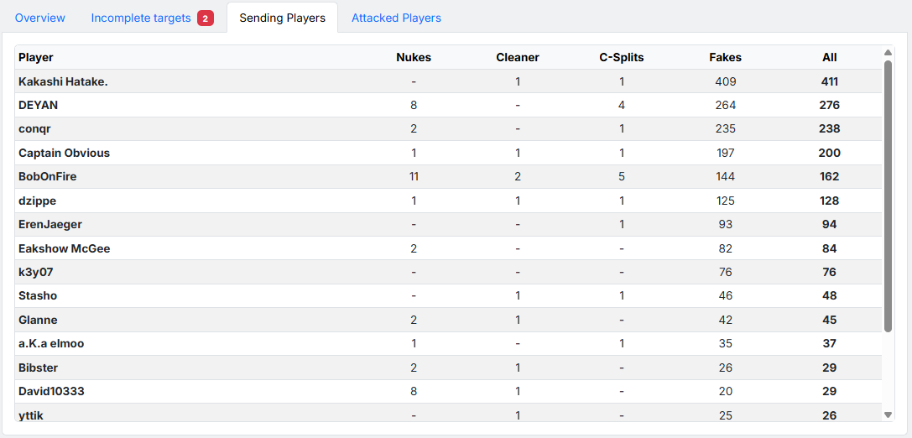
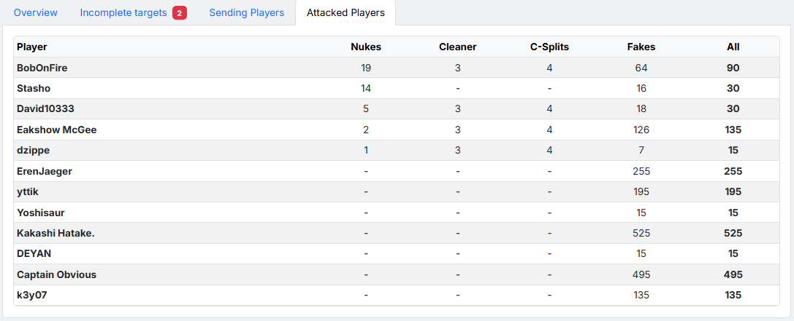

# Schritt 8: Ergebnis

Schritt 8 zeigt den fertigen Befehlsplan. Der Schritt bleibt in der
Schrittleiste **gesperrt**, bis eine Berechnung durchgelaufen ist; danach
springt das Tool von selbst hierher.

## 1. Ergebniskarten und Aktionen

{ .screenshot }

Oben steht eine Reihe von Karten im **Ist/Soll-Vergleich**: links die Zahl,
die tatsächlich geplant werden konnte, rechts nach dem Schrägstrich die Zahl,
die laut deinen Einstellungen geplant werden sollte. Karten, die leer wären,
erscheinen gar nicht erst:

- **„Off"** — echte Offs aus der Angriffsplanung.
- **„ZWC"** — Katta-Zwischencleaner.
- **„K-Splits"** — Katta-Splits.
- **„Fakes (Angriffsplanung)"** — Begleitfakes zu den scharfen Zielen aus
  [Schritt 4](schritt4-angriffsplanung.md).
- **„Fakes (Fakeplanung)"** — reine Fakes aus
  [Schritt 5](schritt5-fakeplanung.md).
- **„Gesamt"** — die Summe aller Befehle, dunkel hervorgehoben.

Stimmen Ist und Soll überein, ist der Plan vollständig. Liegt das Ist
darunter, sagt dir der Reiter
[Unvollständige Ziele](#3-unvollstandige-ziele), was genau fehlt.

Rechts daneben stehen drei Aktionen:

- **„Plan speichern"** — öffnet ein Fenster, in dem du unter **„Name des
  Plans"** einen Namen vergibst. Gespeicherte Pläne stehen anschließend unter
  „Meine Pläne & Container" zur Verfügung — und lassen sich von dort aus
  veröffentlichen, teilen und in eine neue Planung importieren.
- **„Workbench"** — kopiert sämtliche Befehle als Workbench-Strings in die
  Zwischenablage.
- **„Excel"** — lädt das komplette Ergebnis als Excel-Datei herunter.

## 2. Übersicht

{ .screenshot }

Der Reiter **„Übersicht"** zeigt alle geplanten Befehle **je Ziel**. Über
**„Vorheriges"** / **„Nächstes"** blätterst du Ziel für Ziel durch; im Suchfeld
oben springst du per Koordinateneingabe (`123|456`) direkt zu einem bestimmten
Ziel.

Die Spalten:

- **„#"** — laufende Nummer innerhalb des Ziels.
- **„Typ"** — Befehlstyp als farbiges Kennzeichen (Off, Fake, ZWC, K-Split …).
- **„Herkunft"** — Herkunftskoordinate und -spieler.
- **„Ziel"** — Zielkoordinate und -spieler.
- **„Einheit"** — die langsamste Einheit, nach der sich die Laufzeit richtet.
- **„Icon"** — das Befehls-Icon der Workbench.
- **„Abschickzeit"** / **„Ankunftszeit"** — beide Spalten lassen sich per Klick
  sortieren.
- **„Distanz"** — Entfernung in Feldern.
- **„Laufzeit"** — Reisezeit in Minuten.

## 3. Unvollständige Ziele

{ .screenshot }

Dieser Reiter listet alle Ziele, für die **nicht** alle geforderten Befehle
geplant werden konnten. Am Reiternamen zeigt ein rotes Kennzeichen ihre
Anzahl. Sortiert wird nach den fehlenden Offs, das Dringendste zuerst.

Die Spalten nennen die **Koordinate (Spieler)**, die **Kategorie** und dann je
Befehlsart, wie viele fehlen — **Offs fehlen**, **ZWC fehlen**, **K-Splits
fehlen**, **Fakes fehlen** — sowie **Gesamt fehlen**. Wo nichts fehlt, steht
ein „-".

Sind alle Ziele versorgt, erscheint stattdessen die grüne Meldung *„Alle Ziele
sind vollständig."*

!!! info "Was tun, wenn Befehle fehlen?"
    Fehlende Befehle bedeuten fast immer, dass der erlaubte Pool zu eng war.
    Lohnende Stellschrauben: mehr Dorfkategorien in der
    [Priorisierung](schritt4-angriffsplanung.md#24-priorisierung-dorfkategorien)
    einschalten oder die strikte Priorisierung ausschalten, die
    [Abstände der Offs](schritt4-angriffsplanung.md#25-abstande-der-offs)
    großzügiger setzen, den
    [Ankunftszeitraum](schritt3-ankunftszeiten.md) verbreitern oder die
    Frontlinie in [Schritt 1](schritt1-truppen.md#3-frontlinie-definieren)
    verkleinern.

## 4. Abschickende Spieler

{ .screenshot }

Zeigt, **welcher Spieler wie viele Befehle abschickt** — absteigend nach der
Gesamtzahl sortiert. Spalten: **Spieler**, **Offs**, **ZWC**, **K-Splits**,
**Fakes** und **Gesamt**.

Hilfreich, um die Last gleichmäßig zu verteilen und zu erkennen, wenn ein
Einzelner überlastet wird.

## 5. Angegriffene Spieler

{ .screenshot }

Das Gegenstück: **welcher gegnerische Spieler wie viele Befehle bekommt** —
absteigend nach Offs sortiert. Die Spalten sind dieselben wie in Abschnitt 4,
beziehen sich hier aber auf den angegriffenen Spieler.

## 6. Der Plan auf der Karte

Nach der Berechnung zeichnet die [Gesamtkarte](gesamtkarte.md) den Plan als
**Befehlslinien** von Herkunfts- zu Zieldorf, farblich nach Befehlstyp
getrennt. An jedem Zielring steht das Ist/Soll, und ein Klick auf ein Ziel
öffnet einen Infokasten mit allen Befehlen darauf. Siehe
[Die Gesamtkarte · Befehlslinien](gesamtkarte.md#6-befehlslinien-nach-der-berechnung).

## 7. Berechnung wiederholen

Bist du mit dem Ergebnis nicht zufrieden, springst du einfach in den
betreffenden Schritt zurück, passt die Einstellungen an und drückst erneut auf
**„Berechnen"**. Deine Eingaben bleiben dabei erhalten.
